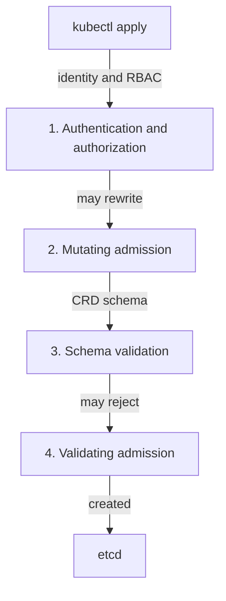
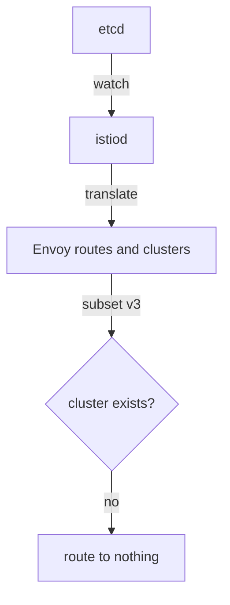

# What The API Server Checks, And What It Cannot

Before you trust a tool that finds configuration errors, you need to know which errors no earlier step could catch. This part follows one `kubectl apply` through every stage it passes in the Kubernetes API server. It shows where Istio can reject an object and where it cannot. It also shows why a reference to a subset that does not exist gets through every stage.

## One apply, four stages

When you run `kubectl apply -f virtualservice.yaml`, the API server does not store the object at once. The API server is the Kubernetes component that accepts every write to the cluster and saves it in etcd, the cluster's database. It handles the object in a fixed order, and each stage can reject it for a different reason:



The diagram shows the four stages in order, ending with the object saved in etcd.

Stage 1 checks who you are and whether you may write this object. Stage 2 runs mutating admission webhooks, which may change the object; for pods, this is where Istio adds the sidecar proxy. Stage 3 is Kubernetes' own work. It checks the object against the CustomResourceDefinition (CRD), the schema that Istio installed for each of its resource kinds. The CRD knows that `spec.http` is a list and that `weight` is a whole number. It has no idea what a subset is.

Stage 4 is Istio's own work. `istiod`, Istio's control plane, runs a validating admission webhook called `validation.istio.io`. A validating admission webhook is a service the API server calls before it stores an object; it can accept or reject the object, but not change it. Istio's webhook applies Istio's rules to **the one object being applied**. This is the stage people expect too much from.

## What the validating webhook can and cannot see

The API server sends the webhook one `AdmissionReview` request that holds the object being applied. That is the webhook's whole input. It does not get the rest of the cluster, and it does not go and fetch it. An admission webhook sits in the path of every write, so it must answer in milliseconds.

So the following rule comes from how the webhook works, not from a missing feature:

> A validating webhook can only check facts that are true or false **inside a single document**.

That rule splits Istio mistakes into classes, and each class is found in a different way:

| Class | Example | Caught at admission? |
| --- | --- | --- |
| **Inside one object** | `weight: 60` twice, so the route weights add up to 120 | **Yes**: the webhook has everything it needs |
| **Inside one object** | a misspelled field, a bad enum value, an invalid duration | Yes, usually at stage 3 |
| **Between objects** | a `VirtualService` naming `subset: v3` that no `DestinationRule` defines | **No**: the `DestinationRule` is a different object |
| **Between objects** | a `gateways:` entry naming a `Gateway` that does not exist | No |
| **Environment** | a namespace with Istio configuration but no sidecar injection label | No |

It is worth seeing the webhook reject a mistake inside one object once. It proves the webhook really runs. The `VirtualService` below sends traffic to two destinations with a weight of 60 each, so the weights add up to 120 instead of 100.

<!-- astrona:playground:renew -->

Save this as `virtualservice-bad-weights.yaml`:

```yaml
apiVersion: networking.istio.io/v1
kind: VirtualService
metadata:
  name: bad-weights
  namespace: analyze-demo
spec:
  hosts:
    - notification-service
  http:
    - route:
        - destination:
            host: notification-service
          weight: 60
        - destination:
            host: notification-service
          weight: 60
```

Apply it:

```sh
kubectl apply -f virtualservice-bad-weights.yaml
```

You should see something like:

```text
Error from server: error when creating "STDIN": admission webhook "validation.istio.io" denied the request:
configuration is invalid: total destination weight 120 != 100
```

This output was captured with the YAML sent on standard input, so it says `"STDIN"`. When you apply the file, your file name appears there instead. The message names the component that refused the object: `admission webhook "validation.istio.io"`, which is `istiod` at stage 4. Everything it needed for that decision was inside the one document.

Now look at the opposite case. The namespace already holds a `VirtualService` that names a subset no `DestinationRule` defines, and all four stages accepted it. List the two objects, then send a request from the `tester` pod to the `notification-service` Service:

```sh
kubectl -n analyze-demo get virtualservice,destinationrule
kubectl -n analyze-demo exec deploy/tester -- \
  curl -s -o /dev/null -w '%{http_code}\n' -X POST http://notification-service/notify
```

You should see something like:

```text
NAME                                              GATEWAYS              HOSTS                      AGE
virtualservice.networking.istio.io/notification   ["missing-gateway"]   ["notification-service"]   4m

NAME                                               HOST                   AGE
destinationrule.networking.istio.io/notification   notification-service   4m

503
```

Both objects exist, and the request fails. The ages will differ on your cluster. Istio's networking resources have no `status` conditions that report a problem, so no `kubectl` command will tell you this pair does not fit together. The `503` status code is the only symptom, and it names no object.

## What istiod does with the object later

Once the object is in etcd, a second and separate process begins. `istiod` watches the API server and holds the **whole** configuration set in memory. It turns that set into Envoy configuration and pushes it to every sidecar proxy over xDS, the protocol `istiod` uses to send configuration to proxies while they run.

At this point the questions between objects can finally be answered, because `istiod` has the complete set:



The diagram shows `istiod` turning the route to subset `v3` into an Envoy cluster name such as `outbound|80|v3|notification-service.analyze-demo.svc.cluster.local`; when no such cluster exists, the route leads nowhere.

Nobody is told when this goes wrong. Your `kubectl apply` succeeded minutes ago, and `istiod` does not report back to you. The only result of a reference that points at nothing is that the proxies get a route that cannot work.

## What an analyzer is

`istioctl analyze` closes this gap. It does on demand what `istiod` does all the time: it loads the whole configuration set and runs a collection of **analyzers** over it. An analyzer is a small check with one job and a list of resource kinds it reads. One analyzer walks every `VirtualService`, collects the subsets its routes name, and compares them with the subsets every `DestinationRule` defines. Another compares `gateways:` entries with the `Gateway` objects that exist. Another looks for namespaces with Istio configuration but no sidecar injection label.

Three facts follow from this design, and all three matter in practice:

- **It is a snapshot, not a watch.** The results describe the cluster at the moment you ran the command. Run it again after every change.
- **It reads whatever you give it.** The configuration set can come from the cluster, from files, or from both.
- **It looks at one namespace by default.** If a relationship crosses namespaces and only one end is in scope, a finding can look wrong until you widen the scope.

Run the analyzer on the namespace you just inspected:

```sh
istioctl analyze -n analyze-demo
```

You should see something like:

```text
Error [IST0101] (VirtualService notification.analyze-demo) Referenced host+subset in destinationrule not found: "notification-service+v3"
Error [IST0101] (VirtualService notification.analyze-demo) Referenced gateway not found: "missing-gateway"
Error: Analyzers found issues when analyzing namespace: analyze-demo.
See https://istio.io/v1.30/docs/reference/config/analysis for more information about causes and resolutions.
```

Two commands ago you had a `503` and no idea which object caused it. Now the analyzer names the object, the fields and the exact values that do not resolve. Both findings are references between objects, the kind that stage 4 can never check.

You now know where each kind of mistake is caught. The API server and the validating webhook check one document at a time, so a reference to another object always gets through. `istiod` sees the whole set but reports nothing, and `istioctl analyze` gives you the same complete view on demand. The open question is how to read what the analyzer reports, because on a real cluster the list is long.

## Common pitfalls

> [!WARNING]
> - **Treating a clean `kubectl apply` as proof the configuration is correct.** It proves the document matched the schema and passed every rule that needs no other object. Every broken reference in this module applied without an error.
> - **Expecting the validating webhook to see other objects.** It only ever sees the one document being applied.
> - **Looking for a failed status on Istio objects.** Networking resources have no status that reports a problem. The failing request is the only symptom.
> - **Running analyze once and trusting it later.** It is a snapshot. Run it again after every change.
