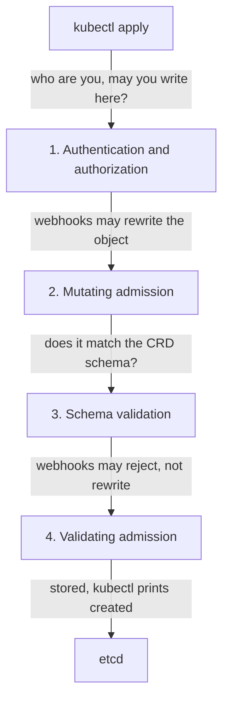
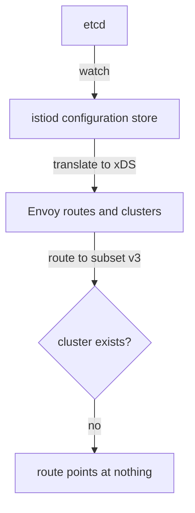

# What The API Server Checks, And What It Cannot

Astronaut, before you trust a tool that finds configuration errors, you need to know which errors could never have been caught earlier. This part follows one `kubectl apply` through every stage it passes. It shows where Istio gets a say and where it does not, and why a reference to a subset that does not exist gets through all of it.

## One apply, four stages

When you run `kubectl apply -f virtualservice.yaml`, the object does not go straight into storage. The Kubernetes API server (the registry office, where every object must be filed) handles it in a fixed order. Each stage can reject it, for different reasons:



The diagram shows the four stages in order, ending in etcd, the registry office's archive. Stage 2 is where sidecar injection happens for pods. Stage 4 is where `istiod` runs its `validation.istio.io` webhook.

Stage 3 is Kubernetes' own work. It uses the CustomResourceDefinition (CRD, the form template) that Istio installed. It knows that `spec.http` is a list and that `weight` is a whole number. It has no idea what a subset is.

Stage 4 is Istio's own work. `istiod` (mission control) runs a validating admission webhook. Think of it as the registry clerk: it applies Istio's rules to **the one form being filed**. This is the stage people expect too much from.

## What the validating webhook can and cannot see

The webhook receives one `AdmissionReview` message that holds the object being filed. That is its whole input. It does not get the rest of the cluster, and it may not go and fetch it. An admission webhook sits in the path of every write, so it must answer in milliseconds.

So the rule that follows is not an oversight. It comes from how the webhook is built:

> A validating webhook can only check facts that are true or false **inside a single document**.

That splits Istio mistakes into classes that are found in completely different ways:

| Class | Example | Caught at admission? |
| --- | --- | --- |
| **Inside one object** | `weight: 60` twice, so the route weights add up to 120 | **Yes**: the webhook has everything it needs |
| **Inside one object** | a misspelled field, a bad enum value, an invalid duration | Yes, usually at stage 3 |
| **Between objects** | a `VirtualService` naming `subset: v3` that no `DestinationRule` defines | **No**: the `DestinationRule` is a different object |
| **Between objects** | a `gateways:` entry naming a `Gateway` that does not exist | No |
| **Environment** | a namespace carrying mesh configuration without an injection label | No |

### See the webhook reject something it can see

The mistake inside one object is worth seeing once. It proves the webhook is really working, not missing.

<!-- astrona:playground:renew -->

Save this as `virtualservice-bad-weights.yaml`:

```yaml
apiVersion: networking.istio.io/v1
kind: VirtualService
metadata:
  name: bad-weights
  namespace: analyze-demo
spec:
  hosts:
    - notification-service
  http:
    - route:
        - destination:
            host: notification-service
          weight: 60
        - destination:
            host: notification-service
          weight: 60
```

Apply it:

```sh
kubectl apply -f virtualservice-bad-weights.yaml
```

You should see something like:

```text
Error from server: error when creating "STDIN": admission webhook "validation.istio.io" denied the request:
configuration is invalid: total destination weight 120 != 100
```

This output was captured with the YAML sent on standard input, so it says `"STDIN"`. When you apply the file, your file name appears there instead.

Read who is speaking: `admission webhook "validation.istio.io"`. That is `istiod`, refusing at stage 4. Everything it needed for that verdict was inside the document, so it did not have to look at anything else.

### See configuration that passed all four stages and does not work

Now the contrast. The namespace already holds a `VirtualService` that names a subset nothing defines, and every one of the four stages accepted it. List the objects, then send a request from your test ship:

```sh
kubectl -n analyze-demo get virtualservice,destinationrule
kubectl -n analyze-demo exec deploy/tester -- \
  curl -s -o /dev/null -w '%{http_code}\n' -X POST http://notification-service/notify
```

You should see something like:

```text
NAME                                              GATEWAYS              HOSTS                      AGE
virtualservice.networking.istio.io/notification   ["missing-gateway"]   ["notification-service"]   4m

NAME                                               HOST                   AGE
destinationrule.networking.istio.io/notification   notification-service   4m

503
```

Both objects exist, neither is marked unhealthy, and the request fails. The exact ages vary. Istio's networking resources have no `status` conditions that turn red, so nothing in `kubectl` will ever tell you this pair does not fit together. The `503` is the only signal, and it names nothing.

## What istiod does with the object later

The object is now in etcd, and a second, separate process begins. `istiod` watches the API server and holds the **whole** configuration set in memory. It turns that set into Envoy configuration and pushes it to every sidecar proxy (the communications officer on each ship).

At that point the questions between objects can finally be answered, because now there is a complete picture:



The diagram shows `istiod` reading every `VirtualService`, `DestinationRule`, `Gateway`, Service and pod, and translating "route to subset v3" into the cluster name `outbound|80|v3|...`. When no such cluster exists, the route points at nothing.

Nobody is told when that goes wrong. Your `kubectl apply` returned successfully minutes ago, and `istiod` is no longer answering you. The only result of a reference that points at nothing is that the proxies receive orders that cannot work.

## What an analyzer is

`istioctl analyze` closes the gap. It does on demand what `istiod` does all the time: it loads the whole configuration set and runs a collection of **analyzers** over it.

An analyzer is a small check with one job and a list of resource kinds it wants to see. One analyzer walks every `VirtualService`, collects the subsets its routes name, and compares them with the subsets every `DestinationRule` defines. Another compares `gateways:` entries with the `Gateway` objects that exist. Another looks for namespaces that carry mesh configuration but have no injection label.

Three facts follow from that design, and all three matter in practice:

- **It is a snapshot, not a watch.** Results describe the cluster at the moment you ran the command. Run it again after every change.
- **It sees whatever you give it.** The configuration set can come from the cluster, from files, or from both.
- **It looks at one namespace by default.** Analyzers run over the objects in scope. If a relationship crosses namespaces and only one end is in scope, the finding can look wrong until you widen the scope.

### Run your first real diagnosis

Run the analyzer on the namespace you just inspected:

```sh
istioctl analyze -n analyze-demo
```

You should see something like:

```text
Error [IST0101] (VirtualService notification.analyze-demo) Referenced host+subset in destinationrule not found: "notification-service+v3"
Error [IST0101] (VirtualService notification.analyze-demo) Referenced gateway not found: "missing-gateway"
Error: Analyzers found issues when analyzing namespace: analyze-demo.
See https://istio.io/v1.30/docs/reference/config/analysis for more information about causes and resolutions.
```

Two commands ago you had a `503` and no suspect. Now the pre-flight inspector has named the object, the fields and the exact values that do not resolve. Both are references between objects, exactly the kind that stage 4 could never check.

## Common pitfalls

> [!WARNING]
> - **Treating a clean `kubectl apply` as proof the configuration is correct.** It proves the document matched a schema and passed every rule that can be checked without looking at another object. Every broken reference in this module applied without a word of complaint.
> - **Expecting the validating webhook to see other objects.** It only ever sees the one document being filed.
> - **Looking for a red status on Istio objects.** Networking resources have no status that turns red. The failing request is the only symptom.
> - **Running analyze once and trusting it later.** It is a snapshot. Run it again after every change.

> *The API server checks one document; `istiod` reads the whole set, and only the second can see a reference that does not resolve.*
