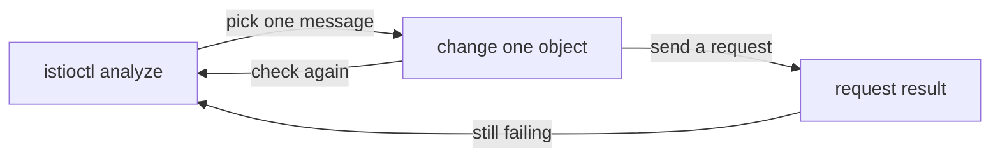

# Choosing The Right Analysis Source

`istioctl analyze` always reads a set of objects together, and you choose that set on the command line. The choice changes the answers. A file that looks broken on its own can be fine on top of the cluster, and a cluster that looks clean can be about to receive a change nobody has checked. This part covers the three sources the analyzer can read, the lighter `istioctl validate` command, and the habit that turns a message into a fix you can prove.

## Three ways to build the set

There are three ways to tell the analyzer what to read, and each one answers a different question:

| Form | Command | The set it reads | The question it answers |
| --- | --- | --- | --- |
| A | `istioctl analyze -n <ns>` | the objects in the cluster | "Is what is running coherent?" |
| B | `istioctl analyze -n <ns> file.yaml` | the objects in the cluster, with the objects in `file.yaml` laid on top | "Would this change be coherent?" This is the check before you merge |
| C | `istioctl analyze --use-kube=false file.yaml` | only the objects in `file.yaml` | "Is this file coherent on its own?" This is the check in a build pipeline with no cluster |

Form **B** is the most useful habit, and the one people discover last. When you are about to apply something, the real question is not "is this file complete on its own". It is "does this file make sense with what is already in the cluster". Form B answers exactly that, because the analyzer sees your file together with the Services, pods and Istio objects that are already running.

Form **C** runs where there is no cluster to ask, and that is also its limit. The analyzer knows only what the file contains, so many checks have nothing to compare against. A missing object can be reported as missing, and a real problem can go unreported. Treat a clean form C run as a quick check, not as proof.

The next file holds a pair, a `DestinationRule` and a `VirtualService`. The `DestinationRule` defines only the subset `v1`, and the `VirtualService` routes to `v3`.

<!-- astrona:playground:renew -->

Save this as `notification-routing-proposed.yaml`:

```yaml
apiVersion: networking.istio.io/v1
kind: DestinationRule
metadata:
  name: notification
  namespace: analyze-demo
spec:
  host: notification-service
  subsets:
    - name: v1
      labels:
        version: v1
---
apiVersion: networking.istio.io/v1
kind: VirtualService
metadata:
  name: notification
  namespace: analyze-demo
spec:
  hosts:
    - notification-service
  http:
    - route:
        - destination:
            host: notification-service
            subset: v3
```

Do not apply it. Analyse the file on top of the cluster, which is form B:

```sh
istioctl analyze -n analyze-demo notification-routing-proposed.yaml
```

You should see something like:

```text
Error [IST0101] (VirtualService analyze-demo/notification notification-routing-proposed.yaml:24) Referenced host+subset in destinationrule not found: "notification-service+v3"
Error: Analyzers found issues when analyzing namespace: analyze-demo.
See https://istio.io/v1.30/docs/reference/config/analysis for more information about causes and resolutions.
```

It is the same `IST0101` that caused the `503` in the cluster, found before anything was applied. Look at the origin field: when the analyzer reads a file, it adds the file name and a **line number**, which it cannot do for an object stored in etcd. Notice also that the gateway message is gone. The `VirtualService` in the file replaces the one in the cluster for this run, and the file has no `gateways:` field.

Now run form C on the same file, without the cluster:

```sh
istioctl analyze --use-kube=false notification-routing-proposed.yaml
```

You should see something like:

```text
✔ No validation issues found when analyzing notification-routing-proposed.yaml.
```

The same mistake goes unreported. In Istio 1.30.5 the subset check gives no result when the analyzer reads only this file, so form C passes a file that form B rejects. This is the limit described above, and the reason to run form B whenever a cluster is available. Keep the file, because the next command uses it again.

## analyze against validate

`istioctl` has a second, lighter command. The difference between the two is the difference between one document and a set.

`istioctl validate -f file.yaml` only answers the one-document question: is it well formed, are the fields real, and are the values allowed. It never contacts the cluster and never looks at a second object. In effect, it runs the same kind of check as Istio's validating admission webhook, but on your own machine and before you apply anything.

| | `istioctl validate` | `istioctl analyze` |
| --- | --- | --- |
| Question answered | Is the document well formed? | Does the configuration set make sense together? |
| Needs a cluster | No | Optional (`--use-kube=false` to skip it) |
| Sees other objects | No | Yes |
| Catches a misspelled field | Yes | Yes |
| Catches a rule with both `redirect` and `route` | Yes | Yes |
| Catches a missing subset | **No** | Yes |
| Catches a namespace without injection | No | Yes |

In practice, use `validate` in an editor or a pre-commit hook, where speed matters and there is no cluster. Run `analyze` before you apply, and whenever requests start to fail. Run `validate` on the same file to see the difference:

```sh
istioctl validate -f notification-routing-proposed.yaml
```

You should see something like:

```text
"notification-routing-proposed.yaml" is valid
```

The file that form B just rejected with an `Error` is perfectly valid on its own terms. It is well-formed YAML for the right schema, with every field in place. That one line is the reason `analyze` exists as a separate command.

## Fixing: which end of a broken reference to change

An `IST0101` message says a reference does not resolve. There are always two ways to make it resolve: create the target, or stop pointing at it. They are not equally correct.

In the `analyze-demo` namespace, the `VirtualService` names `subset: v3` and a gateway that does not exist. Only pods with `version: v1` are running. Adding a `v3` subset to the `DestinationRule` would silence the analyzer, but requests would still fail. A subset whose labels match no pod becomes an Envoy cluster with no endpoints, so the sidecar proxy returns `503` with the response flag `UH` (no healthy upstream). You would swap a clear failure for a less clear one. Routing to `v1` and removing the gateway reference matches what is really deployed. The gateway is not needed, because nothing in this namespace is exposed outside the mesh.

The general rule is to make the reference true in the direction that matches what is deployed. Check the running pods before you create a target. Here, that means a `VirtualService` that routes to `v1` and has no `gateways:` field. Without `gateways:`, a `VirtualService` applies to the sidecar proxies inside the mesh, which is what this Service needs.

Save this as `virtualservice-notification.yaml`:

```yaml
apiVersion: networking.istio.io/v1
kind: VirtualService
metadata:
  name: notification
  namespace: analyze-demo
spec:
  hosts:
    - notification-service
  http:
    - route:
        - destination:
            host: notification-service
            subset: v1
```

Apply it:

```sh
kubectl apply -f virtualservice-notification.yaml
```

```text
virtualservice.networking.istio.io/notification configured
```

Then check the result with the analyzer and with a real request from the `tester` pod:

```sh
istioctl analyze -n analyze-demo
kubectl -n analyze-demo exec deploy/tester -- \
  curl -s -o /dev/null -w '%{http_code}\n' -X POST http://notification-service/notify
```

You should see something like:

```text
✔ No validation issues found when analyzing namespace: analyze-demo.
200
```

You need both proofs, because either one alone can mislead you. A clean analyze run with a `503` means the configuration is coherent but has not reached the sidecar proxy yet. A `200` with analyzer errors means the request took a path that does not touch the broken object.

## One change, then check again

The fix above was one change to one object, checked twice. This habit matters because **the analyzer reports symptoms in the configuration, not causes**. Two messages can share one cause, and one mistake can hide a message while it creates another. If you change two things at once, you can no longer tell which change made the difference. In a graded exam, that costs you the marks for a fix you cannot explain. In production, it costs you the knowledge of which change to roll back.



The diagram shows the loop: run the analyzer, change one object, then run the analyzer again and send a real request before you move on.

When one namespace is clean, widen the scope before you call the mesh healthy. Istio configuration often crosses namespaces. A `Gateway` usually lives in `istio-system`, while the `VirtualService` that binds to it lives with the application, and a one-namespace run sees only one side. Run the analyzer across every namespace:

```sh
istioctl analyze --all-namespaces
```

You should see something like:

```text
Info [IST0102] (Namespace default) The namespace is not enabled for Istio injection. Run 'kubectl label namespace default istio-injection=enabled' to enable it, or 'kubectl label namespace default istio-injection=disabled' to explicitly mark it as not needing injection.
```

The output is shortened to the message. `analyze-demo` is now clean, and the one message left is about the `default` namespace, which runs nothing in this playground. It is an `Info` message, so the exit code stays `0`. On a real cluster this report is rarely empty, and that is fine. The goal is not zero messages. The goal is to know which messages you have decided to accept. Any message you cannot explain is still an open question.

You can now choose what the analyzer reads: the cluster, a file on top of the cluster, or a file alone. You know that `validate` checks one document and `analyze` checks the set. You also know how to fix a broken reference in the direction that matches what is deployed, and how to prove the fix with both the analyzer and a request. A clean analyze run still does not prove that the configuration reached the sidecar proxies. When it is clean and requests still fail, the next question is whether every proxy holds the latest configuration, which `istioctl proxy-status` answers.

## Common pitfalls

> [!WARNING]
> - **Trusting a clean `--use-kube=false` run.** With no cluster to compare against, the analyzer can miss a real problem, such as the missing subset in this module, and can report objects defined elsewhere as missing. Run form B whenever a cluster is available.
> - **Using `validate` where you needed `analyze`.** `validate` cannot see a second object, so it passes every mistake between objects in this module.
> - **Fixing a broken reference by creating the target without checking the pods.** A subset that matches no pods swaps a clear failure for a `503` with `UH`.
> - **Fixing several messages in one apply.** When the symptom clears, you will not know which change mattered.
> - **Stopping at a clean analyze run.** It proves the configuration is coherent, not that requests succeed. Send a request.
> - **Calling a namespace healthy without `--all-namespaces`.** Half of a relationship between namespaces is invisible from inside one namespace.

## Your mission: Find And Fix The Configuration Errors

You can now find every reference that points at nothing, choose the right end to fix, and prove the fix twice. The graded lab gives you a namespace where every `kubectl apply` succeeded and every request returns `503`, and asks you to make the analysis clean and the requests succeed without creating a subset that matches no pod.

The lab runs in its own cluster, so first pause your playground. Nothing in it is lost:

```sh
astrona stop ats-016-playground-010-01
```

Then start the lab:

```sh
astrona run --git ssh://git@github.com/astrona-io/ATS016.git -c sections/section-010/module-01/labs/lab-01
```

The task is on the next page. Solve it on your own first. When you think you are done, send it for grading:

```sh
astrona submit -c sections/section-010/module-01/labs/lab-01
```

When the lab is done, remove it and start your playground again:

```sh
astrona destroy ats-016-lab-010-01
astrona start ats-016-playground-010-01
```
