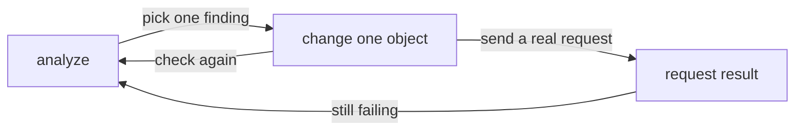

# Choosing The Right Analysis Source

Astronaut, the pre-flight inspector (`istioctl analyze`) always reads a set of forms together. Which set it reads is a choice you make on the command line, and that choice changes the answers. A file that looks broken on its own can be fine on top of the cluster. A cluster that looks clean can be about to receive a change nobody has checked. This part covers the three sources, the lighter `validate` command, and the habit that turns a finding into a fix you can defend.

## Three ways to build the set

There are three ways to tell the analyzer what to read. Each one answers a different question:

| Form | Command | The set it reads | The question it answers |
| --- | --- | --- | --- |
| A | `istioctl analyze -n <ns>` | the objects in the cluster | "Is what is running coherent?" |
| B | `istioctl analyze -n <ns> file.yaml` | the objects in the cluster, with the objects in `file.yaml` laid on top | "Would this change be coherent?" This is the check before you merge |
| C | `istioctl analyze --use-kube=false file.yaml` | only the objects in `file.yaml` | "Is this file coherent on its own?" This is the pipeline check, with no cluster |

Form **B** is the one most worth turning into a habit, and the one people discover last. It answers the question you really have when you are about to apply something: not "is this file complete on its own", but "does this file make sense *with what is already there*". A new `VirtualService` that names a subset the cluster already defines passes B and fails C.

Form **C** is what runs in a pipeline, where there is no cluster to ask. Its limit follows from the set it reads: anything the file correctly refers to elsewhere looks missing to the analyzer. Expect false alarms about hosts, gateways and secrets defined outside the file. So C suits a complete bundle of manifests, and misleads on a single fragment.

### Catch a mistake before it reaches the cluster

Write a pair of objects to a file, then analyse the file alone.

<!-- astrona:playground:renew -->

Save this as `/tmp/proposed.yaml`:

```yaml
apiVersion: networking.istio.io/v1
kind: DestinationRule
metadata:
  name: notification
  namespace: analyze-demo
spec:
  host: notification-service
  subsets:
    - name: v1
      labels:
        version: v1
---
apiVersion: networking.istio.io/v1
kind: VirtualService
metadata:
  name: notification
  namespace: analyze-demo
spec:
  hosts:
    - notification-service
  http:
    - route:
        - destination:
            host: notification-service
            subset: v3
```

Do not apply it. Analyse the file on its own:

```sh
istioctl analyze --use-kube=false /tmp/proposed.yaml
```

You should see something like:

```text
Error [IST0101] (VirtualService notification.analyze-demo /tmp/proposed.yaml:14) Referenced host+subset in destinationrule not found: "notification-service+v3"
Error: Analyzers found issues when analyzing <file>.
```

This is the same `IST0101` that cost you a `503`, found in a file with nothing deployed. Look at the origin field: with a file to read, the analyzer gives you a **line number**, which it cannot do for an object in etcd. Keep `/tmp/proposed.yaml`; the next check uses it again.

Both objects are in that file, so the finding is real and not caused by scope. The `DestinationRule` is right there, defining ship class `v1` and not `v3`. That is what good input for form C looks like: complete enough that a missing reference means something.

## analyze against validate

There is a second, lighter command. The difference between them is the difference between one document and a set.

`istioctl validate -f file.yaml` only answers the one-document question: is it well formed, are the fields real, do the allowed values hold. It never contacts the cluster and never looks at a second object. In effect it is the registry clerk's check (the admission webhook) run on your own machine, before you file anything.

| | `istioctl validate` | `istioctl analyze` |
| --- | --- | --- |
| Question answered | Is the document well formed? | Does the configuration set make sense together? |
| Needs a cluster | No | Optional (`--use-kube=false` to skip it) |
| Sees other objects | No | Yes |
| Catches a misspelled field | Yes | Yes |
| Catches weights adding up to 120 | Yes | Yes |
| Catches a missing subset | **No** | Yes |
| Catches a namespace without injection | No | Yes |

In practice: put `validate` in an editor hook or a pre-commit hook, where speed matters and there is no cluster. Run `analyze` before you apply, and whenever traffic goes wrong.

### Run the same broken file through the lighter check

Validate the file you saved:

```sh
istioctl validate -f /tmp/proposed.yaml
```

You should see something like:

```text
validation succeed
```

The file that just produced an `Error` is, on its own terms, perfectly valid. It is well-formed YAML for the right schema, with every field in place. That one line is the whole reason `analyze` exists as a separate command.

## Fixing: which end of a broken reference to change

An `IST0101` says a reference does not resolve. There are always two ways to make it resolve: create the target, or stop pointing at it. They are not equally correct.

In this namespace the `VirtualService` (the flight plan) names `subset: v3` and a gateway that does not exist. Only `version: v1` pods are running, so:

- **Adding a `v3` subset to the `DestinationRule`** would quiet the analyzer, and traffic would still fail. A subset whose labels match no pod becomes a cluster with no endpoints: a ship class that was never built. You would swap a clear "no such cluster" failure for a murkier "no healthy upstream" one.
- **Routing to `v1` and dropping the gateway reference** matches what is really deployed. The gateway is not needed, because nothing here is exposed outside the mesh.

The general rule: make the reference true *in the direction that matches reality*. Check what is really deployed before you invent a target.

### Fix the route, then prove it twice

Replace the broken `VirtualService` with one that routes to `v1` and has no gateway.

Save this as `virtualservice-notification.yaml`:

```yaml
apiVersion: networking.istio.io/v1
kind: VirtualService
metadata:
  name: notification
  namespace: analyze-demo
spec:
  hosts:
    - notification-service
  http:
    - route:
        - destination:
            host: notification-service
            subset: v1
```

Apply it:

```sh
kubectl apply -f virtualservice-notification.yaml
```

```text
virtualservice.networking.istio.io/notification configured
```

Then check the result with the analyzer and with a real request from your test ship:

```sh
istioctl analyze -n analyze-demo
kubectl -n analyze-demo exec deploy/tester -- \
  curl -s -o /dev/null -w '%{http_code}\n' -X POST http://notification-service/notify
```

You should see something like:

```text
✔ No validation issues found when analyzing namespace: analyze-demo.
200
```

You need both proofs, because either one alone can lie. A clean analyze with a `503` means the configuration is coherent but has not reached the proxy. A `200` with analyzer errors means you got lucky on a path that does not touch the broken object.

## One change, then check again

The fix above was one object edit, checked twice. That habit exists because of one property of this tool: **the analyzer reports findings, not causes.** Two findings can share one cause, and one mistake can hide a finding while creating another.

Change two things at once and you can no longer tell which one made the difference. In a graded exam, that costs you the marks for a fix you cannot show. In production, it costs you the knowledge of which change to roll back in the middle of the night.



The diagram shows the loop: analyze, change one object, then analyze again and send a real request before you move on.

Once a namespace is quiet, widen the scope before you call it healthy. Mesh problems cross namespace boundaries all the time. A `Gateway` lives in `istio-system`, while the `VirtualService` that binds to it lives with the application, and a one-namespace run only ever sees one side.

### Analyse the whole mesh at once

Run the analyzer across every namespace:

```sh
istioctl analyze --all-namespaces
```

You should see something like:

```text
✔ No validation issues found when analyzing all namespaces.
```

On a real cluster this is rarely silent, and that is fine. The goal is not zero findings. The goal is knowing which findings you have consciously decided to live with. Anything you cannot explain is still an open question.

## Common pitfalls

> [!WARNING]
> - **Expecting `--use-kube=false` to be quiet on a fragment.** With no cluster to ask, correct references to objects defined elsewhere are reported as missing. That form is for complete bundles and pipelines, not for spot-checking one file out of ten.
> - **Using `validate` where you needed `analyze`.** `validate` cannot see a second object, so it passes every mistake between objects in this module.
> - **Fixing a broken reference by creating the target without checking reality.** A subset that matches no pods swaps a loud failure for a quiet one.
> - **Fixing several findings in one apply.** When the symptom clears, you will not know which change mattered.
> - **Stopping at a clean analyze.** It proves coherence, not delivery and not behaviour. Send a request. If it still fails, ask `istioctl proxy-status` whether the configuration reached the proxies.
> - **Calling a namespace healthy without `--all-namespaces`.** Half of a relationship between namespaces is invisible from inside one namespace.

> *Choose the set before you read the findings: the cluster answers "is this broken", the file answers "would this break it".*

## Your mission: Find And Fix The Configuration Errors

You can now find every reference that points at nothing, choose the right end to fix, and prove the fix twice. Now prove it in a graded mission: a namespace where every `kubectl apply` succeeded and every request returns `503`, and you must make analysis clean and traffic flow without inventing a subset.

The mission runs in its own training solar system, so first pause your playground. Nothing in it is lost:

```sh
astrona stop ats-016-playground-010-01
```

Then start the mission:

```sh
astrona run --git ssh://git@github.com/astrona-io/ATS016.git -c sections/section-010/module-01/labs/lab-01
```

Read the task in [`question.md`](./labs/lab-01/question.md) and solve it on your own first. When you think you are done, send it for grading:

```sh
astrona submit -c sections/section-010/module-01/labs/lab-01
```

When the mission is done, remove it and wake your playground up again:

```sh
astrona destroy ats-016-lab-010-01
astrona start ats-016-playground-010-01
```
