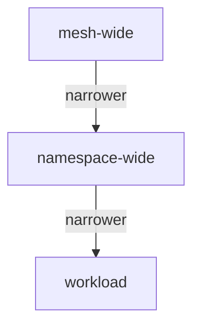

# What describe Resolves For One Workload

`istioctl x describe pod` prints one page of facts about one workload. That page is only useful if you know what question each line answers and what calculation produced it. Several lines are the result of combining objects that live at different scopes, and no single YAML file shows that result. This part explains how each object finds its target, how the objects combine, and how to read the output.

## The problem: four objects, one pod

Four Istio objects exist in the `describe-demo` namespace. Listing them does not tell you which ones reach the workload. Most commands in this module need the name of the `notification-service` pod.

<!-- astrona:playground:renew -->

Store it once in the shell you work in:

```sh
export POD=$(kubectl -n describe-demo get pod -l app=notification-service -o jsonpath='{.items[0].metadata.name}')
```

Now list the four kinds of object:

```sh
kubectl -n describe-demo get virtualservice,destinationrule,peerauthentication,authorizationpolicy
```

You should see something like:

```text
NAME                                              GATEWAYS   HOSTS                      AGE
virtualservice.networking.istio.io/notification              ["notification-service"]   5m

NAME                                               HOST                   AGE
destinationrule.networking.istio.io/notification   notification-service   5m

NAME                                          MODE     AGE
peerauthentication.security.istio.io/default  STRICT   5m

NAME                                                            AGE
authorizationpolicy.security.istio.io/notification-post-only    5m
```

There are four objects, and nothing shows which pod they apply to, in what combination, or what the combination allows. Each kind finds its targets in a different way, which is why no `kubectl` view can join them up.

## Three ways an object finds its target

This is the mechanism `describe` hides from you. If you know it, you can predict the output instead of only reading it.

| Object | Finds its target by | Applied by |
| --- | --- | --- |
| `VirtualService` | `spec.hosts`, a hostname | the **client** proxy that sends to that host |
| `DestinationRule` | `spec.host`, a hostname | the **client** proxy, on the way to that host |
| `PeerAuthentication` | `spec.selector` (pod labels) and its namespace | the **server** proxy that receives connections |
| `AuthorizationPolicy` | `spec.selector` (pod labels) and its namespace | the **server** proxy that receives requests |

Two facts follow from the table. First, the networking objects are matched by host and the security objects by pod labels. So a `VirtualService` can affect a workload that no `AuthorizationPolicy` selects, and the other way round.

Second, the two groups work at **opposite ends of the connection**. The sidecar proxy in the client pod applies the `VirtualService` and the `DestinationRule`. The sidecar proxy in the server pod enforces the `PeerAuthentication` and the `AuthorizationPolicy`. When you investigate, you must look at the right end.

## Scope precedence, and the word "effective"

`PeerAuthentication` and `AuthorizationPolicy` can be written at three scopes, and one workload can be covered at all three at once:



The diagram shows the three scopes from widest to narrowest. A mesh-wide object lives in the root namespace (`istio-system` by default) with no selector and applies to every workload. A namespace-wide object lives in the workload's namespace with no selector. A workload object has a selector that matches the pod's labels and applies to those pods only.

For `PeerAuthentication`, **the narrowest scope wins**. A workload policy overrides a namespace policy, which overrides the mesh-wide one. Overriding is not merging: the winning policy's `mtls.mode` replaces the others for that workload. A workload policy can also set `portLevelMtls`, for example `STRICT` overall and `DISABLE` on one port, which is how a health-check port gets an exception.

`AuthorizationPolicy` works differently, and mixing up the two produces confident wrong answers. All policies that select the workload **apply together**, and none overrides another. The receiving proxy checks `CUSTOM` policies first, then `DENY` policies, where any match denies the request. Then it checks `ALLOW` policies. If any `ALLOW` policy selects the workload, the request must match at least one of its rules, or the proxy denies it.

That last rule is the trap. An `ALLOW` policy does not only permit what it names. **It denies everything it does not name**, for every workload it selects. A workload that no `AuthorizationPolicy` selects accepts every request. Add one narrow `ALLOW` policy, and every request outside its rules gets `403` at once.

Both rules are calculations over several objects. In `describe` output, "effective" means the result of that calculation, which is why reading one object's YAML is not a substitute.

## Reading the output

`describe` prints its answer in sections. Each section answers one question:

| Section | The question it answers |
| --- | --- |
| `Pod` | Is this pod in the mesh, and which sidecar revision runs in it? |
| `Pod Ports` | Which ports does the container open? |
| `Service` | Which Service selects this pod, and how does its port map to the container port? |
| `Exposed on Ingress` | Does anything outside the mesh reach this workload through a gateway? |
| `RBAC policies` | Which `AuthorizationPolicy` rules select this workload? |
| `VirtualService` | Which routing rules match traffic to it, and which route applies? |
| `DestinationRule` | Which subsets and traffic policies apply to requests for it? |
| `Effective PeerAuthentication` | The mTLS mode in force after the precedence rules above |

The `x` in the command stands for `experimental`, and `istioctl experimental describe` is the long form. The command is widely used, but the prefix is still required in Istio 1.30. Ask for the summary of the `notification-service` pod:

```sh
istioctl x describe pod $POD -n describe-demo
```

You should see something like:

```text
Pod: notification-service-v1-6c9f8b7d5-x2kqp
   Pod Revision: default
   Pod Ports: 8084 (notification-service), 15090 (istio-proxy)
--------------------
Service: notification-service
   Port: http 80/HTTP targets pod port 8084
RBAC policies: ns[describe-demo]-policy[notification-post-only]-rule[0]
--------------------
Effective PeerAuthentication:
   Workload mTLS mode: STRICT
--------------------
VirtualService: notification
   Route to host "notification-service" subset "v1"
DestinationRule: notification for "notification-service"
   Matching subsets: v1
```

Read `Effective PeerAuthentication` as the result of the precedence rules, not as a copy of one `PeerAuthentication` object. Here the two agree, because only one policy exists. The `RBAC policies` line names the exact rule that applies to requests, in the `ns[...]-policy[...]-rule[N]` form Envoy uses internally. The same string appears in the proxy's `rbac` log when a rule matches, which is how you tie a live decision back to a YAML file.

## The consequence you can send a request to

The rule that an `ALLOW` policy denies everything else is not a detail. The policy here allows `POST`, so a `GET` to the same path is refused by the sidecar proxy before the application sees it. Send a `POST` and a `GET` from the `tester` pod:

```sh
kubectl -n describe-demo exec deploy/tester -- \
  curl -s -o /dev/null -w 'POST %{http_code}\n' -X POST http://notification-service/notify
kubectl -n describe-demo exec deploy/tester -- \
  curl -s -o /dev/null -w 'GET  %{http_code}\n' -X GET http://notification-service/notify
```

You should see something like:

```text
POST 200
GET  403
```

The sidecar proxy in the `notification-service` pod produced the `403`. So the application's own log is empty, and its metrics show no request. `describe` told you which policy was responsible before you sent anything, and that the policy is enforced on the receiving side.

## The warnings at the bottom

`describe` can end with warnings, and they are the most valuable part of the output because they are easy to scroll past. Two kinds come up often, and both describe configuration that is present and valid but does not do what its author meant.

**A Service port with no declared protocol.** Istio takes a port's protocol from its `name` (`http`, `http2`, `grpc`, `tcp`, `tls` and so on, optionally with a suffix such as `http-notify`) or from the `appProtocol` field. When neither is set, Istio tries to detect HTTP and HTTP/2 automatically, and treats the traffic as plain TCP when it cannot. Plain TCP traffic gets none of the HTTP features: no header routing, no retries, no HTTP metrics, and no `AuthorizationPolicy` rules on methods or paths. Naming the port makes the protocol explicit instead of a guess.

**A policy that cannot take effect.** Usually its selector matches no pod, or it targets a port the Service does not open. For an `ALLOW` policy this can fail open: a typo in a selector turns an intended restriction into no restriction at all.

Without `describe`, you find these only by noticing that something you wrote has no visible effect.

> [!TIP]
> On any "this one service behaves oddly" report, run `istioctl x describe pod` first and read it to the last line. The warnings at the bottom are often the answer.

You can now read what applies to one pod. The networking objects are applied by the client proxy and matched by host. The security objects are enforced by the server proxy and matched by labels. `PeerAuthentication` resolves narrowest first, while every `AuthorizationPolicy` that selects a workload applies together. What `describe` cannot show is why the proxy made one particular decision, for example which rule a denied request failed to match. For that, the proxy has to write its reasoning to its own log.

## Common pitfalls

> [!WARNING]
> - **Reading only the top of `describe`.** The warnings at the end, such as a port with no declared protocol or a policy whose selector matches nothing, are often the answer.
> - **Expecting `describe` to find cluster-wide problems.** It shows one pod. A namespace without its injection label does not appear; `istioctl analyze` finds that.
> - **Reading one `PeerAuthentication` object and calling it the mode.** Mesh, namespace and workload policies resolve narrowest first. Only `Effective PeerAuthentication` accounts for that.
> - **Treating `AuthorizationPolicy` like `PeerAuthentication`.** One overrides, the other adds up, and a single `ALLOW` policy denies everything it does not name.
> - **Assuming a `403` came from the application.** When a policy selects the workload, the sidecar proxy refuses the request before the container sees it.
