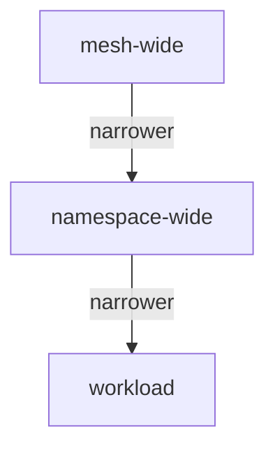

# What describe Resolves For One Workload

Astronaut, `istioctl x describe pod` prints the ship's dossier: a page of facts about one workload. The page is only useful if you know what question each line answers, and what calculation produced it. Several lines are the result of combining policies that live in different objects at different scopes. That combining is what this part is really about.

## The problem: four objects, one pod

Four Istio objects exist on the `describe-demo` planet. Listing them tells you nothing about which ones reach the workload.

### List the objects

Most commands in this module need the name of the `notification-service` pod.

<!-- astrona:playground:renew -->

Set it once in the shell you will work in:

```sh
export POD=$(kubectl -n describe-demo get pod -l app=notification-service -o jsonpath='{.items[0].metadata.name}')
```

Now list the four kinds of object:

```sh
kubectl -n describe-demo get virtualservice,destinationrule,peerauthentication,authorizationpolicy
```

You should see something like:

```text
NAME                                              GATEWAYS   HOSTS                      AGE
virtualservice.networking.istio.io/notification              ["notification-service"]   5m

NAME                                               HOST                   AGE
destinationrule.networking.istio.io/notification   notification-service   5m

NAME                                          MODE     AGE
peerauthentication.security.istio.io/default  STRICT   5m

NAME                                                            AGE
authorizationpolicy.security.istio.io/notification-post-only    5m
```

Four objects, and no sign of which pod they land on, in what combination, or what the combination allows. Each of them finds its targets in a different way, which is why no `kubectl` view can join them up.

## Three different ways an object finds its target

This is the mechanism `describe` hides from you. Knowing it lets you predict the output instead of reading it hopefully.

| Object | Finds its target by | Applies to |
| --- | --- | --- |
| `VirtualService` (the flight plan) | `spec.hosts`, a hostname | the **client** proxy sending to that host |
| `DestinationRule` (docking instructions and ship classes) | `spec.host`, a hostname | the **client** proxy, on the way to that host |
| `PeerAuthentication` (the airlock rule for the handshake) | `spec.selector`, pod labels, plus its namespace | the **server** proxy receiving connections |
| `AuthorizationPolicy` (the guard's list at the airlock) | `spec.selector`, pod labels, plus its namespace | the **server** proxy receiving requests |

Two facts follow. First, the networking pair is addressed by *host* and the security pair by *labels*. So a `VirtualService` can affect a workload that no `AuthorizationPolicy` selects, and the other way round.

Second, the two families work at **opposite ends of the connection**. The communications officer on the sending ship follows the flight plan. The communications officer on the receiving ship enforces the airlock rules. When you investigate, you must look at the right end.

## Scope precedence, and the word "effective"

`PeerAuthentication` and `AuthorizationPolicy` can be written at three scopes: for the whole fleet, for one planet, or for one ship. A workload can be covered by one of each at the same time:



The diagram shows the three scopes from widest to narrowest. A mesh-wide object lives in the root namespace (`istio-system`) with no selector and applies to every workload. A namespace-wide object lives in the workload's namespace with no selector. A workload object has a selector that matches the pod's labels and applies to those pods only.

For `PeerAuthentication`, the rule is **the narrowest wins, decided per port**:

- A workload policy overrides a namespace policy, which overrides the mesh-wide one.
- Overriding is not merging. The winning policy's `mtls.mode` replaces the others completely for that workload.
- `portLevelMtls` narrows it further. A workload policy can be `STRICT` overall and `DISABLE` on one port, which is how a health-check port gets an exception.

`AuthorizationPolicy` works differently. Keep the two apart in your head, because mixing them up produces confident wrong answers:

- All policies that select the workload **apply together**. None overrides another.
- `DENY` policies are checked first. Any match denies the request.
- Then `ALLOW` policies: if any `ALLOW` policy selects the workload, the request must match at least one of their rules, or it is denied.

That last rule is the trap. An `ALLOW` policy does not only permit what it names. **It forbids everything it does not name**, for every workload it selects. A namespace with no `AuthorizationPolicy` is fully open. Add one narrow `ALLOW` policy, and the guard turns away everyone not on the list, at once.

Both rules are calculations over several objects. "Effective" in `describe`'s output means *the result of that calculation*. That is why reading one object's YAML is not a substitute.

## Reading the output

`describe` prints its answer in sections. Learn what each section answers, then run the command on your playground.

| Section | The question it answers |
| --- | --- |
| `Pod` | Is this pod in the mesh at all, and which sidecar revision runs in it? |
| `Pod Ports` | Which ports does the container open, and did Istio work out a protocol for each? |
| `Service` | Which Service (beacon) fronts this pod, and how does its port map to the container's port? |
| `Exposed on Ingress` | Does anything outside the mesh reach this workload through a gateway? |
| `RBAC policies` | Which `AuthorizationPolicy` rules select this workload? |
| `VirtualService` | Which routing rules match traffic to it, and which route wins? |
| `DestinationRule` | Which subsets and traffic policies apply on the way in? |
| `Effective PeerAuthentication` | The mutual TLS mode in force after the precedence rules above, per port |

The `x` in the command stands for `experimental`. The command has been stable and widely used for years, but the prefix is still required. `istioctl experimental describe` is the long form.

### Resolve four objects into one answer

Ask for the dossier of the `notification-service` pod:

```sh
istioctl x describe pod $POD -n describe-demo
```

You should see something like:

```text
Pod: notification-service-v1-6c9f8b7d5-x2kqp
   Pod Revision: default
   Pod Ports: 8084 (notification-service), 15090 (istio-proxy)
--------------------
Service: notification-service
   Port: http 80/HTTP targets pod port 8084
RBAC policies: ns[describe-demo]-policy[notification-post-only]-rule[0]
--------------------
Effective PeerAuthentication:
   Workload mTLS mode: STRICT
--------------------
VirtualService: notification
   Route to host "notification-service" subset "v1"
DestinationRule: notification for "notification-service"
   Matching subsets: v1
```

Read `Effective PeerAuthentication` as the result of the precedence rules, not as a copy of the `PeerAuthentication` object. Here the two agree, because only one policy exists.

The `RBAC policies` line names the exact rule that judges your requests, in the `ns[...]-policy[...]-rule[N]` form Envoy uses inside. The same string appears in the proxy's own `rbac` log when a rule matches, which is how you tie a live decision back to a YAML file.

## The consequence you can send a request to

The rule that an `ALLOW` policy forbids the rest is not a detail. The policy here permits `POST`, so a `GET` to the same path is refused by the sidecar before the application ever sees it.

### Send the same path with two methods

Send a `POST` and a `GET` from your test ship:

```sh
kubectl -n describe-demo exec deploy/tester -- \
  curl -s -o /dev/null -w 'POST %{http_code}\n' -X POST http://notification-service/notify
kubectl -n describe-demo exec deploy/tester -- \
  curl -s -o /dev/null -w 'GET  %{http_code}\n' -X GET http://notification-service/notify
```

You should see something like:

```text
POST 200
GET  403
```

The destination's proxy produced the `403`: the guard turned the signal away at the airlock. So the application's own log is empty, and its metrics show no request. `describe` told you which policy was responsible before you sent anything. It also told you where to look next: the policy is enforced on the receiving side.

## The warnings at the bottom

`describe` can end with warnings, and they are the most valuable part of the output, partly because they are easy to scroll past. Two come up again and again. Both describe configuration that is present, valid and doing nothing.

**A Service port with no protocol.** Istio works out a port's protocol from its `name` (`http`, `http2`, `grpc`, `tcp`, `tls` and so on, optionally with a suffix like `http-notify`) or from `appProtocol`. A port named `web`, or with no name, falls back to plain TCP. At that moment every HTTP feature stops applying to it: header routing, retries, per-route timeouts, HTTP metrics, and `AuthorizationPolicy` rules written against methods or paths. The objects stay valid. They simply never match, because there is no HTTP layer for them to match on.

**A policy that cannot take effect.** Usually its selector matches no pod, or it targets a port the Service does not open. With `ALLOW` policies this is dangerous in the other direction too: a typo in a selector can turn an intended restriction into no restriction at all.

Without `describe`, you would only find these by noticing that something you wrote has no visible effect.

> [!TIP]
> On any "this one service behaves oddly" report, run `istioctl x describe pod` first and read it to the very last line. The warnings at the bottom are often the answer.

## Common pitfalls

> [!WARNING]
> - **Reading only the top of `describe`.** The warnings at the end, such as an unnamed Service port or a policy whose selector matches nothing, are usually the answer.
> - **Expecting `describe` to find cluster-wide problems.** It shows one pod. A `Gateway` nobody binds to, or a namespace missing its injection label, will not appear; `istioctl analyze` finds those.
> - **Reading one `PeerAuthentication` object and calling it the mode.** Mesh, namespace and workload policies resolve narrowest first, per port. Only `Effective PeerAuthentication` accounts for that.
> - **Treating `AuthorizationPolicy` like `PeerAuthentication`.** One overrides, the other adds up, and a single `ALLOW` policy denies everything it does not name.
> - **Assuming a `403` came from the application.** When a policy selects the workload, the sidecar refuses the request before the container sees it.

> *"Effective" is a calculation, not a field: it is what several objects at several scopes add up to for this one pod.*
