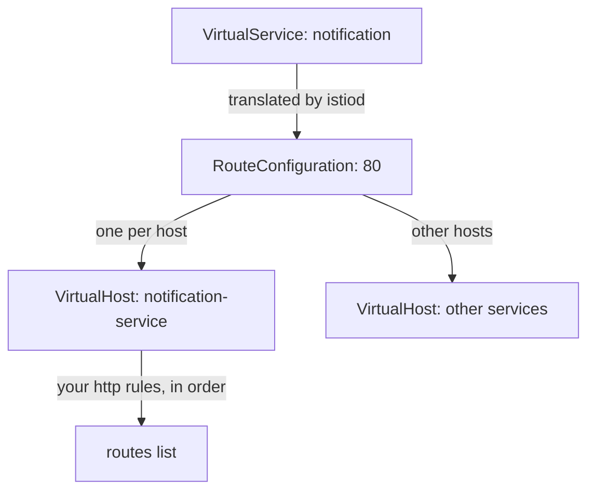
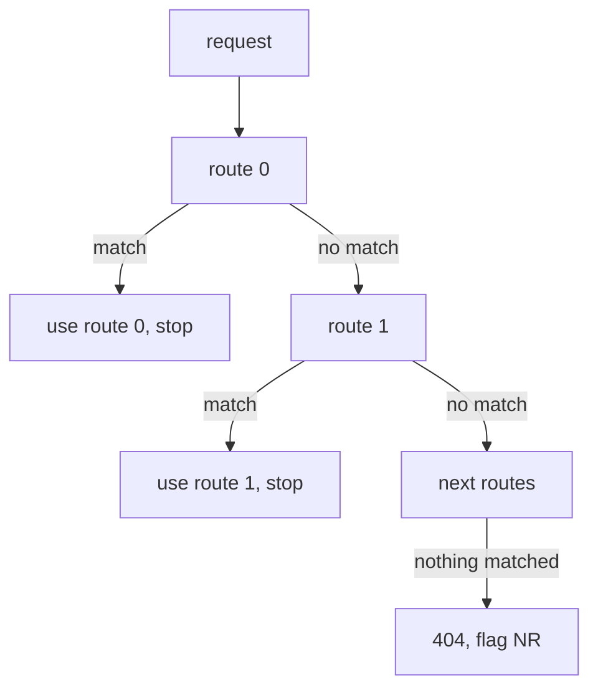

# How A VirtualService Becomes A Route Table

Astronaut, a `VirtualService` (the flight plan for a beacon) is never run as it is. `istiod`, mission control, **translates** it into a data structure that the sidecar proxy, Envoy, checks for every signal. That structure has fixed rules, and your YAML follows them whether you know them or not. This part follows the translation, then uses it to explain why a rule you wrote correctly can never run.

## The symptom to keep in mind

The plan for this planet is easy to say: a request carrying the header `testing: true` should reach `v2`, and everything else should reach `v1`. Someone wrote exactly that, and it does not happen.

<!-- astrona:playground:renew -->

### See it in your playground

Send one request with the header and one without, from your test ship:

```sh
kubectl -n conflict-demo exec deploy/tester -- sh -c \
  'curl -s -X POST -H "testing: true" http://notification-service/notify; echo'
kubectl -n conflict-demo exec deploy/tester -- sh -c \
  'curl -s -X POST http://notification-service/notify; echo'
```

You should see something like:

```text
["EMAIL"]
["EMAIL"]
```

Both requests reached `v1`. The header made no difference at all, and that is itself a clue. A rule that *partly* works points at a matching bug, such as a wrong header name or a `prefix` where you wanted `exact`. A rule with no effect at all points at a rule that was never checked.

## The translation

`istiod` turns your object into Envoy's routing structures. They are nested three levels deep:



The diagram shows that one route configuration per port holds one virtual host per destination host, and each virtual host holds your rules as an ordered list. The virtual host's `domains` list holds every name the beacon answers to: `notification-service`, `notification-service.conflict-demo`, `notification-service.conflict-demo.svc.cluster.local`, and the Service's cluster IP address (for example `10.96.44.31`).

Three facts in that picture matter later:

- **The route configuration is named after the port,** not the service. That is why you ask a proxy for it with `--name 80`.
- **The virtual host is picked by the request's `Host` header,** matched against `domains`. It is not picked by the address you connected to. That is why changing `Host` can make a request miss every route.
- **`routes` is an ordered list,** and its order is the order of your `http:` list. Nothing sorts it by how specific a rule is.

## How each request is checked

For each request, the sending ship's proxy walks the chosen virtual host's routes from the first one down. This is the flight plan's checklist, read top to bottom.

### First match wins

The proxy stops at the first route whose `match` fits:



The diagram shows that evaluation stops at the first match, and a request that matches nothing gets a `404` with the response flag `NR` (no route). There is no "best match", no scoring by how specific a rule is, and no going on after a match. A routing table is an `if` / `else if` chain, not a set of rules weighed together.

### A rule with no match is always true

The second half of the mechanism is what makes it bite. A rule with **no `match` block** becomes a route with a prefix match on `/`, which is true for every HTTP request. It is not a fallback and it is not marked as a default. It is simply a condition that always holds:

```text
http:
  - route: → v1              ← no match: compiles to prefix "/" — always true
  - match: headers.testing   ← index 1, never reached
    route: → v2
```

Everything below an unconditional rule can never be reached. Envoy does not warn you, `istioctl analyze` does not flag it as an error, and the object stays valid. In a programming language, your compiler would call this dead code. Here it is configuration that is accepted without a word.

### Read the order the author wrote

Print the `spec` of the `notification` flight plan:

```sh
kubectl -n conflict-demo get virtualservice notification -o yaml | sed -n '/^spec:/,$p'
```

You should see something like:

```text
spec:
  hosts:
  - notification-service
  http:
  - route:
    - destination:
        host: notification-service
        subset: v1
  - match:
    - headers:
        testing:
          exact: "true"
    route:
    - destination:
        host: notification-service
        subset: v2
```

The catch-all is at index 0 and the header rule at index 1. Each rule on its own is correct, which is exactly why this passes a review. The fault is not in either rule. It is in their order, which belongs to the list, not to anything you can point at alone.

## What counts as a match

Knowing what "a match" means prevents the neighbouring mistake, where a rule can be reached and still never fires.

Inside one `match` entry, **all** conditions must hold: `uri` *and* `headers` *and* `method`. Between entries in the `match` **list**, any one entry is enough. Here is an example (for reading only, not to apply):

```yaml
- match:
    - uri: { prefix: /api }      # entry 1:  (uri prefix /api)
      headers:
        testing: { exact: "true" }  #          AND header testing=true
    - uri: { prefix: /admin }    # entry 2:  OR (uri prefix /admin)
  route: ...
```

Text conditions come in three forms: `exact`, `prefix` and `regex`. Header **values** are matched with these forms. Header **names** are matched as written, without caring about upper or lower case. A common near-miss is writing `exact: true` (a YAML true/false value) when the header value is the text `"true"`. The quotes are not optional.

## The rule that follows

Order your rules **most specific first, unconditional last**. That one sentence is this whole part, put to work. It is the same discipline as an `if` / `else if` / `else` chain, which fails in exactly the same way when the `else` moves to the top.

If you want two unconditional rules, you have written one rule and one piece of dead configuration.

> [!TIP]
> When a routing rule has no effect at all, look for a rule above it with no `match` before you look at the match itself.

## Common pitfalls

> [!WARNING]
> - **Putting the default route first.** A rule with no `match` is unconditional, not a fallback. Everything below it can never be reached, and nothing reports it.
> - **Expecting the most specific rule to win.** Envoy does not rank routes. The order in the list decides.
> - **Writing `exact: true` without quotes.** That is a true/false value, not the text `"true"`, and the header will not match.
> - **Assuming routing follows the address you dialled.** The virtual host is chosen by the `Host` header against `domains`. A changed `Host` lands you somewhere else, or nowhere.
> - **Reading a partial failure and a total failure the same way.** Partial means the match is wrong. Total usually means the rule is never reached.

> *A VirtualService compiles to an ordered list, and an unconditional rule is not a default: it is a wall.*
