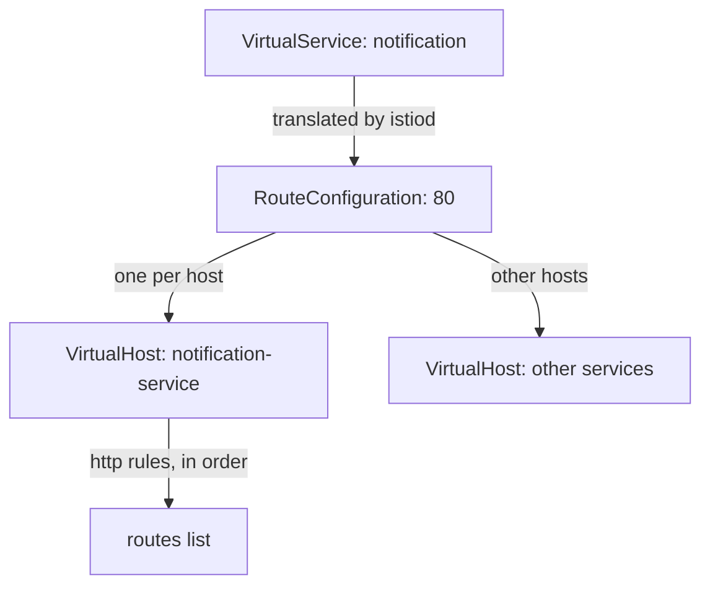
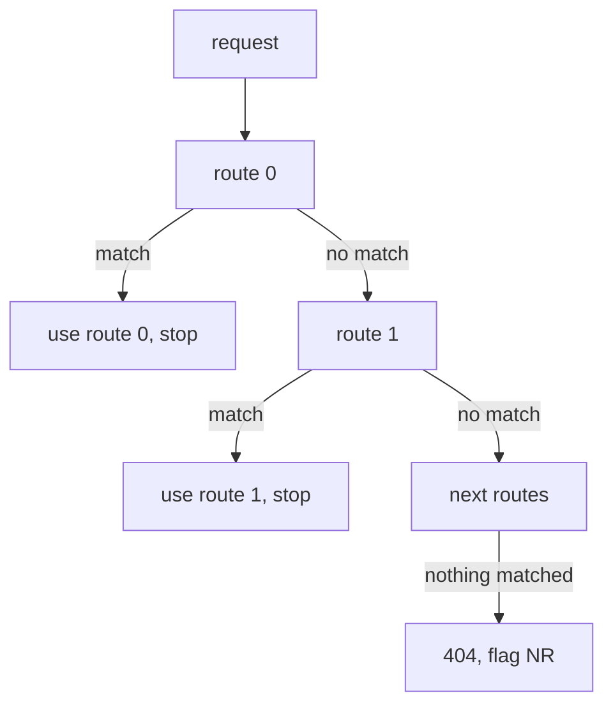

# How A VirtualService Becomes A Route Table

A `VirtualService` is never run as it is written. `istiod`, Istio's control plane, **translates** it into Envoy route configuration, and the sidecar proxy checks that configuration for every request. The translation follows fixed rules, and your YAML follows them whether you know them or not. This part follows the translation, then uses it to explain why a rule you wrote correctly can never run.

## The symptom to keep in mind

The routing plan for this namespace is easy to state: a request that carries the header `testing: true` should reach `v2`, and every other request should reach `v1`. Someone wrote exactly that, and it does not happen.

<!-- astrona:playground:renew -->

Send one request with the header and one without, from the `tester` pod to the `notification-service` Service:

```sh
kubectl -n conflict-demo exec deploy/tester -- sh -c \
  'curl -s -X POST -H "testing: true" http://notification-service/notify; echo'
kubectl -n conflict-demo exec deploy/tester -- sh -c \
  'curl -s -X POST http://notification-service/notify; echo'
```

You should see something like:

```text
["EMAIL"]
["EMAIL"]
```

Both requests reached `v1`. The header made no difference at all, and that is a clue in itself. A rule that *partly* works points at a matching bug, such as a wrong header name or a `prefix` where you wanted `exact`. A rule with no effect at all points at a rule that is never checked. This namespace has two separate reasons for that, and this part explains the first one.

## The translation

`istiod` turns your object into Envoy's routing structures, which are nested three levels deep:



The diagram shows one route configuration per port, holding one virtual host per destination host, and each virtual host holding your rules as an ordered list. The virtual host's `domains` list holds every name the Service answers to: `notification-service`, `notification-service.conflict-demo`, `notification-service.conflict-demo.svc.cluster.local`, and the Service's cluster IP address (for example `10.96.44.31`).

Three facts in that picture matter later. First, **the route configuration is named after the port**, not the service, which is why you ask a proxy for it with `--name 80`. Second, **the proxy picks the virtual host by the request's `Host` header**, matched against `domains`, not by the address it connected to. A changed `Host` header can make a request miss every route. Third, **`routes` is an ordered list**, in the order of your `http:` list. Nothing sorts it by how specific a rule is.

## How each request is checked

For each request, the proxy of the pod that sends it walks the routes of the chosen virtual host from the first one down. It stops at the first route whose `match` fits:



The diagram shows that the check stops at the first match, and that a request that matches nothing gets a `404` with the response flag `NR` (no route). There is no "best match", no scoring by how specific a rule is, and no going on after a match. A routing table works like an `if` / `else if` chain, not like a set of rules weighed together.

The second half of the mechanism is what makes this dangerous. A rule with **no `match` block** becomes a route with a prefix match on `/`, which is true for every HTTP request. It is not a fallback, and nothing marks it as a default. It is simply a condition that always holds:

```text
http:
  - route: → v1              ← no match: compiles to prefix "/" — always true
  - match: headers.testing   ← index 1, never reached
    route: → v2
```

Every rule below an unconditional rule is shadowed: it can never be reached. The object stays valid, and Envoy serves it without an error. Istio only notices it in two quiet places. When you apply the object, the validating webhook prints a line that starts with `Warning: virtualService rule #1 not used`, which is easy to miss because the apply still succeeds. And `istioctl analyze` reports it as `Warning [IST0130]`, where rule `#1` is the second rule, because the count starts at `0`. Print the `spec` of the `notification` `VirtualService` to see the order its author wrote:

```sh
kubectl -n conflict-demo get virtualservice notification -o yaml | sed -n '/^spec:/,$p'
```

You should see something like:

```text
spec:
  hosts:
  - notification-service
  http:
  - route:
    - destination:
        host: notification-service
        subset: v1
  - match:
    - headers:
        testing:
          exact: "true"
    route:
    - destination:
        host: notification-service
        subset: v2
```

The catch-all rule is at index 0 and the header rule at index 1. Each rule on its own is correct, which is why this passes a code review. The fault is not in either rule. It is in their order, which belongs to the list and not to any one rule.

## What counts as a match

Knowing what "a match" means prevents the next mistake, where a rule can be reached and still never fires. Inside one `match` entry, **all** conditions must hold: `uri` *and* `headers` *and* `method`. Between entries in the `match` **list**, any one entry is enough. The example below shows both; it is only an illustration, not something to apply:

```yaml
- match:
    - uri: { prefix: /api }      # entry 1:  (uri prefix /api)
      headers:
        testing: { exact: "true" }  #          AND header testing=true
    - uri: { prefix: /admin }    # entry 2:  OR (uri prefix /admin)
  route: ...
```

Text conditions come in three forms: `exact`, `prefix` and `regex`. Header **values** are case-sensitive. Header **names** in a `VirtualService` must be written in lower case, with hyphens as separators, for example `x-request-id`. One more detail catches many people: the value must be a quoted string. Written as `exact: true` without quotes, YAML reads a boolean, and the API server rejects the object at schema validation, because the CRD (CustomResourceDefinition, the schema Istio installs for its resources) expects a string there.

All of this leads to one rule: order your rules **most specific first, unconditional last**. It is the same discipline as an `if` / `else if` / `else` chain, which fails in exactly the same way when the `else` moves to the top. If you want two unconditional rules, you have written one rule and one piece of dead configuration.

> [!TIP]
> When a routing rule has no effect at all, look for a rule above it with no `match` before you look at the match itself.

You now know how `istiod` turns a `VirtualService` into an ordered route list, and why a rule with no `match` shadows every rule below it. Reordering the rules in this namespace is still not enough, though. A second `VirtualService` claims the same host, and that changes which rules the proxy uses at all.

## Common pitfalls

> [!WARNING]
> - **Putting the default route first.** A rule with no `match` is unconditional, not a fallback. Every rule below it is shadowed, and the only signs are a `Warning` line from `kubectl apply` and `IST0130` from `istioctl analyze`.
> - **Expecting the most specific rule to win.** Envoy does not rank routes. The order in the list decides.
> - **Writing a header name in capitals, or a value without quotes.** Header names must be lower case, and `exact: true` without quotes is a boolean that the API server rejects.
> - **Assuming routing follows the address you connected to.** The proxy chooses the virtual host by the `Host` header. A changed `Host` lands the request somewhere else, or nowhere.
> - **Reading a partial failure and a total failure the same way.** Partial means the match is wrong. Total usually means the rule is never reached.
