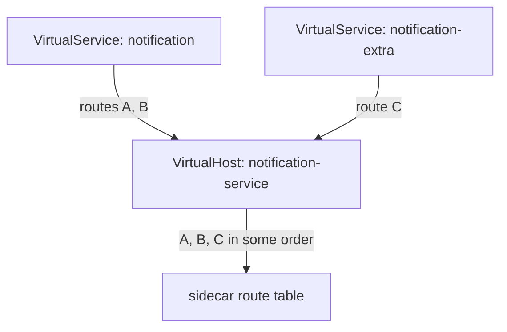
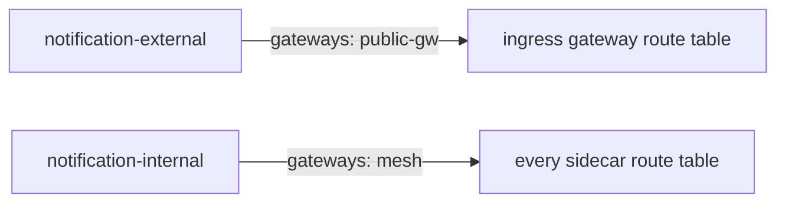

# One Host, Two Owners

Astronaut, a `VirtualService` (a flight plan for a beacon) becomes one ordered list of routes inside one virtual host, and the sidecar proxy follows the first route that fits. This part asks the next question: what happens when **two** flight plans want to fill the same list? The answer is not "the newer one wins", and it is not "Istio rejects one". It is worse than either, and knowing why stops you from writing it.

## Fixing the order would not be enough

Before going further, check that this planet has a second problem. One command does it, and it is worth making a habit.

<!-- astrona:playground:renew -->

### Find a host with two claimants

List every `VirtualService` in the namespace with the hosts it claims and the gateways it is bound to:

```sh
kubectl -n conflict-demo get virtualservice \
  -o custom-columns='NAME:.metadata.name,HOSTS:.spec.hosts,GATEWAYS:.spec.gateways'
```

You should see something like:

```text
NAME                  HOSTS                      GATEWAYS
notification          [notification-service]     <none>
notification-extra    [notification-service]     <none>
```

Two objects, one host, and neither is bound to a gateway. So both apply to traffic inside the mesh, and both describe the same virtual host. Run this in any namespace where routing behaves inconsistently, before you read a line of either object. The `GATEWAYS` column matters too, for a reason the end of this part explains.

## What Istio does with two claimants

`istiod`, mission control, does not reject either object, and it does not pick a winner. It **merges** them into the single virtual host the proxy can hold, by joining their route lists.



The diagram shows two flight plans poured into one checklist. All the routes arrive. What you do not control is their order, and the order is the whole meaning, because the first match wins. A configuration whose meaning depends on an order nobody chose is not "slightly risky". Its behaviour is simply not decided by what you wrote.

The practical results are what make this worth a part of its own:

- **It works.** Traffic flows, requests get answers, nothing errors. There is no outage to investigate.
- **It is stable until it is not.** The order holds until one of the objects is edited, created again, or synced again. Then it may change.
- **The change that breaks it need not touch the object that breaks.** Someone edits `notification-extra`, and the behaviour of `notification` changes. There is no trail from cause to effect.
- **It passes every test you would think to run.** A test suite written after the merge settled treats the current order as the expected behaviour.

Istio's own documentation calls the outcome for conflicting hosts undefined. The practical rule is absolute: **exactly one `VirtualService` per host, per gateway scope.**

## What the analyzer says, and how loudly

`istioctl analyze` is the pre-flight inspector: it reads every object together and reports problems with a code, a severity and the object it blames. This is a case where the severity can fool you.

### Ask the analyzer

Run the analyzer on the planet:

```sh
istioctl analyze -n conflict-demo
```

You should see something like:

```text
Warning [IST0109] (VirtualService notification-extra.conflict-demo) The VirtualServices notification-extra.conflict-demo, notification.conflict-demo associated with mesh gateway define the same host notification-service which can lead to undefined behavior. This can be fixed by merging the conflicting VirtualServices into a single resource.
```

It is a `Warning`, not an `Error`: nothing here is invalid, and Istio will serve this configuration forever. Two phrases in the message are exact. **`associated with mesh gateway`** names the scope where the conflict lives. **`undefined behavior`** is a statement about the result not being decided, not a hedge. The suggested fix, merging into one object, is the only correct one.

The message also tells you how the problem was found. The analyzer compared two objects. The Kubernetes API server checks each object on its own when you apply it, like a registry clerk who never compares one form with another, so both objects passed. Only a tool that reads the whole set can see the clash.

## Scope: gateways are what make two objects legitimate

The phrase `associated with mesh gateway` points at the real ownership rule. A `VirtualService` applies within a **gateway scope**, set by `spec.gateways`:

| `spec.gateways` | Scope |
| --- | --- |
| omitted | `mesh`, the default: applies to sidecars inside the mesh |
| `["mesh"]` | the same, written out |
| `["my-gateway"]` | only traffic arriving through that `Gateway` (the spaceport arrival gate) |
| `["mesh", "my-gateway"]` | both |

Two objects that claim one host **in different scopes are not in conflict**. They describe different virtual hosts, in different proxies' route configurations. That is the intended design when traffic from outside the solar system needs different routing from traffic inside it:



The diagram shows two objects for one host that never meet, because each lands in a different proxy. So "one object per host" is shorthand. The exact rule is **one object per host per scope**. Splitting by gateway binding is the legitimate way to have two, but a `VirtualService` that lists both `mesh` and a gateway brings the overlap straight back.

## The merge does have documented rules: do not rely on them

Istio does define merge behaviour in a few cases. For services bound to a gateway, a `VirtualService` without a rule for the root path can be merged with others. And delegation, through `spec.http[].delegate`, is an explicit, ordered way to combine objects.

Delegation is the supported answer when several teams really need to own parts of one host's routing. A root `VirtualService` owns the host and hands path prefixes to other objects by name. The combination is then written down, not guessed.

What you should not do is rely on the *accidental* merge of two independent objects that happen to name the same host. That is the difference between a planned combination and a collision.

## Common pitfalls

> [!WARNING]
> - **Splitting one host across two `VirtualService` objects in the same scope.** Istio merges them and you do not control the order. Merge them into one, or separate them by gateway binding.
> - **Ignoring `IST0109` because it is only a Warning.** Valid configuration with undefined behaviour is the worst mix: it passes every test you write.
> - **Assuming the newer object wins.** Nothing in Istio says so. Neither does creation time, name order or file order in your repository.
> - **Believing a conflict is solved because the symptom moved.** Editing either object can reshuffle the merge. A symptom that moves without a deliberate fix is still undefined behaviour.
> - **Listing both `mesh` and a gateway in `spec.gateways` on two objects.** The scopes overlap again, and you are back where you started.
> - **Using delegation to hide a collision.** Delegation is for planned combination. If two teams collide, decide who owns the host first.

> *One host, one VirtualService, per gateway scope: anything else hands the order to something you do not control.*
