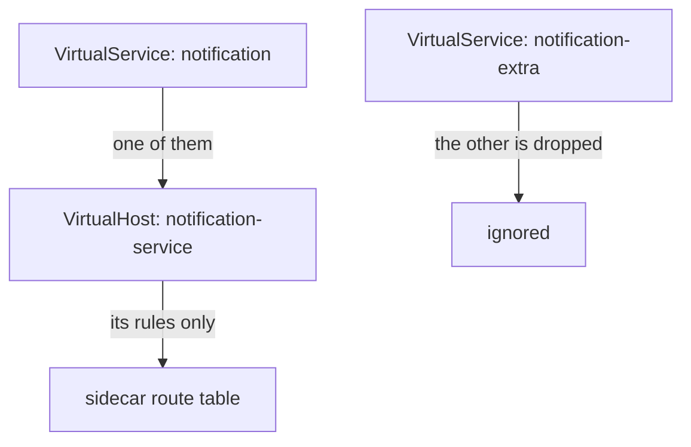
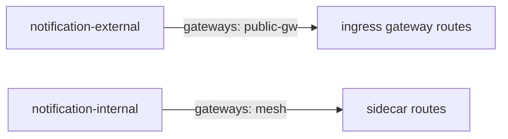

# One Host, Two Owners

A `VirtualService` becomes one ordered list of routes inside one virtual host, and the sidecar proxy follows the first route that fits. This part asks the next question: what happens when **two** `VirtualService` objects claim the same host? The answer is not "the newer one wins", and it is not "Istio rejects one". Knowing what really happens stops you from writing it, and tells you where to look when you meet it.

## Find a host with two owners

Before you change any rule order, check whether more than one object claims the host. One command does it, and it is worth making a habit. It lists every `VirtualService` in the namespace with the hosts it claims and the gateways it is bound to.

<!-- astrona:playground:renew -->

```sh
kubectl -n conflict-demo get virtualservice \
  -o custom-columns='NAME:.metadata.name,HOSTS:.spec.hosts,GATEWAYS:.spec.gateways'
```

You should see something like:

```text
NAME                 HOSTS                    GATEWAYS
notification         [notification-service]   <none>
notification-extra   [notification-service]   <none>
```

Two objects claim one host, and neither is bound to a gateway. So both apply to traffic inside the mesh, and both describe the same virtual host. Run this command in any namespace where routing behaves inconsistently, before you read a line of either object. The `GATEWAYS` column matters too, for a reason the end of this part explains.

## What Istio does with two owners

`istiod` does not reject either object. For the sidecar proxies, it also does not merge them: **host merging is not supported in sidecars**. While `istiod` builds a proxy's route configuration, the first object that claims the host creates the virtual host. Every later object for the same host is dropped for that host, and `istiod` only records it in its `pilot_vservice_dup_domain` metric.



The diagram shows two objects for one host, where only one reaches the proxy's route table. Which one wins depends on the internal order in which `istiod` processes objects, not on anything in your YAML. Istio does not promise any order, so its analyzer calls the result undefined behavior.

The practical results are what make this worth a part of its own:

- **It works.** Requests get answers and nothing reports an error, so there is no outage to investigate.
- **Whole rules disappear.** Every rule in the losing object is gone, however correct it is.
- **The change that breaks it need not touch the object that breaks.** Someone deletes or recreates `notification-extra`, and the behaviour of `notification` changes.
- **It passes every test you would think to run.** A test written after the winner settled treats the current result as the expected behaviour.

The practical rule is absolute: **exactly one `VirtualService` per host, per gateway scope.**

## What the analyzer says

`istioctl analyze` reads every Istio object together and reports each problem with a severity, an `IST####` code and the object it blames. Run it on the namespace:

```sh
istioctl analyze -n conflict-demo
```

You should see something like:

```text
Error [IST0109] (VirtualService conflict-demo/notification-extra) The VirtualServices conflict-demo/notification,conflict-demo/notification-extra associated with mesh gateway define the same host */notification-service.conflict-demo.svc.cluster.local which can lead to undefined behavior. This can be fixed by merging the conflicting VirtualServices into a single resource.
Error [IST0109] (VirtualService conflict-demo/notification) The VirtualServices conflict-demo/notification,conflict-demo/notification-extra associated with mesh gateway define the same host */notification-service.conflict-demo.svc.cluster.local which can lead to undefined behavior. This can be fixed by merging the conflicting VirtualServices into a single resource.
Warning [IST0130] (VirtualService conflict-demo/notification) VirtualService rule #1 not used (route without matches defined before).
Error: Analyzers found issues when analyzing namespace: conflict-demo.
See https://istio.io/v1.30/docs/reference/config/analysis for more information about causes and resolutions.
```

The analyzer prints the `IST0109` message twice, once on each object that claims the host, and it names each object as `<namespace>/<name>`. The third line, `IST0130`, is the shadowed rule inside `notification`; this part is about the first problem.

`IST0109` is an `Error`, and yet `kubectl apply` accepted both objects and Istio serves them. Two phrases in the message are exact. **`associated with mesh gateway`** names the scope where the conflict lives. **`undefined behavior`** says the result is not decided by the configuration. The suggested fix, merging the rules into one object, is the correct one.

The message also shows how the problem was found. The analyzer compared two objects. The API server checks each object on its own when you apply it, so both objects passed. Only a tool that reads the whole configuration set can see the clash.

## Gateway scope decides whether two objects conflict

The phrase `associated with mesh gateway` points at the real ownership rule. A `VirtualService` applies within a **gateway scope**, set by `spec.gateways`. An ingress gateway is an Envoy proxy at the edge of the mesh that accepts traffic from outside the cluster; a `Gateway` object configures it. The special name `mesh` means all the sidecar proxies inside the mesh:

| `spec.gateways` | Scope |
| --- | --- |
| omitted | `mesh`, the default: applies to the sidecar proxies inside the mesh |
| `["mesh"]` | the same, written out |
| `["my-gateway"]` | only traffic arriving through that `Gateway` |
| `["mesh", "my-gateway"]` | both |

Two objects that claim one host **in different scopes do not conflict**. They describe different virtual hosts, in the route configurations of different proxies. That is the intended design when traffic from outside the cluster needs different routing from traffic inside it:



The diagram shows two objects for one host that never meet, because each one reaches a different proxy. So "one object per host" is shorthand, and the exact rule is **one object per host per scope**. A `VirtualService` that lists both `mesh` and a gateway brings the overlap straight back.

## Planned ways to split routing

Istio does support splitting one host's routing across objects in two cases, and both are written down rather than left to chance. For objects bound to a **gateway**, `istiod` merges the route rules of several objects for the same host. Catch-all rules move to the end of the merged list, and the first catch-all applied overrides the others. This merge works only for gateways, never for sidecars.

The other case is **delegation**, through `spec.http[].delegate`. A root `VirtualService` owns the host and hands named parts of its routing, such as path prefixes, to other `VirtualService` objects. This is the supported answer when several teams really need to own parts of one host's routing, because the combination is explicit and ordered.

You now know that two `VirtualService` objects for one host in the mesh scope are not merged: the proxy uses one of them and drops the other, and `istioctl analyze` reports it as `IST0109`. You also know that different gateway scopes, gateway merging and delegation are the planned ways to split routing. What is still open is proof. You have the analyzer's message, but not yet the route table the proxy actually holds.

## Common pitfalls

> [!WARNING]
> - **Splitting one host across two `VirtualService` objects in the mesh scope.** The sidecar proxy uses only one of them. Merge the rules into one object, or separate the objects by gateway binding.
> - **Expecting Istio to merge the rules for sidecars.** Host merging works only for objects bound to a gateway.
> - **Assuming the newer object wins.** Nothing in the API says so. Neither does the name or the order of files in your repository.
> - **Believing a conflict is solved because the symptom moved.** Deleting or recreating either object can change which one wins. A symptom that moves without a deliberate fix is still undefined behavior.
> - **Listing both `mesh` and a gateway in `spec.gateways` on two objects.** The scopes overlap again, and you are back where you started.
