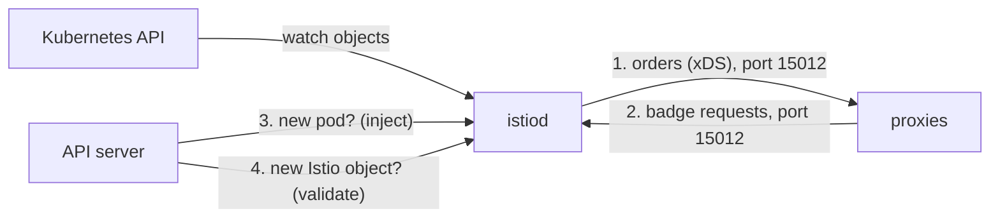

# Four Jobs In One Process

Astronaut, `istiod` is mission control for the mesh. It is one program in one Deployment, so it is tempting to think of it as one thing that is either up or down. It is far more useful to think of it as four services that happen to share one process. They fail on their own, and each failure leaves a different trail.

## The four jobs

`istiod` does four jobs. Two of them talk to the proxies, and two of them talk to the Kubernetes API server (the registry office where every object is filed).



The diagram shows who starts each conversation: the proxies call `istiod` for jobs 1 and 2, and the API server calls `istiod` for jobs 3 and 4.

Here is what each job does:

1. **xDS server.** xDS (the "x Discovery Service" family) is the protocol `istiod` uses to send each communications officer (sidecar proxy) its orders. `istiod` turns your Istio objects into proxy configuration and sends it over port `15012`.
2. **Certificate authority.** This is the badge office. It signs each workload's certificate (its ID badge), over the same port `15012`. The proxy proves who it is with its service account.
3. **Injection webhook.** A webhook is a call the API server makes to another program while it handles a request. This one is the launch-pad crew: it adds the `istio-proxy` container to new pods, on port `15017`.
4. **Validation webhook.** This is the registry clerk. It rejects Istio objects that are clearly invalid, also on port `15017`.

Look at which way each arrow points. Jobs 1 and 2 are **pull**: each proxy calls out to `istiod` and keeps a long-lived connection open. Jobs 3 and 4 are **push**: the API server calls `istiod` and waits for an answer, while your write request is on hold.

That difference is why the failures look so different. A proxy that cannot reach `istiod` keeps the orders it has and carries on. An API server that cannot reach `istiod` has a request waiting, and has to decide what to do with it.

## How each failure looks from the outside

Each job fails in its own way. Learn the four pictures, and you can tell from the symptom which job is in trouble.

### The four failure pictures

| Job | What it does | How the mesh degrades without it |
| --- | --- | --- |
| **xDS server** | Sends routing, policy and endpoints to every proxy | Running proxies keep their last orders and serve traffic normally. No configuration change takes effect. New pods never become ready. |
| **Certificate authority** | Issues and renews workload certificates | Nothing at first. Certificates usually last about 24 hours, so a long outage eventually breaks mutual TLS everywhere at once. |
| **Injection webhook** | Adds the sidecar to new pods | Depends on `failurePolicy`: `Fail` (the Istio default) blocks pod creation; `Ignore` lets pods start with **no sidecar**, quietly outside the mesh. |
| **Validation webhook** | Rejects invalid Istio objects when you apply them | Invalid configuration starts being *accepted* by the API server, then refused later when `istiod` tries to send it. |

### Read the table backwards

When you are on call, you start from the symptom. Read the table from right to left:

- *"New pods stay unready, but existing traffic is fine"* points at job 1.
- *"Everything broke at once, about a day after that incident"* points at job 2.
- *"Half our pods have no sidecar"* points at job 3 with `failurePolicy: Ignore`.
- *"Pods will not start, and there are webhook errors in the events"* points at job 3 with `failurePolicy: Fail`.
- *"I applied it, it exists, and nothing happened"* points at job 4: configuration that was stored but never sent.

## Why traffic survives at all

The most misleading thing about a control plane outage is that signals keep flowing. Two separate stores of information inside each proxy keep the ship flying.

**The orders.** Each proxy holds its complete configuration in memory. The xDS connection is a stream: `istiod` sends updates, the proxy confirms them and keeps them. When the stream drops, nothing is thrown away. The proxy simply stops getting changes, and it keeps routing signals with orders that may be hours old.

**The badge.** Each proxy holds its workload certificate and the mesh's root certificate. The mutual TLS (mTLS) handshake, the secret handshake where both ships show their badges, happens between two proxies, using badges they already carry. `istiod` signed those badges and is not asked again until renewal.

So a mesh without mission control is frozen in time. It works fully, and it cannot change at all.

## The certificate clock

The badge office is the job that turns a survivable outage into a total one. It does this on a timer, not on an event.

Workload certificates are short-lived on purpose, often about 24 hours, and you can change that. The agent next to each proxy renews the badge well before it expires, usually at about half of its lifetime. Renewal needs `istiod`.

| Time after the outage starts | What happens |
| --- | --- |
| `t=0` | The outage begins. Traffic is normal. Nobody notices. |
| `t≈12h` | The first renewals are due. They fail and are retried. Existing certificates are still valid. |
| `t≈24h` | Certificates expire. mTLS handshakes fail across the mesh, at roughly the same moment. |

Two things make this dangerous. First, the failure arrives long after its cause, so people suspect whatever changed at hour 24, not the control plane that went away yesterday. Second, it arrives everywhere at once, because badges issued around the same time expire around the same time. The mesh does not slowly get worse; it falls over.

In space terms: the badge office at mission control closes in the morning. All day, every ship keeps docking with the badges it has. The next morning, every badge has expired, and no ship can prove who it is. An expired badge does not just deny access; it makes the ship unknown to the other ships.

## Establishing a baseline

You cannot call a control plane unhealthy until you know what healthy looks like on this cluster. Check three facts, in order: is it ready, how often has it restarted, and how long has it been up.

<!-- astrona:playground:renew -->

### See the control plane's baseline

List the `istiod` pod and the Deployment's ready count:

```sh
kubectl -n istio-system get pods -l app=istiod
kubectl -n istio-system get deploy istiod \
  -o jsonpath='{.status.readyReplicas}/{.status.replicas}{"\n"}'
```

You should see something like:

```text
NAME                      READY   STATUS    RESTARTS   AGE
istiod-7d4c9b8f4-k2m8x    1/1     Running   0          12m
1/1
```

`1/1`, `Running` and `RESTARTS 0` is the baseline for this playground. Write down the restart count. On a real cluster it quietly tells you whether the control plane has been stable, and it is the field people never check.

### More than one replica

Production installs run `istiod` with more than one replica, and the four jobs behave differently when only one replica fails. The webhooks sit behind a Service, so they survive losing one pod. Each proxy, however, holds its stream to **one** specific `istiod` pod, and moves to another when that pod goes away.

So a rolling restart of `istiod` causes a short burst of reconnections, not an outage. That is also why `istioctl proxy-status` has a column, `ISTIOD`, that names which `istiod` pod serves each proxy.

> [!TIP]
> When traffic looks fine but you suspect the control plane, test **change**, not traffic. Make a small configuration change, or restart one pod, and see whether it takes effect.

## Common pitfalls

> [!WARNING]
> - **Deciding the control plane is fine because traffic is flowing.** Proxies serve from stored orders and badges they already have. Working traffic proves nothing about `istiod`.
> - **Forgetting the certificate clock.** An outage longer than the certificate lifetime breaks mTLS across the mesh at once, long after the incident that caused it.
> - **Treating `istiod` as one thing.** Injection can be broken while xDS is fine, and the other way round. Find the job before you fix it.
> - **Assuming more replicas means no single point of failure for a proxy.** Each proxy is attached to one `istiod` pod at a time.

> *A mesh without mission control is frozen, not broken, and the freeze ends when the badges expire.*
