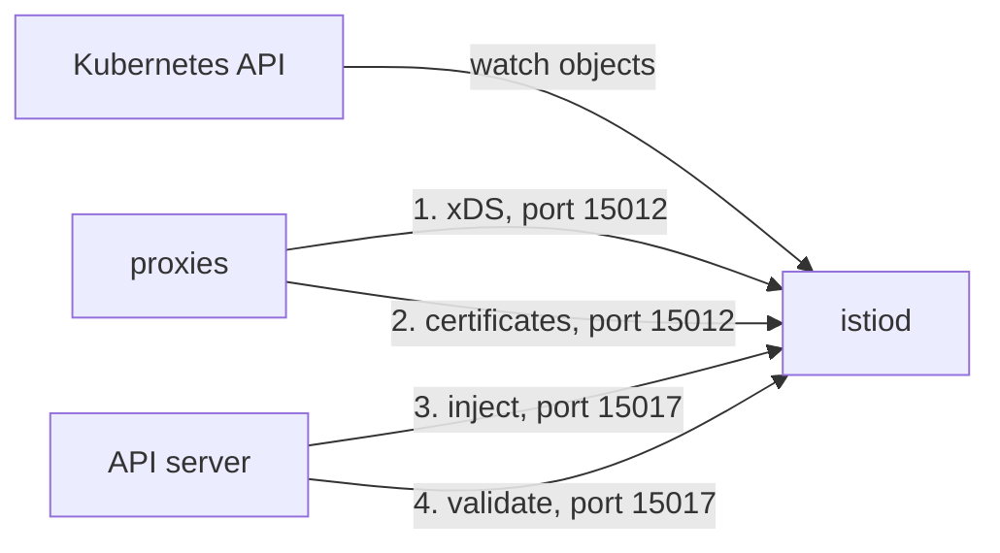

# Four Jobs In One Process

`istiod` is one program in one Deployment, so it is tempting to think of it as one thing that is either up or down. It is far more useful to think of it as four services that share one process. They fail on their own, and each failure leaves a different trail. This part names the four jobs, shows how the mesh degrades when each one stops, and explains why traffic keeps flowing during an outage.

## The four jobs

`istiod` does four jobs. Two of them serve the sidecar proxies, and two of them serve the Kubernetes API server, the component that accepts every write to the cluster.



The diagram shows who starts each connection: the proxies call `istiod` for jobs 1 and 2, and the API server calls `istiod` for jobs 3 and 4.

Each job has a clear task:

1. **xDS server.** xDS is the family of discovery protocols `istiod` uses to push configuration to proxies while they run. `istiod` turns your Istio objects into Envoy configuration and sends it over port `15012`.
2. **Certificate authority (CA).** `istiod` signs each workload's certificate, also over port `15012`. The istio-agent next to each proxy asks for the certificate and proves the pod's identity with its service account token.
3. **Injection webhook.** A webhook is a service the API server calls while it handles a write. The mutating admission webhook `sidecar-injector.istio.io` adds the `istio-proxy` container to new pods. `istiod` serves it on port `15017`.
4. **Validation webhook.** The validating admission webhook `validation.istio.io` rejects Istio objects that are clearly invalid when you apply them. It is also served on port `15017`.

Look at the direction of each connection. Jobs 1 and 2 are started by the proxy: each proxy opens a long-lived connection to `istiod` and keeps it open. Jobs 3 and 4 are started by the API server: it calls `istiod` and waits for an answer while your write request is on hold. That difference explains why the failures look so different. A proxy that cannot reach `istiod` keeps the configuration it has and carries on. An API server that cannot reach `istiod` has a write waiting, and must decide what to do with it.

## How each failure looks from the outside

Each job fails in its own way. If you know the four failure patterns, the symptom tells you which job is in trouble.

| Job | What it does | How the mesh degrades without it |
| --- | --- | --- |
| **xDS server** | Sends routes, policies and endpoints to every proxy | Running proxies keep their last configuration and serve traffic normally. No configuration change takes effect. New proxies get no configuration. |
| **Certificate authority** | Issues and renews workload certificates | Nothing at first. Certificates last 24 hours by default, so a long outage eventually breaks mutual TLS everywhere at once. |
| **Injection webhook** | Adds the sidecar proxy to new pods | Depends on the webhook's `failurePolicy`. `Fail`, the Istio default, refuses to create the pod. `Ignore` lets the pod start with **no sidecar**, outside the mesh. |
| **Validation webhook** | Rejects invalid Istio objects when you apply them | Once `istiod` has started, the webhook's `failurePolicy` is `Fail`, so every write of an Istio object is refused. If the policy is `Ignore`, invalid objects are stored without a check, and `istiod` later serves them as they are. |

When you are on call, you start from the symptom, so read the table from right to left. "New pods are not created, but existing traffic is fine" points at job 3 with `failurePolicy: Fail`, and usually at job 1 too. "Everything broke at once, about a day after an incident" points at job 2. "Half our pods have no sidecar" points at job 3 with `failurePolicy: Ignore`. "Requests behave in a way nobody configured, and the object exists" points at job 4: an object that was stored without validation.

## Why traffic survives at all

The most misleading thing about a control plane outage is that requests keep succeeding. Two stores of data inside each proxy keep it working.

The first store is the configuration. Each proxy holds its complete configuration in memory. The xDS connection is a stream: `istiod` sends updates, and the proxy confirms and keeps them. When the stream drops, nothing is thrown away. The proxy simply stops getting changes, and it keeps routing requests with configuration that may be hours old.

The second store is the certificates. Each proxy holds its workload certificate and the mesh's root certificate. The mutual TLS (mTLS) handshake, in which both sides present a certificate so the connection is encrypted and both identities are verified, happens between two proxies. It uses certificates the proxies already hold. `istiod` signed them and is not asked again until renewal. So a mesh without a control plane is frozen in time: it works fully, and it cannot change at all.

## The certificate clock

The certificate authority is the job that turns a survivable outage into a total one. It does this on a timer, not on an event. Workload certificates last 24 hours by default. The istio-agent next to each proxy renews the certificate when half of that lifetime has passed, and renewal needs `istiod`.

| Time after the outage starts | What happens |
| --- | --- |
| `t=0` | The outage begins. Traffic is normal. Nobody notices. |
| `t≈12h` | The first renewals are due. They fail and are retried. Existing certificates are still valid. |
| `t≈24h` | Certificates expire. mTLS handshakes fail across the mesh at roughly the same time. |

Two facts make this dangerous. First, the failure arrives long after its cause, so people suspect whatever changed at hour 24, not the control plane that stopped the day before. Second, it arrives everywhere at once, because certificates issued around the same time expire around the same time. An expired certificate does not just deny one request. The proxy can no longer prove its identity, so every mTLS connection to or from it fails.

## Establishing a baseline

You cannot call a control plane unhealthy until you know what healthy looks like on this cluster. Check three facts, in order: is it ready, how often has it restarted, and how long has it been up.

<!-- astrona:playground:renew -->

List the `istiod` pod and the ready count of its Deployment:

```sh
kubectl -n istio-system get pods -l app=istiod
kubectl -n istio-system get deploy istiod \
  -o jsonpath='{.status.readyReplicas}/{.status.replicas}{"\n"}'
```

You should see something like:

```text
NAME                      READY   STATUS    RESTARTS   AGE
istiod-7dc9684c55-wks54   1/1     Running   0          30s
1/1
```

`1/1`, `Running` and `RESTARTS 0` is the baseline for this playground. Write down the restart count. On a real cluster it tells you whether the control plane has been stable, and it is the field people never check.

Production installs often run `istiod` with more than one replica, and then the jobs behave differently when one replica fails. The webhooks sit behind the `istiod` Service, so they survive the loss of one pod. Each proxy, however, holds its xDS stream to **one** specific `istiod` pod, and moves to another pod when that one goes away. So a rolling restart of `istiod` causes a short burst of reconnections, not an outage. That is also why `istioctl proxy-status` has an `ISTIOD` column that names the `istiod` pod serving each proxy.

> [!TIP]
> When traffic looks fine but you suspect the control plane, test **change**, not traffic. Make a small configuration change, or restart one pod, and see whether it takes effect.

You now know the four jobs of `istiod`, how each one fails, and why existing traffic survives an outage until the certificates expire. You also have a baseline for the `istiod` pod. The open question is how to read the control plane's state in more detail than `1/1 Running`, which says very little about whether it does its jobs.

## Common pitfalls

> [!WARNING]
> - **Deciding the control plane is fine because traffic is flowing.** Proxies serve with stored configuration and certificates they already hold. Working traffic proves nothing about `istiod`.
> - **Forgetting the certificate clock.** An outage longer than the certificate lifetime breaks mTLS across the mesh at once, long after the incident that caused it.
> - **Treating `istiod` as one thing.** Injection can be broken while xDS is fine, and the other way round. Find the job before you fix it.
> - **Assuming more replicas means a proxy never loses its connection.** Each proxy is connected to one `istiod` pod at a time.
