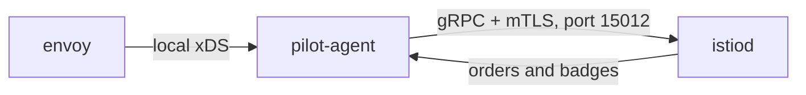
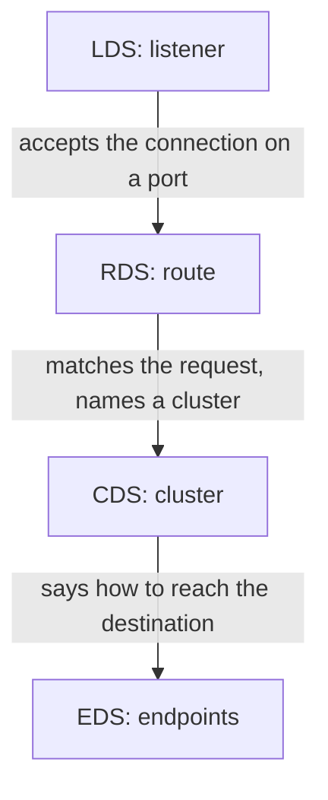
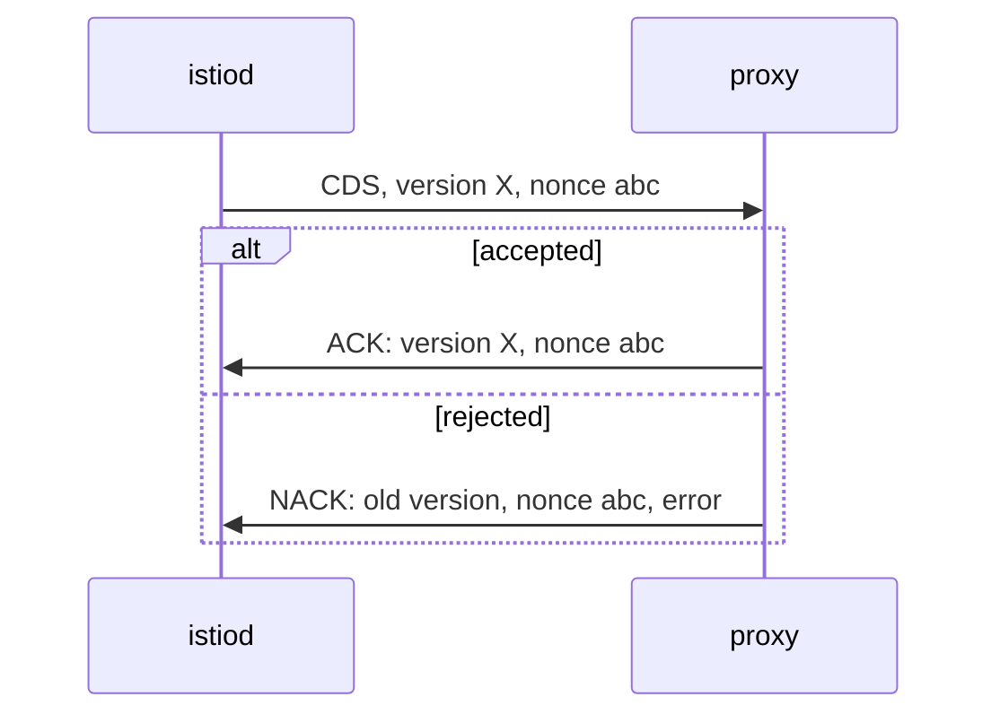

# How Configuration Reaches A Proxy

Astronaut, `istioctl proxy-status` can tell you whether a proxy accepted its configuration only because every order is confirmed. This part is that protocol: who calls whom, what travels, and what comes back.

## Envoy does not read Kubernetes

The sidecar proxy is Envoy, the ship's communications officer. It has no Kubernetes client, does not watch the API server, and has no idea what a `VirtualService` is. It gets all of its configuration over a long-lived **gRPC stream** (a network connection that stays open) from `istiod`, mission control. The protocol family on that stream is called **xDS**: the "x Discovery Services", where the `x` stands for whichever kind of resource is being discovered.



Inside the `istio-proxy` container, `pilot-agent` holds the stream to `istiod.istio-system.svc:15012` and passes the orders on to Envoy, whose local administration page listens on `localhost:15000`.

Three facts about that picture matter for everything that follows:

- **The proxy dials out.** `istiod` never connects to a pod. A proxy that cannot reach `istiod.istio-system.svc:15012` simply has no stream, and so no row in `istioctl proxy-status`.
- **The stream stays open.** The proxy does not poll. Mission control pushes orders when they change, and the connection stays open in between.
- **`pilot-agent` sits in the middle.** It proves the pod's identity with its service account token, fetches the workload certificate (the ID badge), and relays xDS to Envoy. That is why a certificate problem and a configuration problem can look alike: they travel on the same connection.

## The four resource types

xDS is a family, with one member per kind of resource. Four of them appear all the time, and they are the four main columns of `istioctl proxy-status`.

### What each type carries

| Type | Stands for | Carries |
| --- | --- | --- |
| `CDS` | Cluster Discovery Service | The **clusters**: named groups of destinations, roughly "a Service, or one subset of one" (a destination squadron) |
| `LDS` | Listener Discovery Service | The **listeners**: one per port the proxy accepts traffic on (the radio channels the officer listens on) |
| `EDS` | Endpoint Discovery Service | The **endpoints**: the real pod addresses behind each cluster (each ship's actual address) |
| `RDS` | Route Discovery Service | The **routes**: which request goes to which cluster (the flight plan table) |

### How they fit together

The four types are used in a fixed order for every signal:



The diagram shows one signal's path: a listener accepts it, a route picks a cluster, and the cluster's endpoints give the real pod addresses.

You will also see **`ECDS`** (Extension Config Discovery Service) in the output. It carries configuration for WebAssembly and similar extensions. In a mesh with no extensions it has nothing to carry, so it stays at `NOT SENT`.

Istio sends all of these over one shared stream called **ADS** (Aggregated Discovery Service). The order matters when configuration changes: a route that points at a cluster that has not arrived yet would be invalid. One ordered stream avoids that.

## The exchange that makes the state knowable

Every type has a version, and every push must be answered. Here is the exchange for one push, simplified:



The diagram shows the two possible answers to one push: an ACK that repeats the new version, or a NACK that repeats the old version plus an error message.

Read the difference carefully, because it explains a surprising failure. An **ACK** repeats the new version. A **NACK** repeats the *previous* version and adds an error. A proxy that sends a NACK does not fall back to nothing. **It keeps running the last configuration it accepted.** Your change is refused, and the mesh keeps working with the old rules. That is the classic "I applied it and nothing happened" report.

On the control plane side, a NACK increases the `pilot_total_xds_rejects` counter and writes a line in the `istiod` log. On the proxy side, it shows up in the `istio-proxy` container log. `kubectl` shows neither.

From this bookkeeping, the three states of `istioctl proxy-status` follow directly:

| What `istiod` has recorded | What the table shows |
| --- | --- |
| Sent version X, got an ACK for X | `SYNCED` |
| Sent version X, no answer yet, or a NACK | `STALE` |
| Nothing to send for this type | `NOT SENT` |

## Seeing the connection from the proxy's side

The proxy writes its connection to `istiod` in its log. On a healthy sidecar this is one quiet line. Once you know its shape, you will recognise the failing version.

<!-- astrona:playground:renew -->

### Read what a proxy says about its connection

Search the app's proxy log for the connection to `istiod`:

```sh
kubectl -n proxysync-demo logs deploy/notification-service-v1 -c istio-proxy --tail=40 \
  | grep -i -E 'xds|15012|connect'
```

You should see something like:

```text
info    sds     resource:default new connection
info    xdsproxy connected to delta upstream XDS server: istiod.istio-system.svc:15012
```

Two subsystems share one connection. `sds` is the Secret Discovery Service, which delivers this workload's badge (certificate). `xdsproxy` is `pilot-agent` relaying orders to Envoy. The word **`delta`** names the variant in use: delta xDS sends only what changed, not the full set on every update, which keeps a large mesh affordable.

On a proxy that cannot reach `istiod`, the same search shows the same error again and again, such as `connection refused` or `context deadline exceeded`, against `istiod.istio-system.svc:15012`. That message names both the destination and the port to unblock.

## What to take into the table

Three practical points follow from the protocol. Each one prevents a mistake later.

- **`SYNCED` describes a confirmed delivery, not correctness.** It means the proxy accepted the bytes. Wrong configuration synchronises perfectly.
- **A rejected change leaves the proxy on its old, working configuration.** Nothing breaks, and nothing updates. Look for the rejection, not for an outage.
- **No stream means no row.** The table has no "disconnected" state, because it is built from the connections `istiod` holds right now.

## Common pitfalls

> [!WARNING]
> - **Thinking the proxy reads Kubernetes objects.** It only knows what `istiod` sent over xDS. If `istiod` did not send it, the proxy does not have it.
> - **Expecting a rejected change to break traffic.** A NACK keeps the previous configuration running. The symptom is "nothing changed", not an outage.
> - **Looking for rejections with `kubectl`.** They appear only in the `istiod` log, the `pilot_total_xds_rejects` counter and the `istio-proxy` log.
> - **Treating a certificate problem and a configuration problem as unrelated.** Both travel on the same connection to port `15012`.

> *xDS is a push over a confirmed stream, and it is the confirmation, not the push, that `istioctl proxy-status` reports.*
