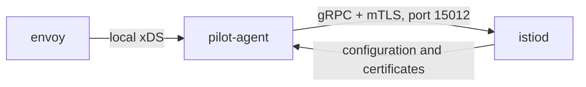
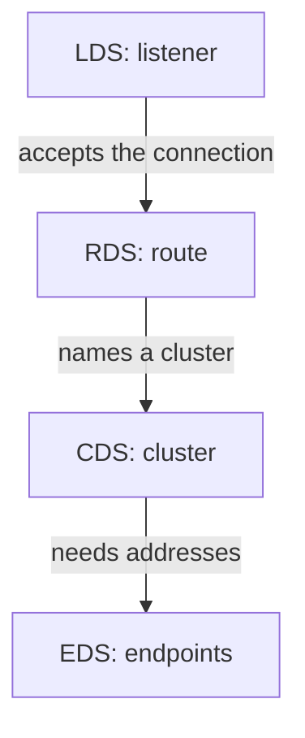
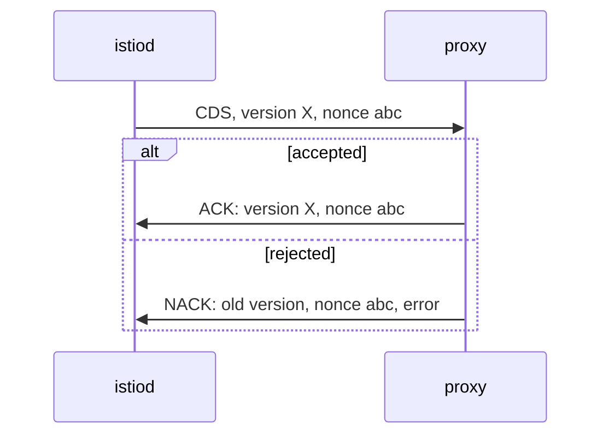

# How Configuration Reaches A Proxy

`istioctl proxy-status` can tell you whether a proxy accepted its configuration only because every push is answered. Before you read the table, you need the protocol underneath it. This part covers who opens the connection, what travels over it, and what comes back.

## Envoy does not read Kubernetes

The sidecar proxy is Envoy. It has no Kubernetes client, does not watch the API server, and has no idea what a `VirtualService` is. It gets all of its configuration over a long-lived **gRPC stream**, a network connection that stays open, from `istiod`. The protocol family on that stream is called **xDS**, the discovery services, where the `x` stands for the kind of resource being sent.



The diagram shows that inside the `istio-proxy` container, `pilot-agent` holds the stream to `istiod.istio-system.svc:15012` and passes the configuration on to Envoy, whose local administration interface listens on `localhost:15000`.

Three facts about that picture matter for everything that follows. First, **the proxy opens the connection.** `istiod` never connects to a pod, so a proxy that cannot reach `istiod.istio-system.svc:15012` has no stream, and so no row in `istioctl proxy-status`. Second, **the stream stays open.** The proxy does not poll; `istiod` pushes configuration when it changes. Third, **`pilot-agent` sits in the middle.** It proves the pod's identity with its service account token, gets the workload certificate, and relays xDS to Envoy. That is why a certificate problem and a configuration problem can look alike: both travel on the same connection.

## The four resource types

xDS is a family, with one member per kind of resource. Four of them appear all the time, and they are the four main types that `istioctl proxy-status` reports:

| Type | Stands for | Carries |
| --- | --- | --- |
| `CDS` | Cluster Discovery Service | The **clusters**: named groups of upstream endpoints, usually one per Service port, or per subset of a Service |
| `LDS` | Listener Discovery Service | The **listeners**: one per address and port the proxy accepts traffic on |
| `EDS` | Endpoint Discovery Service | The **endpoints**: the pod IP addresses and ports behind each cluster |
| `RDS` | Route Discovery Service | The **routes**: which HTTP request goes to which cluster |

The four types are used in a fixed order for every request:



The diagram shows one request's path: a listener accepts it, a route picks a cluster, and the cluster's endpoints give the real pod addresses.

You may also see **`ECDS`**, the Extension Config Discovery Service. It carries configuration for WebAssembly and similar extensions, so in a mesh with no extensions there is nothing for it to carry. Istio sends all these types over one shared stream called **ADS**, the Aggregated Discovery Service. The shared stream keeps the order right when configuration changes: a route that points at a cluster which has not arrived yet would be invalid.

## The exchange that makes the state knowable

Every push carries a version and a nonce, a unique number for that one response, and every push must be answered. Here is the exchange for one push, simplified:



The diagram shows the two possible answers to one push: an ACK that repeats the new version, or a NACK that repeats the previous version and adds an error message.

Read the difference carefully, because it explains a surprising failure. A proxy that sends a NACK does not fall back to nothing. **It keeps running the last configuration it accepted.** Your change is refused, and the mesh keeps working with the old rules. That is the classic "I applied it and nothing happened" report. On the control plane side, a NACK increases the `pilot_total_xds_rejects` counter and writes a line in the `istiod` log. On the proxy side, it shows up in the `istio-proxy` container log. `kubectl` shows neither.

From this bookkeeping, `istiod` records one state per resource type for each proxy. `istioctl proxy-status -v 1` prints these states:

| What `istiod` has recorded for the type | State shown |
| --- | --- |
| Sent a response, and the proxy ACKed that same nonce | `SYNCED` |
| Sent a response, and no ACK for it yet | `STALE` |
| The proxy NACKed the last response | `ERROR` |
| The proxy asked for the type, and nothing has been sent | `NOT SENT` |

## Seeing the connection from the proxy's side

The proxy writes its connection to `istiod` in its log. On a healthy sidecar this is one quiet line, and once you know its shape, you will recognise the failing version.

<!-- astrona:playground:renew -->

Search the application's proxy log for the connection to `istiod`:

```sh
kubectl -n proxysync-demo logs deploy/notification-service-v1 -c istio-proxy --tail=40 \
  | grep -i -E 'xds|15012|connect'
```

You should see a line like this one:

```text
info    xdsproxy connected to delta upstream XDS server: istiod.istio-system.svc:15012
```

The `xdsproxy` scope is `pilot-agent` relaying xDS to Envoy. The word **`delta`** names the variant in use: delta xDS sends only what changed, not the full set on every update, which keeps a large mesh affordable. On a proxy that cannot reach `istiod`, the same search shows a connection error again and again, such as `connection refused` or `context deadline exceeded`, against `istiod.istio-system.svc:15012`. That message names both the address and the port to unblock.

You now know how configuration travels: the proxy opens one stream to `istiod` on port `15012`, `istiod` pushes four main resource types over it, and the proxy answers every push with an ACK or a NACK. Three practical points follow. `SYNCED` describes a confirmed delivery, not correct configuration. A rejected change leaves the proxy on its old, working configuration. And with no stream, there is no row at all. The open question is how `istioctl proxy-status` turns these records into a table you can read.

## Common pitfalls

> [!WARNING]
> - **Thinking the proxy reads Kubernetes objects.** It only knows what `istiod` sent over xDS. If `istiod` did not send it, the proxy does not have it.
> - **Expecting a rejected change to break traffic.** A NACK keeps the previous configuration running. The symptom is "nothing changed", not an outage.
> - **Looking for rejections with `kubectl`.** They appear only in the `istiod` log, the `pilot_total_xds_rejects` counter, the `istio-proxy` log and the `ERROR` state in `istioctl proxy-status -v 1`.
> - **Treating a certificate problem and a configuration problem as unrelated.** Both travel on the same connection to port `15012`.
