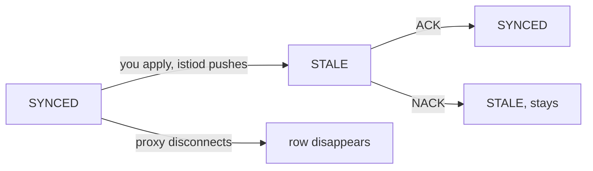

# Reading The Table

Astronaut, `istioctl proxy-status` is mission control's roll call. It asks `istiod` for its delivery records and prints one row for every connected proxy. This part reads that table column by column: what each state rules out, and what the two right-hand columns tell you that has nothing to do with sync at all.

## The table

Start with a healthy mesh, so you know what normal looks like.

<!-- astrona:playground:renew -->

### Take the roll call

Run the command with no arguments:

```sh
istioctl proxy-status
```

You should see something like:

```text
NAME                                              CLUSTER        CDS        LDS        EDS        RDS        ECDS       ISTIOD                     VERSION
istio-ingressgateway-...istio-system              Kubernetes     SYNCED     SYNCED     SYNCED     NOT SENT   NOT SENT   istiod-7d4c9b8f4-k2m8x     1.30.5
notification-service-v1-...proxysync-demo         Kubernetes     SYNCED     SYNCED     SYNCED     SYNCED     NOT SENT   istiod-7d4c9b8f4-k2m8x     1.30.5
tester-...proxysync-demo                          Kubernetes     SYNCED     SYNCED     SYNCED     SYNCED     NOT SENT   istiod-7d4c9b8f4-k2m8x     1.30.5
```

Three proxies answer, all served by the same `istiod` pod, and all on the same version as the control plane. The `NAME` column is `<pod>.<namespace>`; you pass that exact string back to the command when you want to inspect one proxy. The set of columns changes a little between Istio releases, but `CDS`, `LDS`, `EDS` and `RDS` are always there.

Notice the ingress gateway's `RDS: NOT SENT`. Nothing is wrong with it. No `Gateway` or `VirtualService` is bound to it in this cluster, so there are no HTTP routes to send. No configuration is not the same as no health.

## The three states

Each state rules out a different set of theories. That is why you run this command early in any investigation.

### SYNCED

`istiod` sent this resource type and the proxy confirmed it with an ACK. The proxy has your configuration. If the behaviour is still wrong, **the configuration itself is wrong**, and you move on to `istioctl proxy-config` to see what the proxy made of it.

Be clear about what `SYNCED` does *not* prove. It confirms that the bytes were accepted, not that they say what you meant. A proxy that routes every request to the wrong version is perfectly `SYNCED`.

### NOT SENT

`istiod` has nothing to send for that type. That is usually normal:

| Type showing `NOT SENT` | Normal when |
| --- | --- |
| `RDS` | The proxy has no HTTP routes, for example a gateway with nothing bound to it |
| `ECDS` | No WebAssembly or extension configuration exists in the mesh |
| `EDS` | Rare; it would mean no cluster needs dynamic endpoints |

It is only a symptom when you expected that type to exist. A sidecar in an application namespace that shows `RDS: NOT SENT` while the application makes HTTP calls is a real finding.

### STALE

`istiod` sent an update and has not received an ACK. That covers two very different situations:

- The proxy has not answered yet, because it is slow, overloaded, or the connection is poor.
- The proxy answered with a **NACK**. It rejected the configuration and is still running the previous version.

Rule the second one in or out first, because it means your change will never take effect, however long you wait. The evidence is the `pilot_total_xds_rejects` counter and a `reject` line in the `istiod` log, and on the proxy side its own container log.

A short `STALE` right after you apply something is normal: it is the gap between the push and the ACK. A `STALE` that stays is not.

## Changes, not snapshots

The states are points in a small life cycle. Knowing the moves between them tells you whether you are looking at a moment or a condition.



The diagram shows that a push moves a row from `SYNCED` to `STALE`, an ACK moves it back, a NACK leaves it `STALE` for good with the proxy on its previous configuration, and a disconnected proxy leaves the table completely.

That last move is important: disconnection is not a state in this table. It is an absence from it.

> [!TIP]
> To check whether a change landed, run `istioctl proxy-status` **twice, a few seconds apart**. A `STALE` that turns into `SYNCED` is the protocol working. A `STALE` that stays is a fault.

## The ISTIOD column

`ISTIOD` names the control plane pod that serves each proxy. It has two uses.

**Canary upgrades.** During an upgrade, a new `istiod` revision (a new named shift at mission control) runs next to the old one. A workload moves to the new revision only when its pod is recreated with the new revision label. This column is the direct proof that the move happened. If you relabelled and restarted a pod and it still shows the old `istiod` pod, the relabelling did not take effect.

**Load spread.** With several `istiod` replicas, each proxy attaches to exactly one. This column shows at a glance if the spread is very uneven. That is worth noticing, because proxies only move when their stream drops.

## The VERSION column, and the skew rule

`VERSION` is the proxy's own Istio version. Compare it with the control plane's version, and apply Istio's support rule:

> A data plane proxy may be **at most one minor version behind** `istiod`, and must never be ahead.

The reason is the order of an upgrade. `istiod` is upgraded first and must keep serving proxies that have not restarted yet, so it knows how to build configuration for one older minor version. The reverse has no such promise: a newer proxy may get configuration from an older control plane that does not know its features.

Skew fails quietly, not loudly. A `1.24.0` proxy against a `1.30.5` control plane keeps working. It simply never gets anything that depends on a newer feature, so a policy that uses a recent field applies to some workloads and not to others.

### Compare the control plane and proxy versions

Print the versions, then the version of each proxy:

```sh
istioctl version
istioctl proxy-status | awk 'NR==1 || NF>1 {print $1, $NF}'
```

You should see something like:

```text
client version: 1.30.5
control plane version: 1.30.5
data plane version: 1.30.5 (3 proxies)
NAME                                       VERSION
istio-ingressgateway-...istio-system       1.30.5
notification-service-v1-...proxysync-demo  1.30.5
tester-...proxysync-demo                   1.30.5
```

`istioctl version` already sums up the data plane, and lists several versions when there is skew. That is the faster check. The per-proxy list is what you need next, to find out *which* pods are behind so you can restart them.

`istioctl version` prints three lines. `client version` is your local `istioctl`, and it can differ from the other two without anything being wrong. A client several minor versions away from the control plane may, however, print output that does not match what this course shows.

## Common pitfalls

> [!WARNING]
> - **Reading `SYNCED` as "correct".** It means the proxy accepted what it was sent. Wrong configuration synchronises perfectly.
> - **Treating every `NOT SENT` as a fault.** It is expected for `RDS` on a proxy with no HTTP routes, and for `ECDS` in a mesh with no extensions.
> - **Reading a single `STALE` as a failure.** Run the command again a few seconds later. Short is the protocol; lasting is the fault.
> - **Assuming `STALE` only means slow.** It can mean rejected: the proxy refused the update and still serves the previous one. Check the `istiod` log for `reject`.
> - **Ignoring the `VERSION` column after an upgrade.** Proxies keep the old version until their pods restart, and a proxy too far behind quietly ignores newer features.
> - **Forgetting the `ISTIOD` column during a canary upgrade.** It is the only direct proof that a relabelled workload moved to the new revision.

> *The roll call reports a confirmed delivery, not a verdict: `SYNCED` says the proxy has your configuration, never that your configuration is right.*
