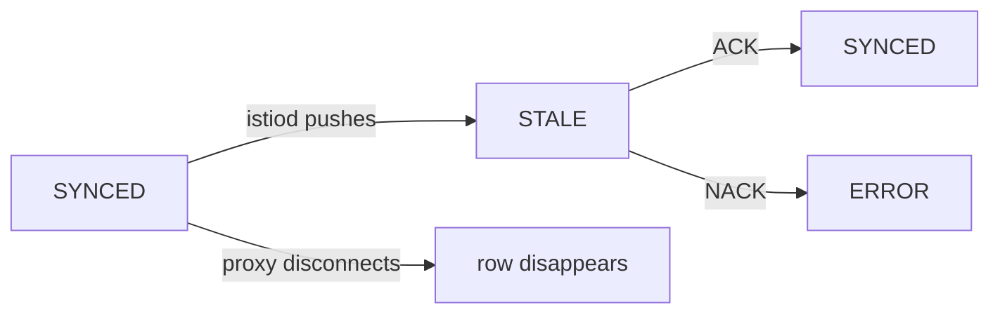

# Reading The Table

`istioctl proxy-status` asks `istiod` for its records about every connected proxy and prints one row per proxy. The short form tells you who is connected and to which `istiod`. The long form, with `-v 1`, adds the sync state of each xDS type. This part reads both forms column by column: what each state rules out, and what the `ISTIOD` and `VERSION` columns tell you that has nothing to do with sync at all.

## The table

Start with a healthy mesh, so you know what normal looks like.

<!-- astrona:playground:renew -->

Run the command with no arguments:

```sh
istioctl proxy-status
```

You should see something like:

```text
NAME                                                        CLUSTER        ISTIOD                      VERSION     SUBSCRIBED TYPES
istio-egressgateway-b7dd4655b-qdm9q.istio-system            Kubernetes     istiod-7dc9684c55-jmkrp     1.30.5      3 (CDS,LDS,EDS)
istio-ingressgateway-7f54444996-vqdpt.istio-system          Kubernetes     istiod-7dc9684c55-jmkrp     1.30.5      3 (CDS,LDS,EDS)
notification-service-v1-54dd46d4b6-b8q8n.proxysync-demo     Kubernetes     istiod-7dc9684c55-jmkrp     1.30.5      4 (CDS,LDS,EDS,RDS)
tester-69699fd775-tb6pc.proxysync-demo                      Kubernetes     istiod-7dc9684c55-jmkrp     1.30.5      4 (CDS,LDS,EDS,RDS)
```

The first two rows are the ingress and egress gateways that the `demo` profile installs in `istio-system`. They subscribe to only three types, because a gateway gets routes (RDS) only once a `Gateway` object binds a port on it, and this playground has none.

Each row is one proxy connected to `istiod` right now. The `NAME` column is `<pod>.<namespace>`; you pass that exact string back to the command when you want to inspect one proxy. `ISTIOD` names the `istiod` pod that serves the proxy, `VERSION` is the proxy's own Istio version, and `SUBSCRIBED TYPES` lists the xDS types the proxy asked for. This short form does **not** show whether each type is in sync. Since Istio 1.27, that needs the long form:

```sh
istioctl proxy-status -v 1
```

You should see something like:

```text
NAME                                                        CLUSTER        CDS              ECDS        EDS             LDS              RDS             ISTIOD                      VERSION
istio-egressgateway-b7dd4655b-qdm9q.istio-system            Kubernetes     SYNCED (11s)     IGNORED     SYNCED (2s)     SYNCED (11s)     IGNORED         istiod-7dc9684c55-jmkrp     1.30.5
istio-ingressgateway-7f54444996-vqdpt.istio-system          Kubernetes     SYNCED (11s)     IGNORED     SYNCED (2s)     SYNCED (11s)     IGNORED         istiod-7dc9684c55-jmkrp     1.30.5
notification-service-v1-54dd46d4b6-b8q8n.proxysync-demo     Kubernetes     SYNCED (2s)      IGNORED     SYNCED (2s)     SYNCED (2s)      SYNCED (2s)     istiod-7dc9684c55-jmkrp     1.30.5
tester-69699fd775-tb6pc.proxysync-demo                      Kubernetes     SYNCED (5s)      IGNORED     SYNCED (2s)     SYNCED (5s)      SYNCED (5s)     istiod-7dc9684c55-jmkrp     1.30.5
```

Now there is one column per xDS type, sorted by name, and the time in brackets is how long ago `istiod` last sent that type. `IGNORED` means the proxy never asked for that type. That is normal for `ECDS` in a mesh with no extensions, and for `RDS` on the two gateways.

## The four states

Each state rules out a different set of theories. That is why you run this command early in any investigation.

`SYNCED` means `istiod` sent this type and the proxy confirmed that exact response with an ACK. The proxy has your configuration. If the behaviour is still wrong, **the configuration itself is wrong**, and you move on to `istioctl proxy-config` to read what the proxy holds. Be clear about what `SYNCED` does *not* prove. It confirms that the configuration was accepted, not that it says what you meant. A proxy that routes every request to the wrong version is perfectly `SYNCED`.

`NOT SENT` means the proxy asked for the type and `istiod` has had nothing to send. That is usually normal, for example `RDS` on a gateway with no HTTP routes bound to it. It is only a symptom when you expected that type to exist. A sidecar in an application namespace that shows `RDS: NOT SENT` while the application makes HTTP calls is a real finding.

`STALE` means `istiod` sent a response and has not received the ACK for it yet. A short `STALE` right after you apply something is normal: it is the gap between the push and the ACK. A `STALE` that stays means the proxy is slow, overloaded or has a poor connection.

`ERROR` means the proxy answered the last push with a **NACK**. It rejected the configuration and is still running the previous version, so your change will never take effect, however long you wait. The evidence for the reason is a `reject` line in the `istiod` log, the `pilot_total_xds_rejects` counter, and the proxy's own container log.

## Changes, not snapshots

The states are points in a small life cycle. Knowing the moves between them tells you whether you are looking at a moment or a condition:



The diagram shows that a push moves a type from `SYNCED` to `STALE`, an ACK moves it back, a NACK moves it to `ERROR` with the proxy on its previous configuration, and a disconnected proxy leaves the table completely.

That last move is important: disconnection is not a state in this table. It is an absence from it.

> [!TIP]
> To check whether a change landed, run `istioctl proxy-status -v 1` **twice, a few seconds apart**. A `STALE` that turns into `SYNCED` is the protocol working. A `STALE` that stays, or any `ERROR`, is a fault.

## The ISTIOD column

`ISTIOD` names the control plane pod that serves each proxy, and it has two uses. The first is canary upgrades. During an upgrade, a new `istiod` revision, a second control plane installed under its own name, runs next to the old one. A workload moves to the new revision only when its pod is recreated with the new revision label. This column is the direct proof that the move happened: if you relabelled and restarted a pod and it still shows the old `istiod` pod, the relabelling did not take effect.

The second use is load spread. With several `istiod` replicas, each proxy connects to exactly one. This column shows at a glance if the spread is very uneven. That is worth noticing, because proxies only move when their stream drops.

## The VERSION column, and the skew rule

`VERSION` is the proxy's own Istio version. Compare it with the control plane's version, and apply Istio's support rule:

> The control plane may be **one minor version ahead** of the data plane. The data plane must never be ahead of the control plane.

The reason is the order of an upgrade. `istiod` is upgraded first and must keep serving proxies that have not restarted yet, so it can build configuration for the previous minor version. The reverse has no such promise: a newer proxy may get configuration from an older control plane that does not know its features. Skew outside this rule fails quietly, not loudly. An old proxy can keep working and simply never get a feature that a newer field depends on, so a policy applies to some workloads and not to others.

Print the versions, then the version of each proxy:

```sh
istioctl version
istioctl proxy-status | awk '{print $1, $4}'
```

You should see something like:

```text
client version: 1.30.5
control plane version: 1.30.5
data plane version: 1.30.5 (4 proxies), 65536.65536.65536 (2 proxies)
NAME VERSION
istio-egressgateway-b7dd4655b-qdm9q.istio-system 1.30.5
istio-ingressgateway-7f54444996-vqdpt.istio-system 1.30.5
notification-service-v1-54dd46d4b6-b8q8n.proxysync-demo 1.30.5
tester-69699fd775-tb6pc.proxysync-demo 1.30.5
```

`istioctl version` already sums up the data plane, and lists several versions when there is skew; that is the faster check. The four proxies on 1.30.5 are the two pods and the two gateways. It also counts two entries with the version `65536.65536.65536`. That is not a real Istio release: it is a placeholder for a version `istioctl` could not read from the data `istiod` reports. The per-proxy list shows every proxy on 1.30.5, so on this playground there is no skew. The per-proxy list is what you need next, to find out *which* pods are behind so you can restart them. `client version` is your local `istioctl`, and it can differ from the other two without anything being wrong, although a client far from the control plane may print output that does not match this page.

You can now read both forms of the table. The short form says who is connected, to which `istiod`, and on which version. The long form gives one of four states per xDS type, and only `SYNCED` means the configuration arrived. What the table cannot show is a proxy that has no connection at all, and that missing row is the most common finding of all.

## Common pitfalls

> [!WARNING]
> - **Looking for sync states in the short form.** Since Istio 1.27, plain `istioctl proxy-status` shows no `SYNCED` or `STALE`. Add `-v 1`.
> - **Reading `SYNCED` as "correct".** It means the proxy accepted what it was sent. Wrong configuration synchronises perfectly.
> - **Treating every `NOT SENT` or `IGNORED` as a fault.** Both are expected for types a proxy does not need.
> - **Reading a single `STALE` as a failure.** Run the command again a few seconds later. Short is the protocol; lasting is the fault.
> - **Missing an `ERROR`.** It means the proxy rejected the update and still serves the previous one. Check the `istiod` log for `reject`.
> - **Ignoring the `VERSION` column after an upgrade.** Proxies keep the old version until their pods restart.
