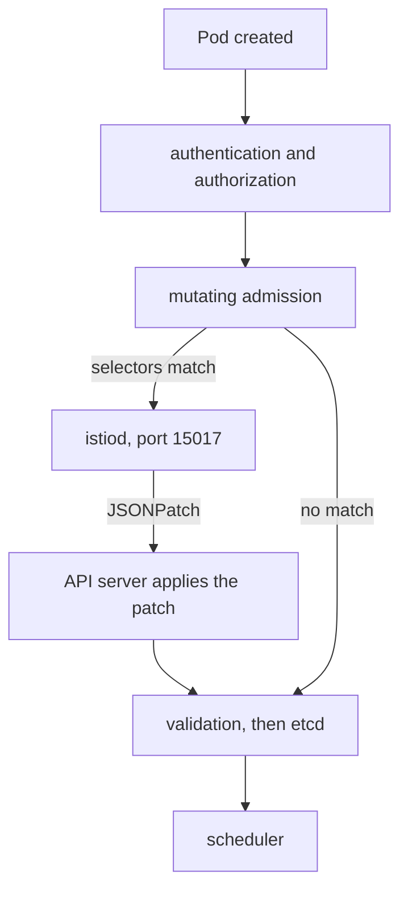

# How Injection Actually Happens

Most wrong ideas about sidecar injection come from picturing it as something Istio keeps doing to your Deployment, like a controller. It is not. Injection is a single edit to a Pod object, made while the Kubernetes API server holds the create request open. It happens when the pod is created, and only then, and everything surprising about injection follows from that one fact. This part follows a pod through that path, lists what is added, and shows two ways to check whether a pod is in the mesh.

## The path a pod takes

When a ReplicaSet, or you, creates a Pod, the API server passes it through a fixed set of stages before it stores it. One of them is mutating admission: the API server calls webhooks that may change the object. The injection webhook is one of them, served by `istiod`.



The diagram shows the API server asking `istiod` for a change only when the webhook's selectors match, then storing the changed pod as if it had always looked that way.

The webhook first checks two selectors. The `namespaceSelector` asks whether the pod's namespace wants injection. The `objectSelector` asks whether this one pod accepts it. If both match, the API server sends the Pod to `istiod` on port `15017`. `istiod` answers with a JSONPatch, a list of edits that adds the sidecar and its supporting pieces. The API server applies the edits to the Pod object, then continues with validation and stores the result in etcd, the cluster's database. The scheduler, the kubelet and every later reader see a pod that was created with a sidecar. The pod keeps no record of the edit, apart from the added content and an annotation that names the injection template used.

## What gets added, and why

The JSONPatch adds several pieces, and each one has a job:

| Added | Purpose |
| --- | --- |
| `istio-proxy` container | Envoy plus `pilot-agent`: the sidecar proxy itself |
| `istio-init` init container | Runs `iptables` rules that redirect the pod's traffic into Envoy |
| `istio-token` volume | A projected service account token, used to prove the pod's identity to `istiod` |
| `istio-ca-root-cert` volume | The mesh root certificate, used to check that `istiod` is genuine |
| `istio-envoy` volume | An in-memory volume for the proxy's working files |

The init container is what makes the redirection invisible to the application. It installs `iptables` rules, Linux packet filtering rules, in the pod's own network namespace. They send outgoing traffic to port `15001` and incoming traffic to port `15006`, where Envoy listens. Your application connects to `notification-service:80` exactly as before and never learns that a proxy is in the path. That also explains one exclusion: a pod that shares the **node's** network (`hostNetwork: true`) cannot get those rules safely, because they would change the node itself.

Two variations change what you see on a real cluster, but not the decision path. Some installs use the **Istio CNI plugin** instead of the init container; it does the same `iptables` work when the pod's network is set up, so `istio-init` is missing. And Istio 1.30 runs the proxy as a Kubernetes **native sidecar**, an init container with `restartPolicy: Always` that starts before the application and keeps running beside it, when every node runs Kubernetes 1.33 or later. The playground's `kind` node does, so in this course `istio-proxy` appears under `initContainers`, not `containers`. The content of the patch comes from a template in the `istio-sidecar-injector` ConfigMap in `istio-system`. When injection adds something unexpected, such as a wrong image or resource limits you did not set, that template is where the answer is.

## Three consequences

Because injection is one edit at pod creation, three things follow, and each one explains a common surprise.

**It happens at pod creation only.** There is no loop that repairs pods later. Nothing will ever add a sidecar to a pod that already exists, however many labels you fix. The only way to inject an existing workload is to replace its pods.

**It changes the Pod, not the Deployment.** `kubectl get deployment -o yaml` never shows `istio-proxy`, because the Deployment really does not contain it. Check the pod, never the controller.

**It needs `istiod` to answer at that moment.** The pod creation waits for the webhook call. That is why the webhook's `failurePolicy` decides what an `istiod` outage does: `Fail`, the Istio default, blocks new pods, and `Ignore` lets them start with no sidecar.

## Is it in the mesh?

Two checks answer this question. They come from different sides, so they fail in different ways, and it is worth knowing both.

<!-- astrona:playground:renew -->

The first check asks Kubernetes. Because the proxy is a native sidecar here, look at both container lists of each pod, the normal containers and the init containers:

```sh
kubectl -n noinject-demo get pods \
  -o custom-columns='POD:.metadata.name,CONTAINERS:.spec.containers[*].name,INIT:.spec.initContainers[*].name'
```

The `CONTAINERS` column shows only the application container for every pod: `notification-service`, `reporting-service` and `tester`. The difference is in the `INIT` column. The pods of `notification-service-v1` and `tester` list `istio-proxy` there, and `reporting-service` lists nothing (`<none>`). Without the `INIT` column, all three pods look the same, which is why the old habit of reading only `.spec.containers` misses the sidecar on Kubernetes 1.33 and later.

`reporting-service` has no `istio-proxy` at all. It is healthy, ready and serving, and it is outside the mesh. Nothing in this output is an error, which is exactly why this state passes reviews and reaches production. In daily work the short version is the `READY` column of plain `kubectl get pods`, which counts native sidecars too: `2/2` against `1/1`.

The second check asks `istiod`. List the proxies it serves in this namespace:

```sh
istioctl proxy-status | grep noinject-demo
```

You should see something like:

```text
notification-service-v1-54dd46d4b6-74r5x.noinject-demo     Kubernetes     istiod-7dc9684c55-ldc2p     1.30.5      4 (CDS,LDS,EDS,RDS)
tester-69699fd775-q8khw.noinject-demo                      Kubernetes     istiod-7dc9684c55-ldc2p     1.30.5      4 (CDS,LDS,EDS,RDS)
```

`reporting-service` has no row, because it has no proxy to connect. Do not expect `istioctl analyze` to help in this case. Its injection analyzer reports `IST0103` (`PodMissingProxy`, a `Warning`) only for a pod that has no proxy *and* did not opt out, in a namespace labelled `istio-injection=enabled`. It skips pods that opt out with `sidecar.istio.io/inject: "false"`, and pods with `hostNetwork: true`, because their exclusion is deliberate. So `istioctl analyze -n noinject-demo` reports nothing about `reporting-service`.

> [!TIP]
> When a policy has no effect on one workload, check that its pod has `istio-proxy` before you read any YAML. A clean `istioctl analyze` run does not prove every pod has a sidecar.

## Why this matters more than it looks

A workload outside the mesh is not weakened; it is exempt from the mesh. A `PeerAuthentication` in `STRICT` mode does not apply to it, so it sends and receives plain text. An `AuthorizationPolicy` does not apply to it, so nothing checks its requests. No telemetry is produced for it, so dashboards show it with no traffic, and it does not appear in `istioctl proxy-status`. Each of those absences looks like a different bug, and none of them names the cause.

You now know that injection is one edit to a Pod at creation, made by the API server with a patch from `istiod`, and that nothing adds a sidecar later. You can check a pod from the Kubernetes side by counting containers and from the `istiod` side with `istioctl proxy-status`. The open question is *why* the webhook skipped `reporting-service`, and the answer is in the labels the selectors read.

## Common pitfalls

> [!WARNING]
> - **Labelling a namespace and expecting existing pods to change.** Injection happens at pod creation. Without new pods, the label has no effect.
> - **Looking for `istio-proxy` in the Deployment.** It is added to the Pod. The Deployment never contains it.
> - **Assuming a `Running` pod is in the mesh.** Kubernetes has no opinion about the mesh. Look for `istio-proxy`, or read `READY` (`2/2` against `1/1`).
> - **Expecting `istioctl analyze` to report every pod without a sidecar.** It skips pods that opt out and pods with `hostNetwork: true`.
> - **Reading only `.spec.containers`.** On Kubernetes 1.33 and later nodes, `istio-proxy` is a native sidecar listed under `initContainers`, so every pod looks unmeshed in the `containers` list.
