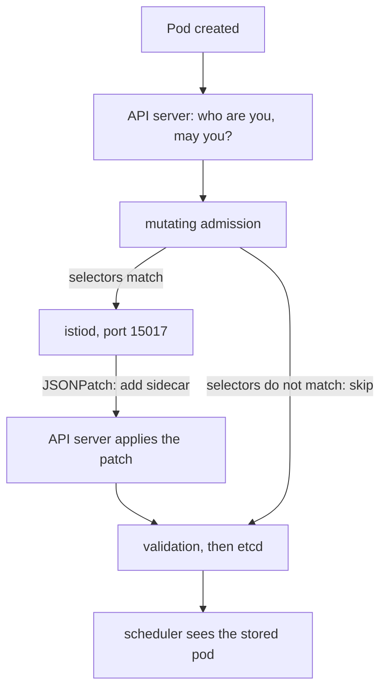

# How Injection Actually Happens

Astronaut, most wrong ideas about sidecar injection come from picturing it as something Istio keeps doing to your Deployment, like a controller. It is not. Injection is a single edit to a Pod object, made while the Kubernetes API server holds the request open. In space terms, the launch-pad crew puts a communications officer on board at launch, and only at launch. Everything surprising about injection follows from that one fact.

## The path a pod takes

When a ReplicaSet (or you) creates a Pod, the API server passes it through a fixed set of checks before it is stored. The injection webhook is one of them: a call the API server makes to `istiod` while it handles the request.



The diagram shows the API server asking `istiod` for a change (a JSONPatch) only when the webhook's selectors match, then storing the changed pod as if it had always looked that way.

The webhook first checks two selectors. The `namespaceSelector` asks: does this pod's planet (namespace) want injection? The `objectSelector` asks: does this one ship accept it? If both say yes, the API server sends the Pod to `istiod` on port `15017`. `istiod` answers with a JSONPatch, a list of edits that adds the sidecar and its supporting pieces. The API server applies the edits to the Pod object, then continues with validation and stores the result in etcd (the registry office's archive).

The scheduler, the kubelet and every later reader see a pod that was born with a sidecar. The pod itself keeps no record of the edit, apart from the added content and an annotation that names the injection template used.

## What gets added, and why

The JSONPatch adds several pieces. Each one has a job.

### The pieces of the patch

| Added | Purpose |
| --- | --- |
| `istio-proxy` container | Envoy plus `pilot-agent`: the proxy itself, the communications officer |
| `istio-init` init container | Runs `iptables` rules that redirect the pod's traffic into Envoy |
| `istio-token` volume | A projected service account token, used to prove the pod's identity to `istiod` |
| `istio-ca-root-cert` volume | The mesh root certificate, used to check that `istiod` is genuine |
| `istio-envoy` volume | An in-memory volume for the proxy's working files |

The init container is what makes the redirection invisible to the app. It installs `iptables` rules (Linux firewall rules) in the pod's own network space that send outgoing traffic to port `15001` and incoming traffic to port `15006`, where Envoy listens. Your application connects to `notification-service:80` exactly as before and never learns that something stepped in.

That also explains one kind of exclusion. A pod that shares the **node's** network (`hostNetwork: true`) cannot have those rules applied safely, because they would change the node itself, not just the pod.

### Variations you may meet

Two variations change what you see on a real cluster, but not the decision path above. First, some installs use the **Istio CNI plugin** instead of the init container. The plugin does the same `iptables` work when the pod's network is set up, so `istio-init` is missing and the pod needs no extra privileges. Second, newer Kubernetes versions let the proxy run as a **native sidecar**: an init container with `restartPolicy: Always`, started before the app. Then `istio-proxy` appears under `initContainers`, not `containers`.

The content of the patch comes from a template stored in the `istio-sidecar-injector` ConfigMap in `istio-system`. When injection produces something unexpected, such as a wrong image, a missing environment variable or resource limits you did not set, that template is where the answer is.

## Three consequences

Because injection is one edit at pod creation, three things follow. Each one explains a common surprise.

**1. It happens at pod creation only.** There is no loop that repairs pods later. Nothing will ever add a sidecar to a pod that already exists, however many labels you fix. The only way to inject an existing workload is to replace its pods.

**2. It changes the Pod, not the Deployment.** `kubectl get deployment -o yaml` never shows `istio-proxy`. The Deployment really does not contain it. Check the pod; never the controller.

**3. It needs `istiod` to answer at that moment.** Injection is a call that the pod creation waits for. That is why the webhook's `failurePolicy` decides what an `istiod` outage does: `Fail` (the Istio default) blocks new pods, `Ignore` lets them start with no sidecar.

## Is it in the mesh?

Two checks answer this. They cost the same, and they fail in different ways, so it is worth knowing both.

<!-- astrona:playground:renew -->

### Count the containers in each pod

List each pod with its ready flags and its container names:

```sh
kubectl -n noinject-demo get pods \
  -o custom-columns='POD:.metadata.name,READY:.status.containerStatuses[*].ready,CONTAINERS:.spec.containers[*].name'
```

You should see something like:

```text
POD                                       READY        CONTAINERS
notification-service-v1-6c9f8b7d5-x2kqp   true,true    notification-service,istio-proxy
reporting-service-7fd4c8b96-mn5tp         true         reporting-service
tester-6d9f7b8c5-hj4kz                    true,true    tester,istio-proxy
```

`reporting-service` has one container where the others have two. It is healthy, ready and serving, and it is outside the mesh. Nothing in this output is an error, which is exactly why this state passes reviews and reaches production. In daily work the short version is the `READY` column of plain `kubectl get pods`: `2/2` against `1/1`.

### Ask the pre-flight inspector

The second check comes from a different direction. `istioctl analyze` reads the pods against what the mesh expects and reports the gap:

```sh
istioctl analyze -n noinject-demo
```

You should see something like:

```text
Info [IST0103] (Pod reporting-service-7fd4c8b96-mn5tp.noinject-demo) The pod is missing the Istio proxy. This can often be resolved by restarting or redeploying the workload.
```

Look at the severity: `Info`, the lowest there is. A workload left out of every mesh policy you have written is reported at the same level as a style note.

The suggested fix, "restarting or redeploying", is consequence 1 stated as advice. It is right *once the cause is fixed*, and useless before that.

> [!TIP]
> Always read `istioctl analyze` output to the bottom. `IST0103`, the missing-proxy message, is only `Info`, and it is easy to skip.

## Why this matters more than it looks

A workload outside the mesh is not weakened; it is exempt from the mesh:

- A `PeerAuthentication` in `STRICT` mode does not apply to it, so it sends and receives plain text.
- An `AuthorizationPolicy` does not apply to it, so nothing checks its requests.
- No telemetry is produced for it, so dashboards show it with no traffic.
- It does not appear in `istioctl proxy-status`.

Each of those absences looks like a different bug. A security review sees a policy that "works". A dashboard shows a service that "has no traffic". A sync check shows a proxy that "is not there". One cause, four symptoms, and none of them names it.

## Common pitfalls

> [!WARNING]
> - **Labelling a namespace and expecting existing pods to change.** Injection happens at pod creation. Without new pods, the label is only a wish.
> - **Looking for `istio-proxy` in the Deployment.** It is added to the Pod. The Deployment never contains it.
> - **Assuming a `Running` pod is a meshed pod.** Kubernetes has no opinion about the mesh. Count the containers.
> - **Expecting `IST0103` to stand out.** It is `Info` severity, at the bottom of the output.
> - **Expecting `hostNetwork: true` pods to be injected.** Traffic redirection cannot be applied to the node's network, so they never are.

> *Injection is one edit to a Pod at launch, which is why nothing can ever add it later.*
