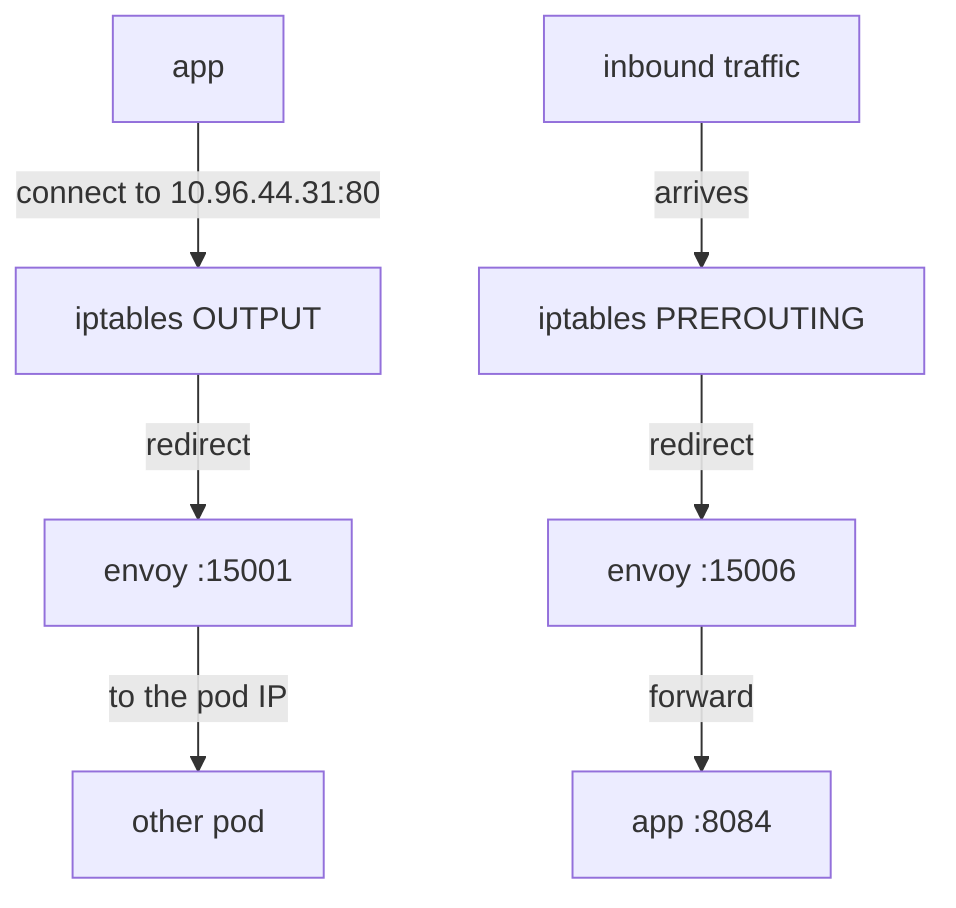
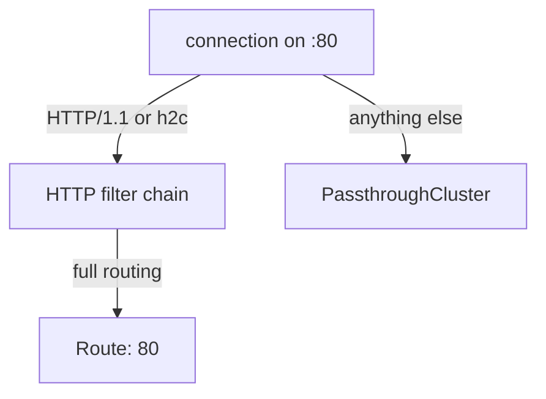

# Capture And Listeners

An application in the mesh never sends its requests to the sidecar proxy on purpose. It connects to `notification-service:80` exactly as it did before Istio was installed. Yet before any Istio routing can apply, that connection has to pass through the sidecar proxy (Envoy). This part shows the mechanism that redirects the connection, and the first of the four stages that acts on it: the listener.

## Capture: network rules inside the pod

When a pod joins the mesh, an init container named `istio-init` writes `iptables` rules into the pod before the application starts. `iptables` is the Linux packet-filtering tool, and these rules are the capture mechanism. They apply only inside the pod's own network namespace, which the application container and the proxy container share.



The diagram shows both directions: connections the application opens are redirected to port 15001, and connections arriving for the application are redirected to port 15006 before Envoy passes them on to the application's own port 8084.

Three facts follow from this, and all three matter when you debug. First, the application is unchanged and unaware: it connected to a Service address, and the connection was redirected before it left the pod. Second, the original destination survives the redirect. The Linux kernel records it, and Envoy reads it back, which is how one listener on 15006 can serve many application ports. Third, traffic that skips the redirect skips the mesh. Annotations such as `traffic.sidecar.istio.io/excludeOutboundPorts` can exclude ports or address ranges, and excluded traffic gets no routing, no policy and no telemetry.

## The ports you will see

The sidecar proxy uses a fixed set of ports. You will not connect to most of them by hand, but you will see them in `proxy-config` output, so learn to recognise them:

| Port | Direction | Purpose |
| --- | --- | --- |
| **15001** | outbound | catch-all: every connection the application opens leaves through here |
| **15006** | inbound | catch-all: every connection arriving for the application enters here |
| 15000 | none | Envoy's administration interface, reachable only inside the pod |
| 15020 | none | merged Prometheus metrics from the Istio agent, Envoy and the application |
| 15021 | none | health checks |
| 15090 | none | Envoy's own Prometheus metrics |

The proxy also connects out to port 15012 on `istiod`, where it receives configuration over xDS and its certificate. The ports in the middle of the table never appear in a request's path. The two in bold are where this part starts.

## What a listener is

A **listener** is a socket that Envoy accepts connections on, plus the chain of filters it applies to whatever arrives. In a sidecar, the listeners are not your application's ports, because the application still owns those. They are Istio's own, created to receive the redirected traffic.

Next to the two catch-alls you will see **outbound listeners per port**, one for each port on which the proxy knows a destination. A listener bound to `0.0.0.0:80` that knows which Services use port 80 can hand an HTTP request to routing. The 15001 catch-all can only pass bytes along. List the first lines of the `tester` proxy's listeners:

<!-- astrona:playground:renew -->

```sh
istioctl proxy-config listener deploy/tester -n proxycfg-demo | head
```

You should see something like:

```text
ADDRESSES    PORT  MATCH                                                   DESTINATION
10.96.0.10   53    ALL                                                     Cluster: outbound|53||kube-dns.kube-system.svc.cluster.local
0.0.0.0      80    Trans: raw_buffer; App: http/1.1,h2c                    Route: 80
0.0.0.0      80    ALL                                                     PassthroughCluster
10.96.0.1    443   ALL                                                     Cluster: outbound|443||kubernetes.default.svc.cluster.local
10.96.118.41 443   ALL                                                     Cluster: outbound|443||istiod.istio-system.svc.cluster.local
10.96.161.85 443   ALL                                                     Cluster: outbound|443||istiod-revision-tag-default.istio-system.svc.cluster.local
10.96.24.221 443   ALL                                                     Cluster: outbound|443||istio-egressgateway.istio-system.svc.cluster.local
10.96.95.84  443   ALL                                                     Cluster: outbound|443||istio-ingressgateway.istio-system.svc.cluster.local
10.96.0.10   9153  Trans: raw_buffer; App: http/1.1,h2c                    Route: kube-dns.kube-system.svc.cluster.local:9153
```

The list is sorted by port, so the two catch-all listeners on 15001 and 15006 come after these first ten lines. The IP addresses on your cluster will differ.

Read the `DESTINATION` column first. It says what happens next, and it is the hand-off from the listener stage to the route stage. The `0.0.0.0:80` line with `App: http/1.1,h2c` hands off to `Route: 80`, which is the name you query at the route stage. The `kube-dns` line on port 53 hands straight to a cluster and has no route stage: Envoy forwards that traffic as plain TCP bytes, with no HTTP routing.

## Two filter chains on port 80

The output above has **two** lines for `0.0.0.0:80`, with different `MATCH` values. That is not a duplicate. A listener can hold several **filter chains**, and Envoy picks one for each connection using match rules. Istio installs two here:



The diagram shows that HTTP traffic gets full routing (header matches, retries and so on), while anything else is forwarded as raw bytes with no routing.

The `MATCH` column is the rule. `Trans: raw_buffer; App: http/1.1,h2c` means "plain-text transport, and the application protocol was detected as HTTP". Envoy detects the protocol by reading the first bytes of the connection. This is where the protocol of a Service port matters. A Service port named `http` (or with `appProtocol: http`) tells Istio the protocol in advance. A port whose name declares no known protocol, such as `web`, leaves it to this automatic detection. Detection works for plain HTTP. It does not work for server-first protocols such as MySQL, where the server speaks first and the client sends nothing for Envoy to read. Istio's documentation says those protocols must be declared explicitly.

## PassthroughCluster is not an error

`PassthroughCluster` appears in the second line for port `80` above. It is the mesh's default for traffic that has no configuration: forward the bytes to the original destination, unchanged, with no routing and no policy. Its opposite, `BlackHoleCluster`, drops such traffic instead.

Which one you get depends on the mesh-wide setting `outboundTrafficPolicy.mode`: `ALLOW_ANY` (passthrough, the default) or `REGISTRY_ONLY` (drop). `REGISTRY_ONLY` allows only destinations Istio knows about, that is Kubernetes Services and hosts added with a `ServiceEntry`. A `ServiceEntry` is the Istio resource that adds an outside host to the mesh's service registry. The setting matters for diagnosis:

| Mode | Unknown destination | Symptom |
| --- | --- | --- |
| `ALLOW_ANY` | forwarded as-is | calls to outside hosts work, with no telemetry and no policy |
| `REGISTRY_ONLY` | dropped | calls to anything without a `ServiceEntry` fail, often with a `502` |

If you see traffic reaching an outside address that no `ServiceEntry` describes, `PassthroughCluster` is the explanation, and the missing metrics for that traffic are the result.

## Filtering, and reading only what you need

An unfiltered listener dump on a real cluster runs to hundreds of lines, because by default a sidecar knows about every Service in the mesh. Two flags make the command usable: `--port <n>` shows only listeners on that port, and `--address <ip>` shows only listeners bound to that address. Narrow from the start; `head` is no substitute, because the line you want is rarely in the first ten.

The same command against two workloads shows the two directions of a connection. Ask the `tester` proxy about port 80, and the `notification-service-v1` proxy about port 15006:

```sh
istioctl proxy-config listener deploy/tester -n proxycfg-demo --port 80
istioctl proxy-config listener deploy/notification-service-v1 -n proxycfg-demo --port 15006
```

You should see something like:

```text
ADDRESSES PORT MATCH                                DESTINATION
0.0.0.0   80   Trans: raw_buffer; App: http/1.1,h2c Route: 80
0.0.0.0   80   ALL                                  PassthroughCluster
ADDRESSES PORT  MATCH                                                                                           DESTINATION
0.0.0.0   15006 Addr: *:15006                                                                                   Non-HTTP/Non-TCP
0.0.0.0   15006 Trans: tls; App: istio-http/1.0,istio-http/1.1,istio-h2                                         InboundPassthroughCluster
0.0.0.0   15006 Trans: raw_buffer; App: http/1.1,h2c                                                            InboundPassthroughCluster
0.0.0.0   15006 Trans: tls; App: TCP TLS                                                                        InboundPassthroughCluster
0.0.0.0   15006 Trans: raw_buffer                                                                               InboundPassthroughCluster
0.0.0.0   15006 Trans: tls                                                                                      InboundPassthroughCluster
0.0.0.0   15006 Trans: tls; App: istio,istio-peer-exchange,istio-http/1.0,istio-http/1.1,istio-h2; Addr: *:8084 Cluster: inbound|8084||
0.0.0.0   15006 Trans: raw_buffer; Addr: *:8084                                                                 Cluster: inbound|8084||
```

The `tester` listener on port 80 is **outbound**: `tester` is a client, so it has a listener for a destination it might call. The `notification-service-v1` listener on 15006 is **inbound**, and it holds many filter chains. The last two lines match on the original destination port `8084`, one for mutual TLS from another sidecar (`Trans: tls`) and one for plain text (`Trans: raw_buffer`), and both hand off to the cluster `inbound|8084||`, not to a route. The lines above them catch connections to any other port and pass them to `InboundPassthroughCluster`, which forwards them unchanged.

## What a missing listener means

When the listener stage fails, the result is often not an error. There are three cases. With no listener for a port and `ALLOW_ANY`, traffic passes through: routing rules do not apply, metrics are missing, and mutual TLS (mTLS, where both sides present a certificate) is not used. With no listener for a port and `REGISTRY_ONLY`, traffic is dropped, and the usual cause is a missing `ServiceEntry` for an outside host. With no inbound listener on the destination, the receiving proxy has nothing to pass to the application, and server-side policy cannot apply.

So the question this stage answers is not "did routing work" but "did Istio ever handle this traffic".

> [!TIP]
> When a rule seems to be ignored rather than wrong, start at the listener. If the port has no `Route:` hand-off, no `VirtualService` can ever apply to it.

You now know how traffic reaches the sidecar proxy: `iptables` rules redirect it to port 15001 or 15006, and a listener decides what happens next. On port 80, the HTTP filter chain hands the request to `Route: 80`. What that route configuration holds, and how Envoy picks one rule in it, is the next question.

## Common pitfalls

> [!WARNING]
> - **Looking for your application's ports in the listener list.** The listeners are Istio's: 15001, 15006, and outbound listeners per port. The application's own port shows up as a `MATCH` rule on 15006, not as a listener of its own.
> - **Treating `PassthroughCluster` as a fault.** It is the default for unknown destinations. It is only a problem when you expected configuration to apply.
> - **Relying on protocol detection.** Name the Service port (`http`, `grpc`, `tcp` and so on) or set `appProtocol`. Detection cannot work for server-first protocols.
> - **Forgetting traffic exclusions.** `excludeOutboundPorts` and similar annotations take traffic out of the mesh completely, and nothing in the listener list shows that a port was excluded.
> - **Dumping listeners unfiltered on a real cluster.** Use `--port` or `--address`. The default output is the sidecar's view of the whole mesh.
