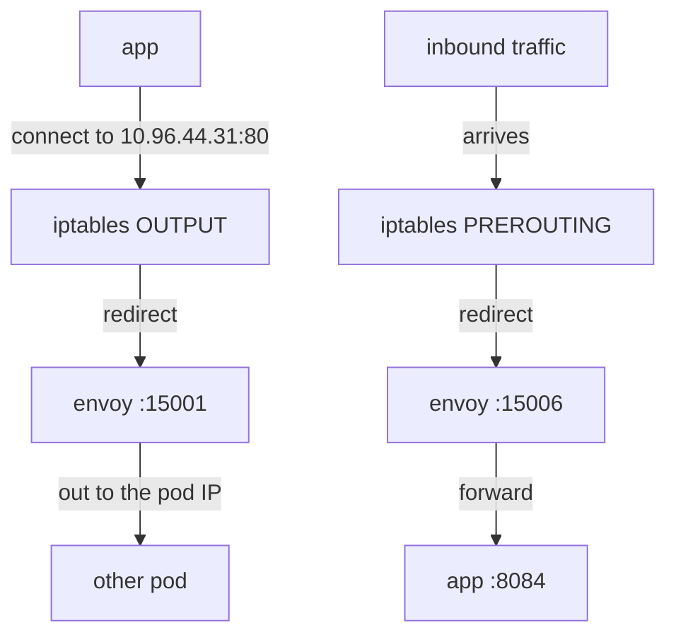
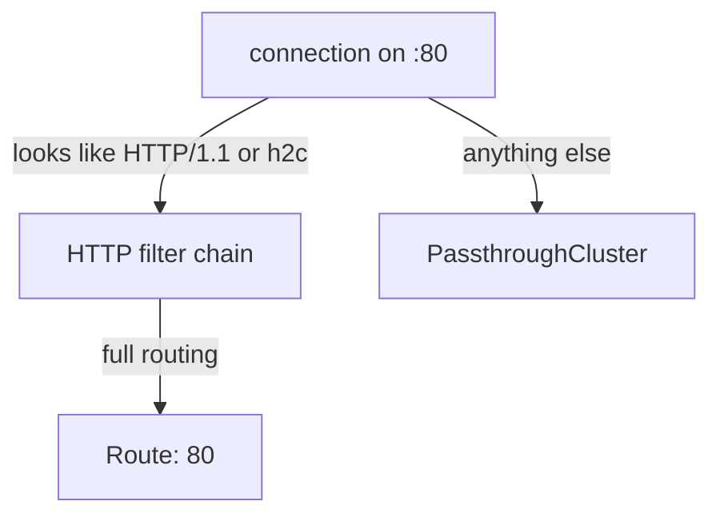

# Capture And Listeners

Astronaut, your app never addresses its signals to the communications officer. It connects to `notification-service:80` exactly as it did before the mesh existed. Yet before any of Istio's routing can apply, something has to make that signal pass through the sidecar proxy (Envoy). This part shows the mechanism that catches the signal, and the first of the four stages that acts on it: the listener.

## Capture: network rules inside the pod

When a pod joins the mesh, an init container writes `iptables` rules (the Linux firewall) into the pod before the app starts. These rules are the capture mechanism. They work only inside the pod's own network space, which the app container and the proxy container share.



The diagram shows both directions: signals the app sends out are redirected to port 15001, and signals arriving for the app are redirected to port 15006 before Envoy hands them on to the app's own port 8084.

Three facts follow from this, and all three matter when you debug:

- **The app is unchanged and unaware.** It dialled a Service address, and the connection was redirected before it left the pod. No library, no proxy setting, no code change.
- **The original destination survives the redirect.** The Linux kernel records it, and Envoy reads it back. That is how a single listener on 15006 can serve many app ports, and why the `ORIGINAL_DST` cluster type exists.
- **Traffic that skips the redirect skips the mesh.** Annotations such as `traffic.sidecar.istio.io/excludeOutboundPorts` can exclude ports or address ranges. Anything excluded gets no routing, no policy and no telemetry. That is a legitimate tool, and also an easy way to build a workload that is "in the mesh" for only some of its traffic.

## The ports you will see

The proxy owns a fixed set of ports. You will not connect to most of them by hand, but you will see them in `proxy-config` output, so learn to recognise them:

| Port | Direction | Purpose |
| --- | --- | --- |
| **15001** | outbound | the catch-all: everything the app sends leaves through here |
| **15006** | inbound | the catch-all: everything arriving for the app enters here |
| 15000 | none | Envoy's administration page, reachable only inside the pod |
| 15020 / 15021 | none | health and readiness endpoints, merged app and proxy checks |
| 15090 | none | Prometheus metrics, collected from outside the pod |
| 15012 | outbound | the xDS and certificate stream to `istiod` (mission control) |

The ports in the middle are plumbing and never appear in a request's path. The two in bold are where this module starts.

## What a listener is

A **listener** is a socket that Envoy accepts connections on, plus the chain of filters it applies to whatever arrives. In space terms, it is the radio channel the communications officer listens on. In a sidecar, listeners are not your app's ports: the app still owns those. They are Istio's own, created to receive redirected traffic.

Next to the two catch-alls you will see **per-service outbound listeners**, one for each port the proxy knows a destination on. A listener bound to `0.0.0.0:80` that knows which services live on port 80 can hand the signal to HTTP-aware routing. The 15001 catch-all can only pass bytes along.

<!-- astrona:playground:renew -->

### See the ports your test ship listens on

List the first lines of the `tester` proxy's listeners:

```sh
istioctl proxy-config listener deploy/tester -n proxycfg-demo | head
```

You should see something like:

```text
ADDRESSES     PORT  MATCH                                                             DESTINATION
10.96.0.10    53    ALL                                                               Cluster: outbound|53||kube-dns.kube-system.svc.cluster.local
0.0.0.0       80    Trans: raw_buffer; App: http/1.1,h2c                              Route: 80
0.0.0.0       80    ALL                                                               PassthroughCluster
0.0.0.0       15001 ALL                                                               PassthroughCluster
0.0.0.0       15006 Addr: *:15006                                                     Inline Route: /*
```

Read the `DESTINATION` column first: it says what happens next, and it is the hand-off from stage one to stage two. The `0.0.0.0:80` line with `App: http/1.1,h2c` hands off to `Route: 80`, which is the name you query at the route stage. The `kube-dns` line hands straight to a cluster and skips routing, because the Domain Name System (DNS) over UDP has no HTTP layer to route on.

## Two listeners on port 80, and why

The output above has **two** entries for `0.0.0.0:80`, with different `MATCH` values. That is not a duplicate. Envoy picks between several **filter chains** on one listener using match rules, and Istio installs two:



The diagram shows that HTTP traffic gets full routing (headers, retries and so on), while anything else is forwarded as raw bytes with no routing.

The `MATCH` column is the rule. `Trans: raw_buffer; App: http/1.1,h2c` means "plain-text transport, and the app protocol was detected as HTTP". Istio sniffs the first bytes of a connection when a port's protocol was not declared.

This is where Service port naming becomes real. A Service port named `http` tells Istio the protocol in advance, so the HTTP chain is used with confidence. A port named `web` leaves it to sniffing. Sniffing works for plain HTTP and fails for anything that does not announce itself in the first bytes, such as server-first protocols like MySQL, or TLS traffic Istio is not opening. Those fall to the passthrough chain, and every routing rule you wrote silently stops applying.

## PassthroughCluster is not an error

`PassthroughCluster` appears twice above. It is the mesh's default for traffic it has no configuration for: forward the bytes to the original destination, unchanged, with no routing or policy. Its opposite, `BlackHoleCluster`, drops such traffic instead.

Which one you get depends on the mesh-wide setting `outboundTrafficPolicy.mode`: `ALLOW_ANY` (passthrough, the default) or `REGISTRY_ONLY` (black hole). Think of it as "ships may signal any planet, charted or not" against "signal only charted planets". It matters for diagnosis:

| Mode | Unknown destination | Symptom |
| --- | --- | --- |
| `ALLOW_ANY` | forwarded as-is | calls to outside hosts "just work", with no telemetry and no policy |
| `REGISTRY_ONLY` | dropped | calls to anything without a `ServiceEntry` fail, often with a confusing `502` |

If you see traffic reaching an outside address that no `ServiceEntry` describes, `PassthroughCluster` is the explanation, and the missing metrics for it are the result.

## Filtering, and reading only what you need

An unfiltered listener dump on a real cluster runs to hundreds of lines, because by default a sidecar knows about every Service in the mesh. Two flags make the command usable, and this section shows them on both sides of a connection.

- `--port <n>` shows only listeners on that port.
- `--address <ip>` shows only listeners bound to that address.

Narrow from the start. `head` is not a substitute, because the line you want is rarely in the first ten.

### Compare an outbound and an inbound listener

Ask the test ship about port 80, and the app's ship about port 15006:

```sh
istioctl proxy-config listener deploy/tester -n proxycfg-demo --port 80
istioctl proxy-config listener deploy/notification-service-v1 -n proxycfg-demo --port 15006
```

You should see something like:

```text
ADDRESSES  PORT  MATCH                                     DESTINATION
0.0.0.0    80    Trans: raw_buffer; App: http/1.1,h2c      Route: 80
0.0.0.0    80    ALL                                       PassthroughCluster

ADDRESSES  PORT   MATCH                                    DESTINATION
0.0.0.0    15006  Addr: *:8084                             Cluster: inbound|8084||
```

The same command against two workloads shows the two directions. The `tester` port-80 listener is **outbound**: `tester` is a client, so it has a listener for a destination it might call. The `notification-service-v1` listener on 15006 is **inbound**: it matches on the original destination port `8084` and hands off to a cluster, not a route.

## What a missing listener means

When stage one fails, the result is the one people least expect: traffic that **works but is not in the mesh**, or a connection that is refused outright. Here are the three cases:

- **No listener for a port, `ALLOW_ANY`:** traffic passes through. Routing rules do not apply, metrics are missing, and mutual TLS is not used. Everything looks fine until someone asks why the dashboards are empty.
- **No listener for a port, `REGISTRY_ONLY`:** traffic is dropped. The usual cause is a missing `ServiceEntry` for an outside host.
- **No inbound listener on the destination:** the receiving proxy has nothing to hand to the app, and server-side policy cannot apply.

So the question this stage answers is not "did routing work" but "was this traffic ever Istio's to route".

> [!TIP]
> When a rule seems to be ignored rather than wrong, start at the listener. If the port has no `Route:` hand-off, no `VirtualService` can ever apply to it.

## Common pitfalls

> [!WARNING]
> - **Looking for your app's ports in the listener list.** The listeners are Istio's: 15001, 15006, and per-destination outbound listeners. The app's own port shows up as a `MATCH` rule on 15006, not as a listener of its own.
> - **Treating `PassthroughCluster` as a fault.** It is the default for unknown destinations. It is only a problem when you expected configuration to apply.
> - **Relying on protocol sniffing.** Name the Service port (`http`, `grpc`, `tcp` and so on) or set `appProtocol`. Sniffing fails silently for server-first protocols and sends them down the passthrough chain.
> - **Forgetting traffic exclusions.** `excludeOutboundPorts` and similar annotations take traffic out of the mesh completely, and nothing in the listener list hints that a port was excluded.
> - **Dumping listeners unfiltered on a real cluster.** Use `--port` or `--address`. The default output is the sidecar's whole view of the mesh.

> *Stage one does not ask where a request should go. It asks whether the mesh ever saw it.*
