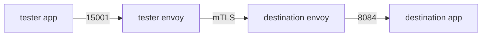

# The Receiving Proxy And Its Certificates

So far every command has read the **client** side: one sidecar proxy deciding where to send a request. The destination pod has a sidecar proxy too. Its configuration is a different set of objects, and a whole class of problems is invisible unless you look there. This part covers that receiving side, and the certificates both proxies use for mutual TLS.

## Two proxies, one request

Every request between two pods in the mesh passes through two proxies, and each one applies different rules:



The diagram shows one request leaving the `tester` application through its outbound listener on 15001, crossing the pod network over mTLS, and entering the destination pod through the inbound listener on 15006 before it reaches the application on port 8084.

The rules split along that line, and the split is not random:

| Proxy | Applies |
| --- | --- |
| client (outbound) | `VirtualService`, `DestinationRule`: routing, retries, timeouts, circuit breaking, load balancing |
| destination (inbound) | `PeerAuthentication`, `AuthorizationPolicy`, `RequestAuthentication` |

**Client-side policy** is about how to reach a destination, so the proxy doing the reaching applies it. **Server-side policy** is about who may do what to this workload, so the workload's own proxy must enforce it. Otherwise a misbehaving client, or one with no proxy at all, could skip it. Server-side policy includes `PeerAuthentication`, which sets whether a workload accepts plain text, mutual TLS (mTLS) or both on inbound connections, and `AuthorizationPolicy`, which allows or denies requests to a workload. In mTLS, both sides present a certificate, so the connection is encrypted and both identities are checked. This split explains a common wasted hour: studying an `AuthorizationPolicy` in the caller's configuration, where it does not appear and never will.

## Inbound configuration

The receiving side is simpler than the sending side. There is one inbound listener (15006) and one inbound cluster for each application port. Ask the `notification-service-v1` proxy for its 15006 listener and its inbound clusters:

<!-- astrona:playground:renew -->

```sh
istioctl proxy-config listener deploy/notification-service-v1 -n proxycfg-demo --port 15006 | grep -E 'PORT|8084'
istioctl proxy-config cluster deploy/notification-service-v1 -n proxycfg-demo | grep inbound
```

You should see something like:

```text
ADDRESSES PORT  MATCH                                                                                           DESTINATION
0.0.0.0   15006 Trans: tls; App: istio,istio-peer-exchange,istio-http/1.0,istio-http/1.1,istio-h2; Addr: *:8084 Cluster: inbound|8084||
0.0.0.0   15006 Trans: raw_buffer; Addr: *:8084                                                                 Cluster: inbound|8084||
                                                               8084      -          inbound       ORIGINAL_DST     
```

The `grep` keeps the header line of the listener table and the filter chains for port `8084`; the 15006 listener also holds chains for every other port, which pass traffic to `InboundPassthroughCluster`. The second command prints the inbound cluster line without its header: the `SERVICE FQDN` column is empty, the port is `8084`, the direction is `inbound` and the type is `ORIGINAL_DST`.

The inbound cluster is named `inbound|8084||`. It uses the same four-field naming as outbound clusters, with no FQDN and no subset, because the destination is this pod's own application. Its type is `ORIGINAL_DST`: it sends the connection on to the address it was first sent to, which is how one listener serves every application port. The `Addr: *:8084` part of each `MATCH` value is the filter chain match on that recorded destination port. One chain takes mutual TLS from other sidecars (`Trans: tls`), the other takes plain text (`Trans: raw_buffer`).

A missing `inbound|<port>||` cluster is a clear finding: traffic arrives at the pod and never reaches the container. The usual causes are a Service that does not expose that port, or a port whose protocol could not be worked out.

The 15006 listener's filter chains are also where server-side policy lives. List the filter names in its JSON:

```sh
istioctl proxy-config listener deploy/notification-service-v1 -n proxycfg-demo \
  --port 15006 -o json | grep -E '"name": "envoy\.filters' | sort -u
```

You should see something like:

```text
                                    "name": "envoy.filters.http.cors",
                                    "name": "envoy.filters.http.fault",
                                    "name": "envoy.filters.http.grpc_stats",
                                    "name": "envoy.filters.http.router",
                        "name": "envoy.filters.network.http_connection_manager",
                        "name": "envoy.filters.network.tcp_proxy",
                "name": "envoy.filters.listener.http_inspector",
                "name": "envoy.filters.listener.original_dst",
                "name": "envoy.filters.listener.tls_inspector",
```

The list shows the listener, network and HTTP filters this proxy runs on inbound connections. `original_dst` reads the recorded destination, `tls_inspector` and `http_inspector` detect the protocol, `http_connection_manager` handles HTTP, and `router` sends the request on. When an `AuthorizationPolicy` selects the workload, Istio adds the authorization filter `envoy.filters.http.rbac` to these chains; this playground has no `AuthorizationPolicy`, so do not expect it here. The TLS settings that carry out mTLS are part of the same filter chains. When a destination refuses a connection because of an mTLS mismatch, this listener is the object doing the refusing.

## Certificates

`istioctl proxy-config secret` prints the certificates a proxy holds right now. These are its own workload certificate, which carries its identity, and the root certificate it uses to check the certificates of other workloads. The command reads the same live Envoy administration interface as every other `proxy-config` subcommand. Ask the `tester` proxy for its secrets:

```sh
istioctl proxy-config secret deploy/tester -n proxycfg-demo
```

You should see something like:

```text
RESOURCE NAME     TYPE           STATUS     VALID CERT     SERIAL NUMBER                        NOT AFTER                NOT BEFORE
default           Cert Chain     ACTIVE     true           0bf42fc131ddcc3b09b89bc411bec754     2026-10-10T22:22:23Z     2026-10-09T22:20:23Z
ROOTCA            CA             ACTIVE     true           6c048900534eb2b2991ab9a59cbbd9a2     2036-10-06T22:22:07Z     2026-10-09T22:22:07Z
```

`default` is this workload's own certificate. It is valid for only about **24 hours**: `istiod` signs short-lived workload certificates, and the Istio agent in the pod renews them before they expire. `ROOTCA` is the mesh root certificate, valid for years. `VALID CERT: false`, a `NOT AFTER` time in the past, or an empty list is a definite answer, not a hint.

The table supports two more readings. Comparing `NOT BEFORE` with the pod's age shows whether the certificate has been renewed at least once, which is useful after a control plane outage. And `-o json` contains the certificate itself, base64-encoded. Decoded with `openssl x509`, its Subject Alternative Name (SAN) field carries the workload's SPIFFE identity, `spiffe://<trust-domain>/ns/<namespace>/sa/<service account>`. The `principals` field of an `AuthorizationPolicy` matches this identity, without the `spiffe://` prefix, so the certificate is the fastest way to check why such a rule does not match.

You now know that one request passes two proxies, and that each applies its own set of rules. The client applies routing; the destination applies `PeerAuthentication` and `AuthorizationPolicy` on its 15006 listener and passes the request to the `inbound|<port>||` cluster. You can also read the certificates a proxy holds and their validity. What is left is to put the stages together into one procedure you can follow under time pressure.

## Common pitfalls

> [!WARNING]
> - **Looking only at the client proxy.** `PeerAuthentication` and `AuthorizationPolicy` are enforced on the inbound side. The sender's configuration cannot show you why a policy denied a request.
> - **Expecting the application's port as an inbound listener.** There is one inbound listener, 15006, and the application's port is a match rule on it, plus an `inbound|<port>||` cluster.
> - **Forgetting the certificate lifetime.** A workload certificate is valid for about a day. An expired one explains a mesh-wide failure with no configuration change behind it.
> - **Guessing the identity a `principals` rule should match.** Read the SAN from the proxy's own certificate instead.
