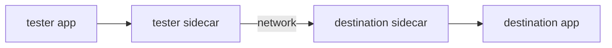

# Who Answered With 503

Astronaut, the first useful question about a `503` is not *why* but *who*. Until you know whether a proxy or the app produced it, every theory is a guess. The two live in different systems, with different logs, and different people fix them. This part answers the question in one command, and then reads the answer properly.

## The symptom, and what it already rules out

Start with the failure itself, and the state of the ships on the planet. Both together already rule out the obvious explanations.

<!-- astrona:playground:renew -->

### See the failure

Send one signal from the test ship, then list the pods:

```sh
kubectl -n fivezerothree-demo exec deploy/tester -- \
  curl -s -o /dev/null -w '%{http_code}\n' -X POST http://notification-service/notify
kubectl -n fivezerothree-demo get pods
```

You should see something like:

```text
503
NAME                                      READY   STATUS    RESTARTS   AGE
notification-service-v1-6c9f8b7d5-x2kqp   2/2     Running   0          6m
tester-6d9f7b8c5-hj4kz                    2/2     Running   0          6m
```

A `503` against a `2/2 Running` destination with no restarts. That combination rules out the obvious causes before you spend any time on them: the app is up, it has a sidecar, and nothing has crashed and come back. Whatever refused this request did it somewhere between the two pods, or before the request ever left the first one.

`2/2` matters here. A `1/1` pod would mean the destination has no communications officer on board at all, so it could not take part in mesh routing, and that is a different investigation.

## Where a 503 can come from

Four different components can produce the same three digits:



The tester's sidecar can answer `503` when there is no cluster, no endpoints, or no way to reach the destination. The destination's sidecar can answer `503` when inbound policy or its connection to the app fails. And the destination app can return `503` itself.

You cannot tell these apart from the status code: it carries no origin. Envoy solves this by writing an **access log** line for every request it handles, like a flight log with one line per signal. In that line it puts a short code, the **response flag**, that says why the request ended the way it did.

The `demo` profile used by this playground switches access logging on. In a production-profile install it is usually off, and you must turn it on before you can read it.

## The flags in the 503 family

Each flag is a short code the communications officer stamps on a failed signal. These are the ones you meet with a `503`:

| Flag | Name | What it means | Where to look next |
| --- | --- | --- | --- |
| `NC` | no cluster | the route named a cluster that does not exist | `DestinationRule` subsets, host names |
| `UH` | no healthy upstream host | the cluster exists and has no usable endpoints | Service selector, pod readiness, subset labels, ejections |
| `NR` | no route | nothing matched the request | `Host` header, port protocol, `VirtualService` binding |
| `UF` | upstream connection failure | could not set up a connection at all | mutual TLS mismatch, wrong port, network policy |
| `UC` | upstream connection termination | the connection was dropped during the request | app crash, protocol mismatch |
| `-` | *(none)* | no proxy-level error | the **app** produced the status |

Two reading aids turn this into a model rather than a list. The `U` prefix means **upstream**, a statement about the destination. And the flags are roughly ordered by how far the request got: `NC` never found a destination, `UH` found one with nothing in it, `UF` tried to connect and failed, `UC` connected and lost it.

The last row saves the most time. A `503` with flag `-` is **your service's own answer**, passed on faithfully. No amount of Istio debugging will explain it; the investigation belongs in the app's logs.

## Reading the line

The client proxy's access log is the proxy's own account of the request. Read it before anything else.

### See the proxy's account of the request

Read the last lines of the test ship's proxy log:

```sh
kubectl -n fivezerothree-demo logs deploy/tester -c istio-proxy --tail=5
```

You should see something like:

```text
[2026-09-27T09:31:44.812Z] "POST /notify HTTP/1.1" 503 NC no_healthy_upstream - "-" 0 19 0 - "-" "curl/8.4.0" "b1f0..." "notification-service" "-" - - 10.96.44.31:80 10.244.0.9:41234 - default
```

Read it from left to right and stop at the fourth field:

```text
  "POST /notify HTTP/1.1"   503      NC       no_healthy_upstream    ...   "-"
   the request              status   FLAG     response code details        upstream host
```

`NC` says the proxy produced this, and names the reason: there was no usable cluster to send it to. The exact flag can differ by Istio version and by the exact state, and `UH` appears in closely related cases. So **read the flag you get**, rather than reciting one from memory.

Two more fields on that line carry weight:

- **The response code details** (`no_healthy_upstream` here) are Envoy's own longer explanation. For some failures, such as authorization, they are the whole answer.
- **The upstream host field** is `-`. That means no connection was ever attempted. On a successful request it holds an address such as `10.244.0.12:8084`, which proves the proxy got as far as talking to something.

## The other log that is empty

This is the half of the evidence people forget: check the **destination's** proxy for the same request.

### See what the destination saw

Read the last lines of the app's proxy log:

```sh
kubectl -n fivezerothree-demo logs deploy/notification-service-v1 -c istio-proxy --tail=5
```

No line for this request appears. That absence is not a gap in the evidence. It *is* evidence, and it settles the question:

| Client log | Destination log | Means |
| --- | --- | --- |
| failure | **nothing** | the request never arrived: routing, clusters, endpoints, or the connection itself |
| failure | failure | it arrived and failed there: inbound policy, or the app |
| success | failure | rare; a problem on the way back |

Here the client failed and the destination saw nothing, so the whole investigation stays on the **sending** side.

## What the flag has already told you

Before you run a single `proxy-config` command, the log has narrowed the problem to one stage of the proxy's chain:

```text
   NR  → stage 2, route        nothing matched
   NC  → stage 3, cluster      the named cluster does not exist
   UH  → stage 4, endpoint     the cluster is empty
   UF  → beyond stage 4        connection refused at the far end
   -   → not Istio             the application answered
```

That is why "read the flag first" is the rule and not a preference. Walking the chain from stage one with no flag takes four commands; with a flag it takes one.

> [!TIP]
> Make reading the client proxy's last log line your first move on any failing request. It tells you who answered and which stage to check, before you open a single YAML file.

## Common pitfalls

> [!WARNING]
> - **Reading the app log first.** For this kind of failure the request never reaches the app, so its log is empty and proves nothing.
> - **Ignoring the response flag.** `NC`, `UH`, `UF` and `UC` point at four different layers, and `-` points out of Istio entirely.
> - **Memorising one flag for "missing subset".** The exact flag varies with Istio version and state. Read what you actually get, and use the table to interpret it.
> - **Skipping the destination's log.** The missing line there is half the diagnosis.
> - **Assuming a `503` with a healthy pod means the app is down.** `2/2 Running` plus `503` is the signature of a routing fault, not an app fault.
> - **Expecting access logs to be on.** The `demo` profile turns them on; many production installs do not.

> *The status code says a request failed; the response flag says who failed it, and that is the only question worth asking first.*
