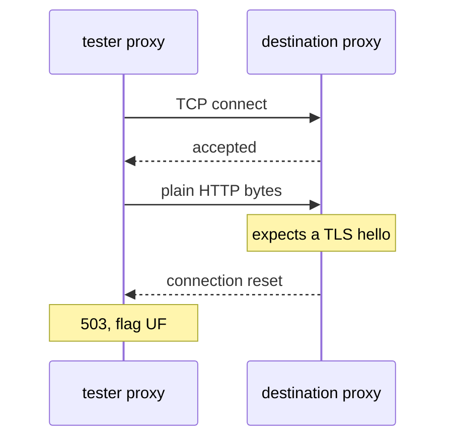

# Two Objects, Two Ends Of One Connection

Astronaut, **mutual TLS** (mTLS, mutual Transport Layer Security) is a secret handshake: both ships show their ID badges before they talk. Inside the mesh, the communications officers (the sidecar proxies) do this handshake for the app. This whole failure follows from one fact: the two halves of the handshake are set by two unrelated objects, in two different API groups, and neither object mentions the other. This part shows what each side controls, what every mode means, and what the settings become inside the proxies.

## The split

One object sets the airlock rule on the receiving ship. A different object sets how the sending ship approaches the airlock.

| | Object | API group | Field | Values |
| --- | --- | --- | --- | --- |
| **Server**: what will be accepted | `PeerAuthentication` | `security.istio.io` | `spec.mtls.mode` | `STRICT`, `PERMISSIVE`, `DISABLE`, `UNSET` |
| **Client**: what will be sent | `DestinationRule` | `networking.istio.io` | `spec.trafficPolicy.tls.mode` | `ISTIO_MUTUAL`, `SIMPLE`, `MUTUAL`, `DISABLE` |

Nothing checks the pair. The `DestinationRule` names a host, not a policy; the `PeerAuthentication` selects pods, not callers. The Kubernetes API server checks each object on its own when you apply it, and never compares one with the other.

## Server modes: what will be accepted

A **`PeerAuthentication`** is the rule on a ship's airlock: who must do the handshake before docking. Its modes are:

- **`STRICT`**: only mTLS connections are accepted. No handshake, no docking. Plain text is refused at the transport layer.
- **`PERMISSIVE`**: either mTLS or plain text is accepted, decided per connection.
- **`DISABLE`**: mTLS is not used for this workload; plain text is expected.
- **`UNSET`**: take the mode from a wider scope, or the mesh default (`PERMISSIVE` in a standard install).

`PERMISSIVE` needs more than one line, because it explains why these mismatches go unnoticed for so long. It exists so you can bring workloads into the mesh step by step: a workload can join while half its callers are still outside, and nothing breaks. The cost is that a client sending plain text to a `PERMISSIVE` server works perfectly. So a `DestinationRule` with `tls: DISABLE` can sit in a repository for a year, doing exactly what it says, until somebody tightens the namespace to `STRICT` and a service that "nobody touched" starts failing.

`PeerAuthentication` also supports `portLevelMtls`, which overrides the mode for single ports. That is how you exempt a health-check or metrics port from `STRICT` without weakening the rest of the workload.

## Client modes: what will be sent

A **`DestinationRule`** holds the docking instructions for one beacon. Its `tls.mode` decides how the sending ship approaches the airlock:

- **`ISTIO_MUTUAL`**: mTLS with the certificates Istio manages. The correct choice inside the mesh. You configure no certificates, because `istiod` (mission control) already issued both ends their ID badges.
- **`SIMPLE`**: ordinary one-way TLS. The client checks the server, but shows no certificate of its own. For services outside the mesh.
- **`MUTUAL`**: mTLS with certificates **you** supply, referenced from the `DestinationRule`. For outside services that require client certificates.
- **`DISABLE`**: send plain text.

`MUTUAL` and `ISTIO_MUTUAL` differ by one word and mean different things. `MUTUAL` without a certificate reference is a configuration error. `ISTIO_MUTUAL` is the one that "just works" between workloads in the mesh.

## The combinations

Put a server mode and a client mode together and the result is fixed:

| Server (`PeerAuthentication`) | Client (`DestinationRule`) | Result |
| --- | --- | --- |
| `STRICT` | `ISTIO_MUTUAL`, or **no `DestinationRule` at all** | works |
| `STRICT` | `DISABLE` | **fails**: plain text arriving at a TLS-only listener |
| `DISABLE` | `ISTIO_MUTUAL` | **fails**: TLS arriving at a plain-text listener |
| `PERMISSIVE` | anything | works |

The first row holds the most useful fact in this module: **no `DestinationRule` is the safe default.** Left alone, traffic between two sidecars uses mTLS automatically, because the injected proxies already have identities and Istio sets them up to use them.

So almost every mismatch in practice comes from a `DestinationRule` written for some *other* reason: a load balancing setting, a connection pool, an outlier detection policy. Someone copied a `tls:` block along with it. The TLS setting was never the point of the object, which is exactly why nobody reviews it.

<!-- astrona:playground:renew -->

### See what each object asks for

Your playground already holds a `PeerAuthentication` and a `DestinationRule` in the namespace `mtlsfail-demo`. Print the mode each one sets:

```sh
kubectl -n mtlsfail-demo get peerauthentication -o yaml | grep -A3 'mtls:'
kubectl -n mtlsfail-demo get destinationrule -o yaml | grep -A3 'tls:'
```

You should see something like:

```text
    mtls:
      mode: STRICT
      tls:
        mode: DISABLE
```

Four lines, and you only see the contradiction because you read both objects at once. The server requires mTLS; the client is told to send plain text. Each object is valid and makes sense on its own, and neither mentions the other. That is why this configuration got written and reviewed without anyone noticing.

## What the settings become

Both objects end up as Envoy configuration inside the proxies. Knowing which piece each one sets makes the failure easy to predict.

### On the server

`PeerAuthentication` sets the **transport socket** on the filter chains of the proxy's inbound listener, on port `15006`. A filter chain is one way the listener can handle a connection:

```text
   STRICT       inbound 15006 has ONE filter chain, requiring TLS with a client certificate
   PERMISSIVE   inbound 15006 has TWO chains, matched on whether the connection is TLS:
                    tls      → mTLS chain
                    raw_buffer → plaintext chain
   DISABLE      inbound 15006 has one plaintext chain
```

`PERMISSIVE` really is an extra filter chain. It uses the same chain-matching that the listener uses to guess a connection's protocol, applied to transport security.

### On the client

`DestinationRule` `tls.mode` sets the transport socket on the **outbound cluster** for that host. `ISTIO_MUTUAL` attaches Istio's certificates; `DISABLE` attaches nothing.

You can read both directly. The first command shows the client's cluster for `notification-service`; the second counts the filter chains on the destination's inbound listener:

```sh
istioctl proxy-config cluster deploy/tester -n mtlsfail-demo \
  --fqdn notification-service.mtlsfail-demo.svc.cluster.local -o json | grep -i -A3 transport_socket
istioctl proxy-config listener deploy/notification-service-v1 -n mtlsfail-demo \
  --port 15006 -o json | grep -c 'filter_chains'
```

## Why the failure is a handshake failure

Put the plain-text client and the TLS-only server together, and the mechanism follows:



The diagram shows the tester's proxy connecting, sending plain text, and the destination's proxy closing the connection before any request exists.

The TCP (Transmission Control Protocol) connection succeeds. What fails is the **first thing that happens on it**: the destination's proxy expects the opening message of a TLS handshake and gets something else. It closes the connection before it has read an HTTP request; at that point there is no HTTP at all. So it has nothing to write an access log line about.

The client's proxy reports this as an upstream connection failure: a `503` with the flag `UF`. That is the whole signature of this failure: a failure on the client, and silence on the server. The server is not unreachable; the request simply never became a request.

## Common pitfalls

> [!WARNING]
> - **Adding a `DestinationRule` where none is needed.** Traffic between sidecars is already mTLS by default. Every `tls:` block you write is a chance to disagree with the server.
> - **Using `MUTUAL` instead of `ISTIO_MUTUAL`.** `MUTUAL` means "mTLS with certificates I supply". Inside the mesh you want Istio's certificates, which is `ISTIO_MUTUAL`.
> - **Treating `PERMISSIVE` as a safe permanent state.** It works, and it hides which callers still send plain text. It is a migration mode, not a destination.
> - **Believing a `DestinationRule` is about security because it has a `tls` field.** It is a client-side traffic policy; the security rule is set by `PeerAuthentication` on the server.
> - **Expecting the API server to catch the mismatch.** The two objects are never compared when you apply them.

> *The server declares what it will accept and the client declares what it will send, and nothing anywhere checks that the two agree.*
