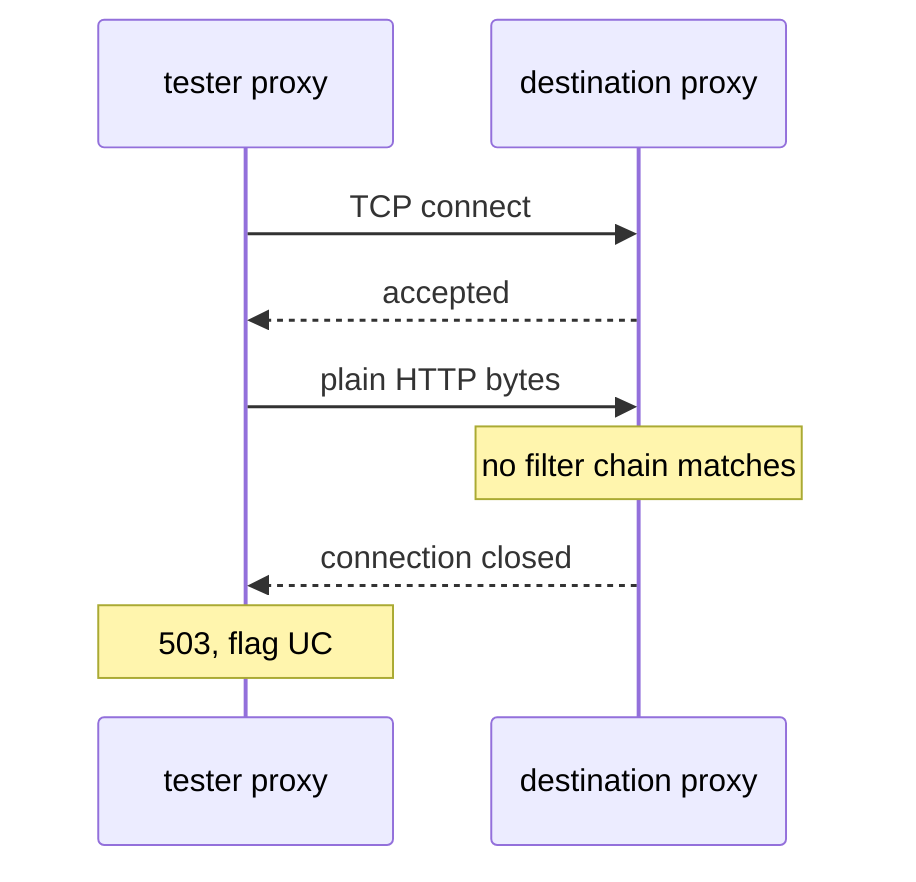

# Two Objects, Two Ends Of One Connection

Inside the mesh, the sidecar proxies set up mutual TLS (mTLS) for the application: both proxies present a certificate, so the connection is encrypted and both identities are checked. This whole failure follows from one fact. The two ends of that connection are set by two unrelated objects, in two different API groups, and neither object mentions the other. This part shows what each side controls, what every mode means, and what the settings become inside the proxies.

## The split

One object sets what the receiving side accepts. A different object sets what the sending side sends.

| | Object | API group | Field | Values |
| --- | --- | --- | --- | --- |
| **Server**: what is accepted | `PeerAuthentication` | `security.istio.io` | `spec.mtls.mode` | `STRICT`, `PERMISSIVE`, `DISABLE`, `UNSET` |
| **Client**: what is sent | `DestinationRule` | `networking.istio.io` | `spec.trafficPolicy.tls.mode` | `ISTIO_MUTUAL`, `SIMPLE`, `MUTUAL`, `DISABLE` |

Nothing checks the pair. The `DestinationRule` names a host, not a policy, and the `PeerAuthentication` selects pods, not callers. The Kubernetes API server checks each object on its own when you apply it, and never compares one with the other.

## Server modes: what is accepted

A **`PeerAuthentication`** sets whether a workload accepts plain text, mTLS or both on inbound connections. Its modes are:

- **`STRICT`**: only mTLS connections are accepted. Plain text is refused at the transport layer, before any HTTP request exists.
- **`PERMISSIVE`**: both mTLS and plain text are accepted, decided per connection.
- **`DISABLE`**: mTLS is not used for this workload, and plain text is expected.
- **`UNSET`**: the mode comes from a wider scope, or from the mesh default, which is `PERMISSIVE` in a standard install.

`PERMISSIVE` needs more than one line, because it explains why these mismatches go unnoticed for so long. It exists so you can bring workloads into the mesh step by step: a workload can join while half its callers are still outside, and nothing breaks. The cost is that a client sending plain text to a `PERMISSIVE` server works perfectly. So a `DestinationRule` with `tls.mode: DISABLE` can sit in a repository for a year, doing exactly what it says. Then somebody changes the namespace to `STRICT`, and a service that nobody touched starts failing.

`PeerAuthentication` also has a `portLevelMtls` field, which overrides the mode for single ports. That is how you exempt a health-check or metrics port from `STRICT` without weakening the rest of the workload.

## Client modes: what is sent

A **`DestinationRule`** defines what happens to traffic for a host after routing. Its `tls.mode` decides how the client's proxy connects to that host:

- **`ISTIO_MUTUAL`**: mTLS with the certificates Istio manages. This is the correct choice inside the mesh. You configure no certificates, because `istiod`, Istio's control plane, already gave both proxies their certificates.
- **`SIMPLE`**: ordinary one-way TLS. The client checks the server's certificate but presents none of its own. This is for services outside the mesh.
- **`MUTUAL`**: mTLS with certificates **you** supply, referenced from the `DestinationRule`. This is for outside services that require client certificates.
- **`DISABLE`**: send plain text.

`MUTUAL` and `ISTIO_MUTUAL` differ by one word and mean different things. `MUTUAL` without a certificate reference is a configuration error. `ISTIO_MUTUAL` is the one that works between workloads in the mesh with no extra setup.

## The combinations

Put a server mode and a client mode together, and the result is fixed:

| Server (`PeerAuthentication`) | Client (`DestinationRule`) | Result |
| --- | --- | --- |
| `STRICT` | `ISTIO_MUTUAL`, or **no `DestinationRule` at all** | works |
| `STRICT` | `DISABLE` | **fails**: plain text arrives at a listener that accepts only TLS |
| `DISABLE` | `ISTIO_MUTUAL` | **fails**: TLS arrives at a listener that accepts only plain text |
| `PERMISSIVE` | anything | works |

The first row holds the most useful fact in this module: **no `DestinationRule` is the safe default.** Without one, traffic between two sidecar proxies uses mTLS automatically. Istio calls this auto mTLS: the client's proxy detects that the destination has a sidecar proxy and uses Istio's certificates.

So almost every mismatch in practice comes from a `DestinationRule` written for some other reason, such as a load balancing setting, a connection pool or outlier detection. Someone copied a `tls:` block along with it. The TLS setting was never the point of the object, which is exactly why nobody reviews it.

The playground already holds a `PeerAuthentication` and a `DestinationRule` in the namespace `mtlsfail-demo`. Print the mode each one sets:

<!-- astrona:playground:renew -->

```sh
kubectl -n mtlsfail-demo get peerauthentication -o yaml | grep -A3 'mtls:'
kubectl -n mtlsfail-demo get destinationrule -o yaml | grep -A3 'tls:'
```

You should see something like:

```text
    mtls:
      mode: STRICT
kind: List
metadata:
      tls:
        mode: DISABLE
kind: List
metadata:
```

The `kind: List` and `metadata:` lines come from the end of each list that `kubectl get -o yaml` prints; `grep -A3` keeps them because they follow the match. You only see the contradiction because you read both objects at once. The server requires mTLS, and the client is told to send plain text. Each object is valid and makes sense on its own, and neither mentions the other. That is how this configuration got written and reviewed without anyone noticing.

## What the settings become

Both objects end up as Envoy configuration inside the proxies, and each one sets a different piece. Knowing which piece makes the failure easy to predict.

### On the server

`PeerAuthentication` sets the **transport socket** on the filter chains of the destination proxy's inbound listener, on port `15006`. A listener is the port where the proxy accepts connections; a filter chain is one way the listener can handle a connection; the transport socket is the part that decides whether the connection uses TLS.

```text
   STRICT       the inbound filter chains accept only TLS with a client certificate
   PERMISSIVE   each port has two filter chains, matched on whether the connection is TLS:
                    tls        -> mTLS chain
                    raw_buffer -> plain-text chain
   DISABLE      the inbound filter chains accept only plain text
```

`PERMISSIVE` really is an extra filter chain. It uses the same matching that the listener uses to detect a connection's protocol, applied to transport security.

### On the client

`DestinationRule` `tls.mode` sets the transport socket on the client proxy's **outbound cluster** for that host. A cluster is Envoy's name for a group of destination pods. `ISTIO_MUTUAL`, or auto mTLS when there is no `tls` setting, attaches Istio's certificates; `DISABLE` attaches nothing. You can read it directly from the `tester` pod's proxy:

```sh
istioctl proxy-config cluster deploy/tester -n mtlsfail-demo \
  --fqdn notification-service.mtlsfail-demo.svc.cluster.local -o json | grep -A3 '"transportSocket'
```

In the JSON that `istioctl` prints, field names are in camel case, so the transport socket appears as `transportSocket` (and `transportSocketMatches` when auto mTLS picks the socket per endpoint). With `tls.mode: DISABLE`, the cluster for this host carries no transport socket, so the client's proxy sends plain text. Run the command again after the fix and compare the two results.

## Why the destination closes the connection

Put the plain-text client and the server that accepts only TLS together, and the mechanism follows:



The diagram shows the `tester` pod's proxy connecting, sending plain text, and the destination's proxy closing the connection before any request exists.

The TCP (Transmission Control Protocol) connection succeeds. What fails is the first thing that happens on it. With `STRICT`, every filter chain on the destination proxy's inbound listener matches only TLS connections, and a plain-text connection matches none of them. The destination's proxy closes the connection before it has read an HTTP request. It still writes one access log line for the connection, at the TCP level, with the response flag `NR` and the details `filter_chain_not_found`. The client's proxy sees the connection closed before any response, and reports a `503` with the flag `UC` (upstream connection termination). That pair is the whole signature of this failure: `UC` on the client's side, and `filter_chain_not_found` on the server's side.

You now know that the server's mode comes from `PeerAuthentication`, the client's mode comes from `DestinationRule`, and nothing compares the two. You know which combinations fail, and that no `DestinationRule` at all is the safe default. The open question is how to recognise this failure on a live cluster, where the only symptom is a `503`.

## Common pitfalls

> [!WARNING]
> - **Adding a `DestinationRule` where none is needed.** Traffic between sidecar proxies already uses mTLS by default. Every `tls:` block you write is a chance to disagree with the server.
> - **Using `MUTUAL` instead of `ISTIO_MUTUAL`.** `MUTUAL` means "mTLS with certificates I supply". Inside the mesh you want Istio's certificates, which is `ISTIO_MUTUAL`.
> - **Treating `PERMISSIVE` as a safe permanent state.** It works, and it hides which callers still send plain text. It is a migration mode, not an end state.
> - **Believing a `DestinationRule` is a security rule because it has a `tls` field.** It is a client-side traffic policy; the security rule is set by `PeerAuthentication` on the server.
> - **Expecting the API server to catch the mismatch.** The two objects are never compared when you apply them.
