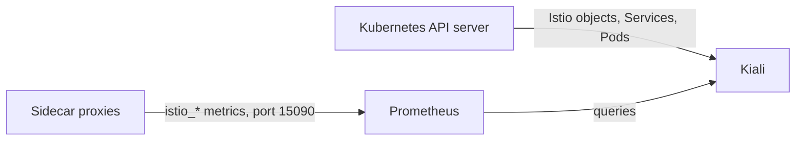
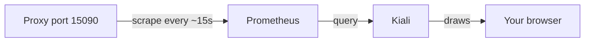

# What Kiali Is Built From

Kiali looks like a monitoring system, but it is not one. It is the tactical map in mission control: it draws what other systems already know. Once you know what it reads, you know how much to trust each thing it shows. You also know, in advance, every way it can look broken when nothing is wrong.

## Two inputs, no storage

Kiali has two sources of data and no storage of its own. Each time you open a page, Kiali asks its sources again, live.



The diagram shows Kiali in the middle. The Kubernetes API server (the registry office where every object is filed) gives it the Istio objects, such as `VirtualService`, `DestinationRule`, `Gateway` and policies, plus Services and Pods. Prometheus gives it the `istio_*` metrics, which Prometheus collected from each proxy on port `15090`.

Three facts follow from this, and they explain most "Kiali is broken" reports:

- **No Prometheus, no graph.** Kiali builds the map from metrics. Without them it still lists workloads and checks configuration, but the graph is empty.
- **No traffic, no graph.** Even with a healthy Prometheus, an edge only exists if requests were recorded in the time window you picked. An idle service has no edges, so Kiali does not draw it.
- **Nothing it shows is Kiali's own opinion.** Every number came from a proxy. Every warning came from an analyzer. You can check any of it yourself.

<!-- astrona:playground:renew -->

### Check both data sources in your playground

Look for the Kiali pod and the Prometheus pod in `istio-system`:

```sh
kubectl -n istio-system get pods -l app=kiali
kubectl -n istio-system get pods -l app.kubernetes.io/name=prometheus
```

You should see something like:

```text
NAME                     READY   STATUS    RESTARTS   AGE
kiali-5d7f8b6c4-t9wqx    1/1     Running   0          8m

NAME                          READY   STATUS    RESTARTS   AGE
prometheus-7c9b8d5f4-k3m2p    2/2     Running   0          8m
```

Both must be `Running`. A running Kiali with no Prometheus shows an empty graph and no useful error. That is the most common "Kiali is broken" report, and Kiali is not the broken part.

Kiali being `1/1` also tells you nothing about whether it can *reach* Prometheus. Kiali's own configuration names the Prometheus address, and a wrong address fails just as quietly. You can read that configuration with `kubectl -n istio-system get configmap kiali -o yaml`.

## From a metric to an edge

The graph is the answer to a query, not a drawing of your deployments. Kiali asks Prometheus for `istio_requests_total` over a time range, grouped by the labels that name both ends of each call. Here is one such metric series, and the edge Kiali draws from it:

```text
   istio_requests_total{
     reporter="destination",
     source_workload="tester",            source_workload_namespace="kiali-demo",
     destination_workload="notification-service-v1",
     destination_service_name="notification-service",
     response_code="200",
     connection_security_policy="mutual_tls"
   }  98
        │
        ▼
   node("tester") ──edge: 5.2 req/s, 0% error, 🔒──▶ node("notification-service")
```

Each group of labels with a rate above zero becomes an edge. The workloads become nodes. The response codes become the colour. The `connection_security_policy` label becomes the padlock. In plain words, the graph is a `sum(rate(...)) by (source, destination, ...)` query drawn with arrows.

That one idea explains every limit of the graph:

| Because the graph comes from request metrics… | …this follows |
| --- | --- |
| metrics are produced by **proxies** | a workload with no sidecar is invisible, however busy |
| metrics are **request**-scoped | non-HTTP/TCP traffic appears differently, or not at all |
| rates are over a **window** | an edge fades and disappears after traffic stops |
| labels identify **workloads and services** | a call the metrics cannot attribute is drawn to "unknown" |

## Traffic first, always

Because edges come from traffic in a time window, your first move when something looks missing is to send traffic. Do that before you study the graph.

### Start steady traffic and read one future edge

This command starts a loop in the background inside the `tester` pod. It sends a signal to the beacon five times a second and keeps running until you stop it. Then it waits 20 seconds and reads the counters straight from the tester's own proxy:

```sh
kubectl -n kiali-demo exec deploy/tester -- sh -c \
  'nohup sh -c "while true; do curl -s -o /dev/null -X POST http://notification-service/notify; sleep 0.2; done" >/dev/null 2>&1 &'
sleep 20
kubectl -n kiali-demo exec deploy/tester -c istio-proxy -- \
  pilot-agent request GET stats/prometheus \
  | grep 'istio_requests_total' | grep 'destination_service_name="notification-service"' | head -2
```

You should see something like:

```text
istio_requests_total{reporter="source",source_workload="tester",destination_workload="notification-service-v1",response_code="200",...} 98
```

That one line is one edge of the graph, before Kiali has drawn anything: a source workload, a destination workload, a response code and a count. Five requests a second is plenty. The graph needs traffic that keeps going, not a lot of it, because it draws a rate, not a total.

This number came from the proxy directly, not from Prometheus. The proxy is where the number starts. Prometheus collects it about every 15 seconds, and Kiali then asks Prometheus. Each step adds a delay, so new traffic takes a moment to show up on the map.

Leave the loop running. The graph needs it, and you stop it when you clean up.

## The pipeline, and where it breaks

A number travels from the proxy to your screen in four steps. Each step can break, and each break looks the same on the map: something is missing.



The diagram shows the path from the proxy, through Prometheus and Kiali, to your browser. Here is what breaks at each stop:

- **At the proxy:** no sidecar means no metrics at all, so the workload is invisible everywhere after it.
- **At Prometheus:** a scrape problem or a short retention time leaves the graph empty for some time ranges.
- **At Kiali:** a wrong Prometheus address gives an empty graph and no error.

To find the cause of an empty graph, walk along the path in order. Each step rules out the ones before it:

1. **Is there traffic?** Send some.
2. **Does the proxy have the metric?** Run `pilot-agent request GET stats/prometheus | grep istio_requests_total`, as you just did.
3. **Does Prometheus have it?** Query Prometheus directly over its HTTP API.
4. **Does Kiali reach Prometheus?** Read Kiali's configuration and logs.

Step 1 solves most cases. Step 2 tells "not in the mesh" apart from "monitoring problem" in one command.

## Reaching the Kiali page

To open Kiali in a browser, forward its port from the cluster to your machine:

```sh
kubectl -n istio-system port-forward svc/kiali 20001:20001
```

Then open `http://localhost:20001` in a browser that can reach this machine. `istioctl dashboard kiali` does the same, and also tries to open a browser for you. That is handy on your own laptop and of no use on a machine with no screen.

The add-on install used here runs Kiali without a login (anonymous access). That is fine for a throwaway playground and for nothing else. A real installation uses a token or OpenID login, because Kiali can read every Istio object in the cluster.

## Common pitfalls

> [!WARNING]
> - **Expecting Kiali to work without Prometheus.** Kiali is not a data source. Without metrics the graph is empty, and nothing tells you why.
> - **Assuming a `Running` Kiali can reach Prometheus.** A wrong address in its configuration fails just as quietly as a missing Prometheus.
> - **Deciding a service is not in the mesh because it is not on the graph.** No traffic in the window means no edge. Send traffic first.
> - **Forgetting the delay.** Proxy, then Prometheus, then Kiali: a new edge takes tens of seconds to appear even when everything works.
> - **Leaving anonymous access on outside a playground.** Kiali can read the configuration of the whole mesh.

> *Kiali draws a Prometheus query with arrows, so every limit of the graph is a property of the metrics underneath it.*
