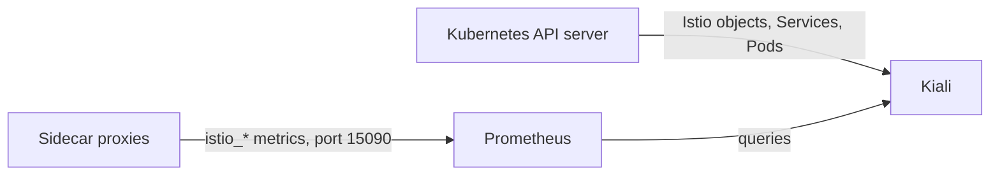
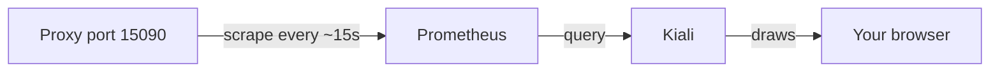

# What Kiali Is Built From

Kiali looks like a monitoring system, but it is not one. It draws what other systems already know. Once you know what Kiali reads, you know how much to trust each thing it shows. You also know in advance every way it can look broken when nothing is wrong. This part covers Kiali's two data sources, how a metric becomes a line in the graph, and the path a number takes from a proxy to your screen.

## Two inputs, no storage

Kiali has two sources of data and no storage of its own. Each time you open a page, Kiali asks its sources again, live.



The diagram shows Kiali reading Istio objects, Services and Pods from the Kubernetes API server, and reading the `istio_*` metrics from Prometheus, which collected them from each proxy on port `15090`.

The Kubernetes API server is the component that stores every object in the cluster. From it, Kiali gets the Istio objects, such as `VirtualService`, `DestinationRule`, `Gateway` and policies, plus Services and Pods. From Prometheus, it gets the request metrics. Three facts follow from this, and they explain most "Kiali is broken" reports:

- **No Prometheus, no graph.** Kiali builds the graph from metrics. Without them it still lists workloads and checks configuration, but the graph is empty.
- **No traffic, no graph.** Even with a healthy Prometheus, an edge only exists if requests were recorded in the time window you picked. An idle service has no edges, so Kiali does not draw it.
- **Nothing Kiali shows is its own opinion.** Every number came from a proxy, and every warning came from an analyzer. You can check any of it yourself.

The first check is therefore whether both data sources run at all. Look for the Kiali pod and the Prometheus pod in `istio-system`:

<!-- astrona:playground:renew -->

```sh
kubectl -n istio-system get pods -l app=kiali
kubectl -n istio-system get pods -l app.kubernetes.io/name=prometheus
```

You should see something like:

```text
NAME                     READY   STATUS    RESTARTS   AGE
kiali-5d7f8b6c4-t9wqx    1/1     Running   0          8m

NAME                          READY   STATUS    RESTARTS   AGE
prometheus-7c9b8d5f4-k3m2p    2/2     Running   0          8m
```

Both must be `Running`. A running Kiali with no Prometheus shows an empty graph and no useful error. That is the most common "Kiali is broken" report, and Kiali is not the broken part.

A `1/1` Kiali pod also tells you nothing about whether Kiali can *reach* Prometheus. Kiali's own configuration holds the Prometheus address, and a wrong address fails just as quietly. You can read that configuration with `kubectl -n istio-system get configmap kiali -o yaml`.

## From a metric to an edge

The graph is the answer to a query, not a drawing of your Deployments. Kiali asks Prometheus for `istio_requests_total` over a time range, grouped by the labels that name both ends of each call. Here is one such metric series, and the edge Kiali draws from it:

```text
   istio_requests_total{
     reporter="destination",
     source_workload="tester",            source_workload_namespace="kiali-demo",
     destination_workload="notification-service-v1",
     destination_service_name="notification-service",
     response_code="200",
     connection_security_policy="mutual_tls"
   }  98
        │
        ▼
   node("tester") ──edge: 5.2 req/s, 0% error, padlock──▶ node("notification-service")
```

Each group of labels with a rate above zero becomes an edge, and the workloads at its two ends become nodes. The response codes decide the colour of the edge, and the `connection_security_policy` label decides the padlock. In plain words, the graph is a `sum(rate(...)) by (source, destination, ...)` query drawn with arrows.

That one idea explains every limit of the graph:

| Because the graph comes from request metrics… | …this follows |
| --- | --- |
| metrics are produced by **proxies** | a workload with no sidecar is invisible, however busy |
| metrics are **request**-scoped | traffic that is not HTTP or TCP appears differently, or not at all |
| rates are over a **window** | an edge fades and disappears after traffic stops |
| labels identify **workloads and services** | a call the metrics cannot attribute is drawn to "unknown" |

## Traffic first, always

Because edges come from traffic in a time window, your first move when something looks missing is to send traffic. Do that before you study the graph.

The next command starts a loop in the background inside the `tester` pod. The loop sends a `POST` request to the `notification-service` Service five times a second and keeps running until you stop it. The command then waits 20 seconds and reads the counters straight from the `tester` pod's own sidecar proxy:

```sh
kubectl -n kiali-demo exec deploy/tester -- sh -c \
  'nohup sh -c "while true; do curl -s -o /dev/null -X POST http://notification-service/notify; sleep 0.2; done" >/dev/null 2>&1 &'
sleep 20
kubectl -n kiali-demo exec deploy/tester -c istio-proxy -- \
  pilot-agent request GET stats/prometheus \
  | grep 'istio_requests_total' | grep 'destination_service_name="notification-service"' | head -2
```

You should see something like:

```text
istio_requests_total{reporter="source",source_workload="tester",destination_workload="notification-service-v1",response_code="200",...} 98
```

That one line is one edge of the graph, before Kiali has drawn anything: a source workload, a destination workload, a response code and a count. `pilot-agent request GET stats/prometheus` asks the sidecar proxy for its metrics page from inside the `istio-proxy` container. Five requests a second is plenty, because the graph draws a rate, not a total; it needs traffic that keeps going, not a lot of it.

This number came from the proxy directly, not from Prometheus. The proxy is where the number starts. Prometheus collects it about every 15 seconds, and Kiali then asks Prometheus. Each step adds a delay, so new traffic takes a moment to show up in the graph. Leave the loop running, because the graph needs it; you stop it when you clean up.

## The path, and where it breaks

A number travels from the proxy to your screen in four steps. Each step can break, and each break looks the same in the graph: something is missing.



The diagram shows the path from the proxy, through Prometheus and Kiali, to your browser.

At the proxy, a missing sidecar means no metrics at all, so the workload is invisible in every later step. At Prometheus, a scrape problem or a short retention time leaves the graph empty for some time ranges. At Kiali, a wrong Prometheus address gives an empty graph and no error. To find the cause of an empty graph, walk along the path in order:

1. **Is there traffic?** Send some.
2. **Does the proxy have the metric?** Run `pilot-agent request GET stats/prometheus | grep istio_requests_total`, as you just did.
3. **Does Prometheus have it?** Query Prometheus directly over its HTTP interface.
4. **Does Kiali reach Prometheus?** Read Kiali's configuration and logs.

Step 1 solves most cases. Step 2 tells "not in the mesh" apart from "monitoring problem" in one command.

When the data is there and you want to see the graph itself, forward Kiali's port from the cluster to your machine:

```sh
kubectl -n istio-system port-forward svc/kiali 20001:20001
```

Then open `http://localhost:20001` in a browser that can reach this machine. `istioctl dashboard kiali` does the same, and also tries to open a browser for you. That helps on your own laptop and not at all on a machine with no screen.

The add-on install used here runs Kiali without a login (the `anonymous` authentication strategy). That is fine for a playground and for nothing else. A real installation uses a token or OpenID Connect login, because Kiali can read every Istio object in the cluster.

You now know that Kiali is a view over two sources: the API server for objects and Prometheus for metrics. An edge is a request rate between two workloads, so no traffic, no sidecar or no Prometheus all give the same empty graph. With traffic flowing, the next question is how to read the graph correctly, because a red edge says less than it seems to.

## Common pitfalls

> [!WARNING]
> - **Expecting Kiali to work without Prometheus.** Kiali is not a data source. Without metrics the graph is empty, and nothing tells you why.
> - **Assuming a `Running` Kiali can reach Prometheus.** A wrong address in its configuration fails just as quietly as a missing Prometheus.
> - **Deciding a service is not in the mesh because it is not in the graph.** No traffic in the window means no edge. Send traffic first.
> - **Forgetting the delay.** Proxy, then Prometheus, then Kiali: a new edge takes tens of seconds to appear even when everything works.
> - **Leaving anonymous access on outside a playground.** Kiali can read the configuration of the whole mesh.
