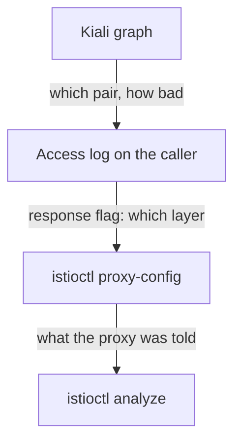

# Validations, Badges And Cross-Checking

The graph is only half of what Kiali does. The other half reads Istio objects instead of metrics: it checks your configuration, and it reports how connections were secured. This part covers both, checks each one against the command line underneath it, and ends with a method that keeps Kiali in its proper role.

## Istio Config: the analyzers, with navigation

Kiali's **Istio Config** view lists every Istio object in scope and checks it. It uses the same analyzers as `istioctl analyze`, the pre-flight inspector that reads every object together and finds the ones that point at nothing. It reports the same `IST####` codes, the inspector's warning codes, such as `IST0101` for a reference that does not resolve.

The findings are the same, so you choose by what you are doing:

| Use | When |
| --- | --- |
| **Kiali Istio Config** | you do not know which namespace is at fault; you want to click from a finding to the object; you are showing someone else |
| **`istioctl analyze`** | you already know the namespace; you are in a terminal; you want an exit code for a build pipeline |

Kiali helps you move around: a red validation icon on an object, one click to its YAML, and a view across all namespaces of which ones are unhealthy. Its weakness is that it is a web page, and a web page cannot stop a broken build.

<!-- astrona:playground:renew -->

### See a broken object from both sides

This `VirtualService` points at a `Gateway` and a subset that do not exist. The API server accepts it anyway, because it checks each object on its own.

Save this as `virtualservice-broken.yaml`:

```yaml
apiVersion: networking.istio.io/v1
kind: VirtualService
metadata:
  name: broken
  namespace: kiali-demo
spec:
  hosts:
    - notification-service
  gateways:
    - does-not-exist
  http:
    - route:
        - destination:
            host: notification-service
            subset: nonexistent
```

Apply it:

```sh
kubectl apply -f virtualservice-broken.yaml
```

Then check the result with the analyzer:

```sh
istioctl analyze -n kiali-demo
```

The output below was taken while a second `VirtualService` for the same host, named `notification` (a 30% fault drill), was also applied in `kiali-demo`. You should see something like:

```text
Error [IST0101] (VirtualService broken.kiali-demo) Referenced gateway not found: "does-not-exist"
Error [IST0101] (VirtualService broken.kiali-demo) Referenced host+subset in destinationrule not found: "notification-service+nonexistent"
Warning [IST0109] (VirtualService broken.kiali-demo) The VirtualServices broken.kiali-demo, notification.kiali-demo associated with mesh gateway define the same host notification-service which can lead to undefined behavior.
```

There are three findings. In Kiali's Istio Config view the same three appear as a red validation badge on the `broken` object, each linking to the field at fault.

Look at the third one, the `IST0109` warning. Two `VirtualService` objects now claim the same host: two flight plans for one beacon, and only one is followed. That shows how easily it happens: two people, two objects, one host, and the only notice is a `Warning`. If you never applied the `notification` object, you see only the two `Error` lines.

When Kiali and the analyzer agree, you also learn something useful: Kiali is reading the cluster you think it is reading.

## The security badge

The padlock on an edge means Kiali found `connection_security_policy="mutual_tls"` on the metrics for that pair. Mutual TLS (mTLS) is the secret handshake: both ships show their ID badges before they talk. The padlock is that metric label, drawn as an icon.

It helps most at scale. During a move to `STRICT` mTLS (the airlock rule "no handshake, no docking"), the question "which parts of the mesh are already encrypted" is slow to answer one workload at a time. On a graph with the Security option on, you see it at once.

The badge comes from traffic that actually happened, so keep two limits in mind:

- **It reports what happened, not what is required.** Under `PERMISSIVE`, some traffic on a path can use mTLS and some can be plain text. The badge shows the mix, not a policy.
- **An edge with no traffic has no badge,** for the same reason it has no edge.

### Read the label behind the padlock

Ask the destination's own proxy which security policy its counted requests used:

```sh
kubectl -n kiali-demo exec deploy/notification-service-v1 -c istio-proxy -- \
  pilot-agent request GET stats/prometheus | grep istio_requests_total \
  | grep -o 'connection_security_policy="[^"]*"' | sort | uniq -c
```

You should see something like:

```text
   2 connection_security_policy="mutual_tls"
```

The value is `mutual_tls`, on the **destination's** own metrics. That is where the label means the most: the receiving proxy is the one that knows how the connection was secured. The padlock in the Kiali page and this output are the same fact, one drawn and one raw.

## Cross-checking, as a habit

Every picture in Kiali has a command-line version. Knowing the mapping lets you trust the page in a hurry and check it when the answer matters:

| Kiali shows | Underneath it is | Check it with |
| --- | --- | --- |
| an edge, with a rate | `sum(rate(istio_requests_total{...}[Nm]))` | `pilot-agent request GET stats/prometheus`, or a Prometheus query |
| edge colour | the `response_code` label distribution | the same metric, grouped by code |
| a padlock | `connection_security_policy="mutual_tls"` | the destination proxy's metrics |
| a red validation badge | an analyzer finding | `istioctl analyze -n <ns>` |
| a workload's health | Kubernetes object state | `kubectl get pods`, `istioctl proxy-status` |
| response time on an edge | `istio_request_duration_milliseconds_bucket` | a `histogram_quantile` query in Prometheus |

Make this a habit: when Kiali shows something surprising, check the right-hand column before you act. Kiali is not unreliable. It draws faithfully. But the check tells you *which* underlying fact is surprising, and that is usually the real finding.

## Cleaning up

Stop the traffic loop, remove the two `VirtualService` objects, and confirm the beacon answers again.

### Stop the load and remove the faults

Run the clean-up, then send one test signal and run the analyzer:

```sh
kubectl -n kiali-demo exec deploy/tester -- pkill -f 'while true' || true
kubectl -n kiali-demo delete virtualservice broken notification
sleep 5
kubectl -n kiali-demo exec deploy/tester -- \
  curl -s -o /dev/null -w '%{http_code}\n' -X POST http://notification-service/notify
istioctl analyze -n kiali-demo
```

You should see something like:

```text
virtualservice.networking.istio.io "broken" deleted
virtualservice.networking.istio.io "notification" deleted
200
✔ No validation issues found when analyzing namespace: kiali-demo.
```

If you never applied the `notification` object, `kubectl` reports it as not found instead. That is fine.

Both `VirtualService` objects are gone, so the proxies fall back to Istio's default routing for the Service, and the request succeeds. A Service with no Istio routing objects at all is a valid, working setup.

Prometheus keeps its old counter totals. What changes is the **rate** over the sliding window. So the map turns green again over the next minute or two, not at once. The same delay that hid problems now works in your favour.

## The method

Kiali is the first step of an investigation, not the last. Here is the order that works on an unfamiliar problem:



The diagram shows four steps from top to bottom. The Kiali graph names the pair of workloads, how bad it is and since when (set the graph type and time window on purpose). The access log on the caller gives the response flag, which names the layer that failed. `istioctl proxy-config` shows what the proxy was configured to do. `istioctl analyze` tells you whether the configuration made sense in the first place.

Kiali removes the hardest step, which is deciding where to point the other tools. It replaces none of them. The moment you treat it as the final answer ("the graph says the notification service is broken"), it starts costing you time instead of saving it.

## Common pitfalls

> [!WARNING]
> - **Using Kiali's validations instead of `istioctl analyze`, or the other way round, out of trust.** They are the same analyzers. Choose by what you are doing.
> - **Taking the padlock as proof of a `STRICT` policy.** It shows how observed connections were secured. Under `PERMISSIVE`, a path can be partly encrypted.
> - **Expecting a badge on an edge with no traffic.** No traffic, no edge, no badge.
> - **Acting on a surprising panel without checking the data underneath.** The check usually shows which fact is the real finding.
> - **Leaving fault injection in place.** A `VirtualService` that fails 30% of requests keeps doing it after you stop looking at the graph.
> - **Leaving a load generator running.** It is a background process inside a pod. Stop it with `pkill`, or destroy the playground.

> *Every pixel in Kiali has a command behind it, and knowing which one turns a dashboard into evidence.*

## Your mission: An Empty Graph And A Red Badge

You can now explain an empty Kiali graph, find what a red validation badge is about, and fix it from the command line. Now prove it in a graded mission: a colleague saw an empty graph and a red badge in `kiali-demo` and reported "the mesh is down", and you have to show it is not, then make validation clean without removing the route.

The mission runs in its own training solar system, so first pause your playground. Nothing in it is lost:

```sh
astrona stop ats-016-playground-060-01
```

Then start the mission:

```sh
astrona run --git ssh://git@github.com/astrona-io/ATS016.git -c sections/section-060/module-01/labs/lab-01
```

Read the task in [`question.md`](./labs/lab-01/question.md) and solve it on your own first. When you think you are done, send it for grading:

```sh
astrona submit -c sections/section-060/module-01/labs/lab-01
```

When the mission is done, remove it and wake your playground up again:

```sh
astrona destroy ats-016-lab-060-01
astrona start ats-016-playground-060-01
```
