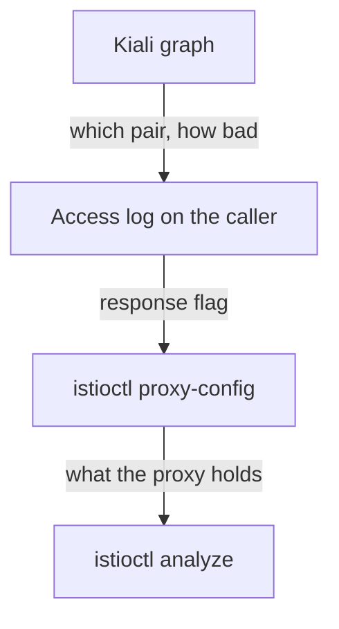

# Validations, Badges And Cross-Checking

The graph is only half of what Kiali does. The other half reads Istio objects instead of metrics: it checks your configuration, and it reports how connections were secured. This part covers both, checks each one against the command line underneath it, and ends with a method that keeps Kiali in its proper role: finding where a problem is, not explaining it.

## Istio Config: the analyzers, with navigation

Kiali's **Istio Config** view lists every Istio object in scope and checks it. It uses the same analyzers as `istioctl analyze`, the command that reads every Istio object together and reports references that do not resolve. It reports the same `IST####` message codes, such as `IST0101` for a referenced resource that does not exist.

The messages are the same, so you choose by what you are doing:

| Use | When |
| --- | --- |
| **Kiali Istio Config** | you do not know which namespace is at fault; you want to click from a message to the object; you are showing someone else |
| **`istioctl analyze`** | you already know the namespace; you are in a terminal; you want an exit code for a build pipeline |

Kiali helps you move around: a red validation icon on an object, one click to its YAML, and a view across all namespaces of which ones have problems. Its weakness is that it is a web page, and a web page cannot stop a broken build.

The `VirtualService` below points at a `Gateway` and a subset that do not exist. The API server accepts it anyway, because its validating webhook checks each object on its own and never looks at a second object.

<!-- astrona:playground:renew -->

Save this as `virtualservice-broken.yaml`:

```yaml
apiVersion: networking.istio.io/v1
kind: VirtualService
metadata:
  name: broken
  namespace: kiali-demo
spec:
  hosts:
    - notification-service
  gateways:
    - does-not-exist
  http:
    - route:
        - destination:
            host: notification-service
            subset: nonexistent
```

Apply it:

```sh
kubectl apply -f virtualservice-broken.yaml
```

Then check the result with the analyzer:

```sh
istioctl analyze -n kiali-demo
```

You should see something like this (shortened to the two messages):

```text
Error [IST0101] (VirtualService broken.kiali-demo) Referenced gateway not found: "does-not-exist"
Error [IST0101] (VirtualService broken.kiali-demo) Referenced host+subset in destinationrule not found: "notification-service+nonexistent"
```

There are two messages, both `IST0101` on the object `broken`. In Kiali's Istio Config view the same two appear as a red validation icon on `broken`, each linking to the field at fault. When Kiali and the analyzer agree, you also learn something useful: Kiali is reading the cluster you think it is reading.

The `broken` object does not conflict with the fault-injection `VirtualService` named `notification`, even though both name the host `notification-service`. `broken` binds only to the gateway `does-not-exist`, so it does not apply to the sidecar proxies, and the analyzer's host-conflict check (`IST0109`) only compares objects that apply to the sidecar proxies.

## The security badge

The padlock on an edge means Kiali found `connection_security_policy="mutual_tls"` on the metrics for that pair of workloads. The padlock is that metric label, drawn as an icon.

It helps most at scale. During a move to `STRICT` mTLS, where a `PeerAuthentication` policy makes workloads accept only mTLS connections, the question "which parts of the mesh are already encrypted" is slow to answer one workload at a time. On a graph with the Security option on, you see it at once.

The badge comes from traffic that actually happened, so keep two limits in mind. First, **it reports what happened, not what is required.** Under `PERMISSIVE` mode, a workload accepts both mTLS and plain text, so some traffic on a path can use mTLS and some can be plain text; the badge shows the mix, not a policy. Second, **an edge with no traffic has no badge**, for the same reason it has no edge.

To read the label behind the padlock, ask the destination's own sidecar proxy which security policy its counted requests used:

```sh
kubectl -n kiali-demo exec deploy/notification-service-v1 -c istio-proxy -- \
  pilot-agent request GET stats/prometheus | grep istio_requests_total \
  | grep -o 'connection_security_policy="[^"]*"' | sort | uniq -c
```

You should see something like:

```text
   2 connection_security_policy="mutual_tls"
```

The value is `mutual_tls`, on the **destination's** own metrics. That is where the label means something: the receiving proxy knows how the connection was secured. On the caller's side, Istio sets this label to `unknown`, because the client proxy cannot fill it in reliably. The padlock in the Kiali page and this output are the same fact, one drawn and one raw.

## Cross-checking, as a habit

Every picture in Kiali has a command-line version. Knowing the mapping lets you trust the page in a hurry and check it when the answer matters:

| Kiali shows | Underneath it is | Check it with |
| --- | --- | --- |
| an edge, with a rate | `sum(rate(istio_requests_total{...}[Nm]))` | `pilot-agent request GET stats/prometheus`, or a Prometheus query |
| edge colour | the spread of the `response_code` label | the same metric, grouped by code |
| a padlock | `connection_security_policy="mutual_tls"` | the destination proxy's metrics |
| a red validation icon | an analyzer message | `istioctl analyze -n <ns>` |
| a workload's health | Kubernetes object state | `kubectl get pods`, `istioctl proxy-status` |
| response time on an edge | `istio_request_duration_milliseconds_bucket` | a `histogram_quantile` query in Prometheus |

When Kiali shows something surprising, check the right-hand column before you act. Kiali draws faithfully, so the problem is rarely the drawing. The check tells you *which* underlying fact is surprising, and that is usually the real finding.

## Cleaning up

With the investigation done, stop the traffic loop, remove the two `VirtualService` objects, then send one test request and run the analyzer:

```sh
kubectl -n kiali-demo exec deploy/tester -- pkill -f 'while true' || true
kubectl -n kiali-demo delete virtualservice broken notification
sleep 5
kubectl -n kiali-demo exec deploy/tester -- \
  curl -s -o /dev/null -w '%{http_code}\n' -X POST http://notification-service/notify
istioctl analyze -n kiali-demo
```

You should see something like:

```text
virtualservice.networking.istio.io "broken" deleted
virtualservice.networking.istio.io "notification" deleted
200
✔ No validation issues found when analyzing namespace: kiali-demo.
```

If you never applied the `notification` object, `kubectl` reports it as not found instead. Both `VirtualService` objects are gone, so the sidecar proxies fall back to Istio's default routing for the Service, and the request succeeds. A Service with no Istio routing objects at all is a valid, working setup.

Prometheus keeps its old counter totals. What changes is the **rate** over the sliding window, so the graph turns green again over the next minute or two, not at once. The same delay that hid problems now works in your favour.

## The method

Kiali is the first step of an investigation, not the last. Here is the order that works on an unfamiliar problem:



The diagram shows four steps from top to bottom: the graph names the pair, the caller's access log names the failing layer, `proxy-config` shows the proxy's configuration, and `analyze` checks whether the configuration made sense.

In more detail, the Kiali graph names the pair of workloads, how bad it is and since when; set the graph type and time window on purpose. The access log on the caller gives the response flag, which names the layer that failed. `istioctl proxy-config` shows what the proxy was configured to do. `istioctl analyze` tells you whether the configuration made sense in the first place. Kiali removes the hardest step, deciding where to point the other tools, and replaces none of them.

You can now use both halves of Kiali and check each against the command line: the Istio Config view against `istioctl analyze`, and the padlock against `connection_security_policy` on the destination. You also have a method that starts with the graph and ends with the proxy configuration. Kiali shows *where* and roughly *how much*; measuring exactly how much, and since when, is a job for Prometheus queries.

## Common pitfalls

> [!WARNING]
> - **Trusting Kiali's validations over `istioctl analyze`, or the other way round.** They are the same analyzers. Choose by what you are doing.
> - **Taking the padlock as proof of a `STRICT` policy.** It shows how observed connections were secured. Under `PERMISSIVE`, a path can be partly encrypted.
> - **Reading `connection_security_policy` on the caller.** The client proxy reports `unknown`. Read it on the destination.
> - **Expecting a badge on an edge with no traffic.** No traffic, no edge, no badge.
> - **Leaving fault injection in place.** A `VirtualService` that fails 30% of requests keeps doing it after you stop looking at the graph.
> - **Leaving a load generator running.** It is a background process inside a pod. Stop it with `pkill`, or destroy the playground.

## Your mission: An Empty Graph And A Red Badge

You can now explain an empty Kiali graph, find what a red validation icon is about, and fix it from the command line. The graded lab gives you a namespace where a colleague saw an empty graph and a red validation icon and reported "the mesh is down"; you show that it is not, then make validation clean without removing the route.

The lab runs in its own cluster, so first pause your playground. Nothing in it is lost:

```sh
astrona stop ats-016-playground-060-01
```

Then start the lab:

```sh
astrona run --git ssh://git@github.com/astrona-io/ATS016.git -c sections/section-060/module-01/labs/lab-01
```

The task is on the next page. Solve it on your own first. When you think you are done, send it for grading:

```sh
astrona submit -c sections/section-060/module-01/labs/lab-01
```

When the lab is done, remove it and start your playground again:

```sh
astrona destroy ats-016-lab-060-01
astrona start ats-016-playground-060-01
```
