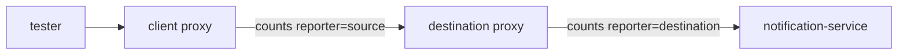

# The reporter Label And PromQL Patterns

Every request in the mesh is counted twice. That is not a fault to filter out. It is like reading the flight logs of both ships: the sender's and the receiver's. The difference between the two counts is a diagnosis in its own right. This part covers that label, then the three query shapes that answer most troubleshooting questions.

## Two observations of one request

A signal from `tester` to `notification-service` passes two communications officers (sidecar proxies): the tester's on the way out, and the app's on the way in. Each one counts it.



The diagram shows one request passing the client proxy and the destination proxy. Both add one to `istio_requests_total` with the same labels, except `reporter`: the client proxy writes `reporter="source"`, the destination proxy writes `reporter="destination"`. The `reporter` label says which ship filed the report.

Here is how to read the two counts side by side:

| Comparison | Means |
| --- | --- |
| both agree | normal. Pick one and be consistent. |
| **source sees requests destination does not** | the request never arrived: the metric form of a `UF` (connection failure) or `NC` (no cluster) failure |
| **source sees errors destination reports as success** | the failure was on the way back, or inside the client proxy: a timeout, a circuit breaker, a reset after the response started |
| destination sees requests source does not | the caller is not in the mesh — it has no proxy to count them |

The last row is quietly useful. It finds callers outside the mesh that call a meshed service, without touching a single pod.

Forgetting this label is the most common way to get a query wrong. A rate added up across both reporters is roughly **double** the real request rate. Every dashboard built on it is then wrong by a factor of two, and nobody notices until they compare it with something else.

<!-- astrona:playground:renew -->

### Count the same traffic twice

First start a steady load so there is something to measure. This loop runs in the background inside the `tester` pod, ten requests a second, until you stop it. After 30 seconds, ask Prometheus for the rate, grouped by reporter and response code:

```sh
kubectl -n metrics-demo exec deploy/tester -- sh -c \
  'nohup sh -c "while true; do curl -s -o /dev/null -X POST http://notification-service/notify; sleep 0.1; done" >/dev/null 2>&1 &'
sleep 30
kubectl -n metrics-demo exec deploy/tester -- curl -s \
  'http://prometheus.istio-system:9090/api/v1/query' \
  --data-urlencode 'query=sum(rate(istio_requests_total{destination_workload="notification-service-v1"}[1m])) by (reporter, response_code)'
```

You should see something like:

```text
{"status":"success","data":{"resultType":"vector","result":[
  {"metric":{"reporter":"destination","response_code":"200"},"value":[1774000000,"9.8"]},
  {"metric":{"reporter":"source","response_code":"200"},"value":[1774000000,"9.8"]}]}}
```

There are two series with almost the same rate, around ten requests a second each. That is **one** workload's traffic, seen from both ends. They are rarely exactly equal: Prometheus scrapes the two proxies at different moments, so a request in flight is counted by one and not yet by the other.

Leave the loop running for the rest of this part.

## The three query shapes

Almost every troubleshooting question fits one of three PromQL shapes: a rate, a ratio or a percentile. Learn the shapes, and you can write any of the queries.

### Query shape one: a rate, grouped

Most troubleshooting queries follow the same pattern:

```text
   sum(  rate(  metric{filters}[window]  )  ) by (labels)
    │      │           │         │              │
    │      │           │         │              └── what you want to compare
    │      │           │         └───────────────── how far back to average
    │      │           └─────────────────────────── which series to include
    │      └─────────────────────────────────────── counter → per-second change
    └────────────────────────────────────────────── collapse everything not in `by`
```

Here it is applied to the request rate by result:

```promql
sum(rate(istio_requests_total{destination_workload="notification-service-v1", reporter="destination"}[1m])) by (response_code)
```

Change the `by` clause to change the question. These four matter most:

| `by (...)` | Answers |
| --- | --- |
| `response_code` | is it failing, and how |
| `source_workload` | **who** is affected — turns one alert into a blast radius |
| `response_flags` | *why* it is failing, in the access log's response flags |
| `destination_version` | is the canary worse than the stable version |

The `[1m]` window is a trade-off. Short windows react fast but jump around; long windows are smooth but slow to react. One minute is a good default when you troubleshoot by hand, five minutes for dashboards.

### Query shape two: a ratio

An error ratio is two of the same query, one divided by the other. Service level objectives (SLOs, the promised share of good requests) are written against it, because it does not depend on traffic volume:

```promql
sum(rate(istio_requests_total{reporter="destination", response_code=~"5.."}[1m]))
  /
sum(rate(istio_requests_total{reporter="destination"}[1m]))
```

`=~` is a regular-expression match, so `"5.."` means any three-character code that starts with `5`. The result is between 0 and 1.

Keep two things right. **The filters on both halves must match**, apart from the thing you are selecting. A top half for one workload over a bottom half for the whole mesh gives a meaningless number. And **the `reporter` must be the same on both halves**, for the same reason.

### Query shape three: a percentile

```promql
histogram_quantile(0.99,
  sum(rate(istio_request_duration_milliseconds_bucket{destination_workload="notification-service-v1"}[1m])) by (le))
```

Read it from the inside out: take the bucket counters, turn them into rates, add them up **keeping `le`**, then estimate the 99th percentile.

`le` is the bucket edge label ("less than or equal to"), and it **must survive the aggregation**. `histogram_quantile` needs the full set of buckets to find the one the target rank falls in. Drop `le` and you hand it one meaningless number, and it gives back a confident, meaningless answer. No error appears. This is the classic PromQL mistake, and it is silent.

To compare percentiles across workloads, add the grouping label next to `le`:

```promql
histogram_quantile(0.99,
  sum(rate(istio_request_duration_milliseconds_bucket[1m])) by (le, destination_workload))
```

### Run the three shapes, and the mistake

Define a small shell helper so each query is one short line. `prom_query` sends its first argument to Prometheus from the `tester` pod:

```sh
prom_query() { kubectl -n metrics-demo exec deploy/tester -- curl -s \
  'http://prometheus.istio-system:9090/api/v1/query' --data-urlencode "query=$1"; echo; }
```

Now run a rate, a percentile, and the same percentile with `by (le)` removed:

```sh
prom_query 'sum(rate(istio_requests_total{destination_workload="notification-service-v1",reporter="destination"}[1m])) by (response_code)'
prom_query 'histogram_quantile(0.99, sum(rate(istio_request_duration_milliseconds_bucket{destination_workload="notification-service-v1"}[1m])) by (le))'
prom_query 'histogram_quantile(0.99, sum(rate(istio_request_duration_milliseconds_bucket{destination_workload="notification-service-v1"}[1m])))'
```

You should see something like:

```text
{"status":"success",...,"result":[{"metric":{"response_code":"200"},"value":[...,"9.9"]}]}
{"status":"success",...,"result":[{"metric":{},"value":[...,"0.9"]}]}
{"status":"success",...,"result":[{"metric":{},"value":[...,"NaN"]}]}
```

That is ten requests a second, a 99th percentile under a millisecond, and then the same percentile query without `by (le)`. The last one returns `NaN` or a nonsense figure, not an error. That is why `le` gets its own warning: the query looks right, runs fine, and lies.

> [!TIP]
> Keep a small query helper like `prom_query` in your shell whenever you troubleshoot with Prometheus from a terminal. It turns every check into one short line you can repeat after each change.

## Where the reporter choice matters

In a healthy mesh both reporters give the same answer, and the choice is a matter of taste. It stops being a matter of taste in exactly the cases you investigate:

- **Client-side faults**, such as an injected abort, a circuit breaker rejection or a client timeout, are recorded by `source` only. Query `destination` and the mesh looks healthy.
- **Server-side denials**, such as a `403` from an `AuthorizationPolicy` (the guard at the airlock), are recorded by both, because the request arrived.
- **Requests that never arrive**, with flags `NC`, `UH` or `UF`, appear in `source` with nothing to match them in `destination`.

The rule that follows: **use `destination` for "is this service healthy", and `source` for "is this caller getting what it needs".** When the two disagree, the disagreement is the finding.

When you are done with this part, you can stop the load loop with `kubectl -n metrics-demo exec deploy/tester -- pkill -f 'while true' || true`, or leave it running if you go straight on to measuring a failure.

## Common pitfalls

> [!WARNING]
> - **Ignoring the `reporter` label.** Adding up both roughly doubles your rate, and the *difference* between them is often the real finding.
> - **Dropping `le` when you aggregate a histogram.** The query returns a number, and the number is meaningless. No error appears.
> - **Mismatched filters in a ratio.** The top and bottom halves must be scoped the same way, apart from the selector under test.
> - **Reading a rate too soon after a change.** A `[1m]` window holds a minute of history. Wait out the window before you trust the value.
> - **Querying `destination` for a client-side fault.** Injected aborts, circuit breakers and timeouts never reach the destination's counters.
> - **Using a long window during an incident.** A `[5m]` rate smooths away exactly the change you are trying to time.

> *Every request is counted twice on purpose, and when the two counts disagree, that disagreement is the diagnosis.*
